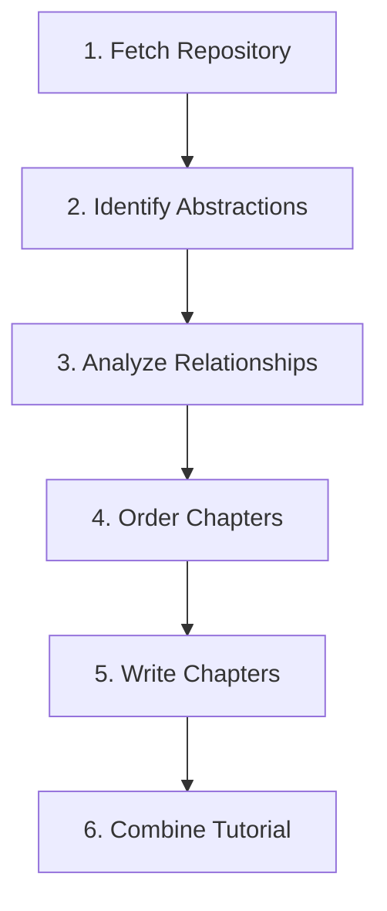

 # Documentation Generation Workflow

This document explains the workflow of the documentation generation process, focusing on how the Large Language Model (LLM) prompts chain together to create a comprehensive tutorial for a given codebase.

## Overview

The process is a pipeline of six sequential steps. Four of these steps involve interactions with an LLM to analyze the code, structure the content, and write the documentation.



## Detailed Steps & Prompt Chaining

Here’s a detailed breakdown of each step, focusing on the inputs and outputs of the LLM prompts.

### 1. Fetch Repository (`FetchRepo`)
This initial step does not use an LLM. It's responsible for gathering the source code.

- **Input**: A repository URL or a local directory path.
- **Output**: A list of all relevant code files and their content. This list becomes the foundational input for the entire workflow.
- **Chaining**: The raw codebase content is passed to the next step.

---

### 2. Identify Abstractions (`IdentifyAbstractions`)
This is the first interaction with the LLM. Its goal is to identify the most important, high-level concepts in the codebase.

- **Input to Prompt**: The entire codebase content fetched in the previous step.
- **LLM Prompt Goal**: The LLM is asked to analyze the code and identify the top 5-10 core abstractions. For each abstraction, it must provide:
    1. A concise `name`.
    2. A beginner-friendly `description` with an analogy.
    3. A list of relevant `file_indices` that implement or define the abstraction.
- **Output of Prompt**: The LLM returns a YAML-formatted string.
    ```yaml
    - name: |
        Core Concept A
      description: |
        An explanation of what this concept does, like a central controller.
      file_indices:
        - 0 # path/to/file1.py
        - 3 # path/to/file2.py
    ```
- **Chaining**: The validated list of abstractions (name, description, file indices) is passed to the next step.

---

### 3. Analyze Relationships (`AnalyzeRelationships`)
The second LLM interaction focuses on understanding how the identified abstractions interact.

- **Input to Prompt**: The list of abstractions (names and descriptions) and the code snippets from their relevant files.
- **LLM Prompt Goal**: The LLM is prompted to:
    1.  Create a high-level `summary` of the project's purpose.
    2.  Define the `relationships` between the abstractions, describing how they interact (e.g., "Manages", "Inherits from", "Uses").
- **Output of Prompt**: A YAML object containing the summary and a list of relationships.
    ```yaml
    summary: |
      A brief, simple explanation of the project's purpose.
    relationships:
      - from_abstraction: 0 # Core Concept A
        to_abstraction: 1 # Core Concept B
        label: "Manages"
    ```
- **Chaining**: The project summary and the list of relationships are passed to the next step.

---

### 4. Order Chapters (`OrderChapters`)
The third LLM interaction determines the best pedagogical order to present the concepts.

- **Input to Prompt**: The project summary, the list of abstractions, and their relationships.
- **LLM Prompt Goal**: The LLM is asked to determine the optimal sequence for a tutorial. It's instructed to start with foundational or user-facing concepts and then move to lower-level implementation details, respecting dependencies revealed in the relationships.
- **Output of Prompt**: A YAML list of the abstraction indices, sorted in the recommended chapter order.
    ```yaml
    - 2 # FoundationalConcept
    - 0 # CoreClassA
    - 1 # CoreClassB (uses CoreClassA)
    ```
- **Chaining**: This ordered list of indices dictates the structure of the final tutorial and is passed to the chapter writing step.

---

### 5. Write Chapters (`WriteChapters`)
This is the most intensive LLM step, where the actual tutorial content is generated for each abstraction, one by one.

- **Input to Prompt (for each chapter)**:
    - The specific abstraction's details (name, description).
    - The full tutorial structure (for linking to other chapters).
    - The content of previously written chapters (to ensure smooth transitions).
    - Relevant code snippets for the current abstraction.
- **LLM Prompt Goal**: The LLM is given a detailed set of instructions to write a beginner-friendly Markdown chapter. This includes creating a heading, explaining the concept with analogies, providing simplified code examples (under 10 lines), using Mermaid diagrams for illustration, and writing transitions to the previous and next chapters.
- **Output of Prompt**: A Markdown-formatted string for each chapter.
- **Chaining**: The list of all generated Markdown chapter strings is passed to the final step.

---

### 6. Combine Tutorial (`CombineTutorial`)
This final step does not use an LLM. It assembles all the generated pieces into the final documentation.

- **Input**: The project summary, relationship graph, chapter order, and the content of all chapters.
- **Output**: A directory containing:
    - `index.md`: An overview page with the project summary, a Mermaid diagram of the relationships, and a linked table of contents.
    - `01_concept.md`, `02_another.md`, etc.: Individual chapter files in Markdown format.
- **Chaining**: This is the final step, and the output is the completed tutorial saved to the filesystem.