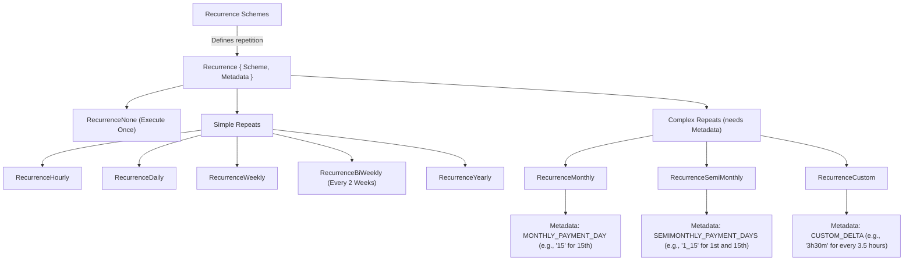

# Chapter 1: Schedule Blueprint (`schedule.Schedule`)

Welcome to the `scheduler` project! If you've ever needed a program to do something automatically at a specific time, like sending a daily report or checking for updates every hour, then you're in the right place. This project helps you do just that.

At the heart of any scheduling system is the need to clearly define *what* task to do, *when* to do it, and *how often* it should repeat. In our `scheduler` project, this detailed instruction sheet is called a **`schedule.Schedule`**.

Think of `schedule.Schedule` as a **recipe card** or a detailed instruction manual for a task. Just like a recipe tells you the ingredients, steps, and cooking time, a `schedule.Schedule` tells our system everything it needs to know to perform an action correctly and consistently.

## What Problem Does the `schedule.Schedule` Solve?

Imagine you're building an e-commerce website. A common feature is to send a reminder email to a customer if they add items to their shopping cart but don't complete the purchase within, say, 24 hours.

To make this happen automatically, you need to tell the system:
1.  **What to do:** Send an email.
2.  **To whom:** The specific customer.
3.  **With what content:** The reminder message and a link to their cart.
4.  **When to do it:** 24 hours after they last updated their cart.
5.  **How often:** Just once for that specific abandoned cart.

The `schedule.Schedule` is the way we package all this information into a neat, understandable format for our `scheduler` system.

## Meet the `schedule.Schedule`: Your Task's Recipe Card

Let's break down what goes into this "recipe card." A `schedule.Schedule` primarily defines three things:

1.  **The Task (WHAT):** What action needs to be performed? This usually involves sending some data (a "payload") to a specific destination (a "topic").
2.  **The Timing (WHEN):** When should this task be executed for the first time? This includes the date, time, and timezone.
3.  **The Repetition (HOW OFTEN):** Should this task repeat? If so, how frequently (e.g., hourly, daily, weekly, or a custom interval)?

## Dissecting the Blueprint: Key Ingredients of `schedule.Schedule`

In our Go codebase, the `schedule.Schedule` is a data structure (a `struct`). Let's look at its main fields. You can find the full definition in `api/pkg/schedule/schedule.go`.

Here's a simplified view of its structure:

```go
// Simplified from: api/pkg/schedule/schedule.go
package schedule

import "time"

// Schedule holds all details for a task.
type Schedule struct {
    // === WHEN to run? ===
    LocalExecutionTime time.Time   // The exact date and time for the task.
    TimeLocation       string      // The timezone for LocalExecutionTime (e.g., "America/New_York").

    // === HOW OFTEN to repeat? ===
    Recurrence         *Recurrence // Details about repetition (if any).

    // === WHAT task to perform? ===
    TargetTopic   string      // Where the task's message/result should go (e.g., "email-sending-service").
    TargetKey     string      // A specific key for the message (e.g., "user123-reminder").
    TargetPayload []byte      // The actual data/content for the task (e.g., the email body).

    // === HOW to identify this blueprint? ===
    Key           string      // Your unique name for this schedule definition.
    
    // ID string // An internal, system-generated ID. You don't usually set this.
}

// Recurrence defines how a schedule repeats.
type Recurrence struct {
    Scheme   string            // Type of repetition (e.g., "DAILY", "WEEKLY").
    Metadata map[string]string // Extra info for complex schemes (e.g., day of month for "MONTHLY").
}
```

Let's explore these "ingredients":

*   **`LocalExecutionTime` (When):** This is a `time.Time` object in Go. It specifies the exact date and time the task should run. For example, `2024-07-15T10:00:00`.
*   **`TimeLocation` (When):** This is a string like `"America/New_York"` or `"UTC"`. It's crucial because `LocalExecutionTime` is interpreted according to this timezone. 10:00 AM in New York is different from 10:00 AM in London!
*   **`Recurrence` (How Often):** This points to another small structure, `Recurrence`, which we'll discuss more soon. It tells the system if the task should run just once (`RecurrenceNone`) or repeat (e.g., `RecurrenceDaily`, `RecurrenceWeekly`).
*   **`TargetTopic` (What):** Think of this as the address or channel where the outcome of your task is sent. For example, if your task is "send an email," the `TargetTopic` might be something like `"email-notifications"`. Other parts of your system listen to this topic.
*   **`TargetKey` (What):** When the task's message is sent to the `TargetTopic`, this `TargetKey` helps identify or organize it. For example, if sending a password reset email, the `TargetKey` might be the `userID`.
*   **`TargetPayload` (What):** This is the actual content or data for your task, represented as a slice of bytes (`[]byte`). For an email task, this could be the email's subject and body, perhaps formatted as JSON.
*   **`Key` (Identity):** This is a unique string you provide to name your schedule definition. For example, `"monthly-invoice-generation"` or `"user-activity-report-user123"`. You'll use this `Key` if you ever want to update or delete this specific schedule blueprint.
*   **`ID` (Identity - Internal):** The `ID` field (commented out in the simplified struct above for clarity, but present in the actual code as `json:"-"`) is typically generated by the system itself (e.g., when you save a schedule using the [Schedule Management Service (`api.SchedulesService`)](03_schedule_management_service___api_schedulesservice___.md)). It's an internal unique identifier. For recurring tasks, a new `ID` might be generated for each upcoming run derived from the same `Key`. You generally don't set this `ID` yourself when creating a new schedule.

## Example: Crafting an Abandoned Cart Reminder Blueprint

Let's go back to our e-commerce example: sending a reminder email for an abandoned cart 24 hours later. Here's how you might define a `schedule.Schedule` for a specific user's abandoned cart (let's say cart ID "cart-xyz-789" for user "customer-567").

```go
package main

import (
	"fmt"
	"time"

	// This is the actual package for Schedule struct
	"github.com/nestoca/scheduler/api/pkg/schedule" 
)

func createAbandonedCartReminder() *schedule.Schedule {
	// Calculate execution time: 24 hours from now
	executionTime := time.Now().Add(24 * time.Hour)

	// Define the timezone. Let's use UTC for simplicity.
	// In a real app, you might load a specific store's timezone:
	// loc, err := time.LoadLocation("America/Denver")
	// if err != nil { /* handle error */ }
	loc := time.UTC 

	// The payload for our task (e.g., what to include in the email)
	// Usually, this would be JSON data.
	payload := []byte(fmt.Sprintf(`{"userId": "customer-567", "cartId": "cart-xyz-789", "message": "You left items in your cart!"}`))

	// This is a one-time reminder for this specific cart.
	reminderBlueprint := &schedule.Schedule{
		// WHEN
		LocalExecutionTime: schedule.DeriveScheduleExecutionTimeFromEntry(executionTime, loc), // Helper to set time with location
		TimeLocation:       loc.String(), // e.g., "UTC" or "America/Denver"

		// HOW OFTEN (None means it runs only once)
		Recurrence: &schedule.Recurrence{
			Scheme:   schedule.RecurrenceNone, // This task does not repeat
			Metadata: nil,                     // No extra info needed for RecurrenceNone
		},

		// WHAT
		TargetTopic:   "cart-reminder-notifications", // Where to send the task info
		TargetKey:     "cart-xyz-789",                // Unique key for this specific cart reminder task
		TargetPayload: payload,                       // The actual data

		// IDENTITY
		Key: "abandoned-cart-reminder-cart-xyz-789", // Your unique name for this blueprint
	}

	return reminderBlueprint
}

func main() {
	myReminder := createAbandonedCartReminder()
	fmt.Printf("Blueprint created for Key: %s at %s in %s\n", 
		myReminder.Key, 
		myReminder.LocalExecutionTime.Format(time.RFC3339), 
		myReminder.TimeLocation)
}
```

When you run this (conceptually), you'd create an object in memory. This object is the "recipe card."
The `schedule.DeriveScheduleExecutionTimeFromEntry()` function is a helper from `api/pkg/schedule/schedule.go` that ensures the time is correctly associated with the location, stripping monotonic clock readings if any, which is good practice for scheduled times.

## Understanding Recurrence: Making Tasks Repeat

What if you want a task to run every day, or every Monday at 9 AM? That's where the `Recurrence` part of the `schedule.Schedule` comes in.

The `Recurrence` struct has two main parts:
*   `Scheme`: A string indicating the type of repetition.
*   `Metadata`: A map for any extra information needed by certain schemes.

Here are some common recurrence schemes (defined as constants in `api/pkg/schedule/schedule.go`):



**Examples of setting up `Recurrence`:**

1.  **A task that runs daily:**
    ```go
    dailyRecurrence := &schedule.Recurrence{
        Scheme: schedule.RecurrenceDaily,
        // Metadata is usually nil or empty for daily
    }
    ```

2.  **A task that runs on the 10th of every month:**
    ```go
    monthlyRecurrence := &schedule.Recurrence{
        Scheme: schedule.RecurrenceMonthly,
        Metadata: map[string]string{
            schedule.RecurrenceMetadataMonthlyPaymentDay: "10", // Run on the 10th
        },
    }
    ```

3.  **A task that runs every 2 hours and 30 minutes (custom interval):**
    ```go
    customRecurrence := &schedule.Recurrence{
        Scheme: schedule.RecurrenceCustom,
        Metadata: map[string]string{
            schedule.RecurrenceMetadataCustomDelta: "2h30m", // Standard Go duration string
        },
    }
    ```
When you define a recurring schedule, the `LocalExecutionTime` you provide is typically the *first* time the task should run. The system then uses the `Recurrence` settings to figure out all future execution times.

## How the System Uses This Blueprint

So you've carefully crafted your `schedule.Schedule` "recipe card." What happens next?

1.  **Submission:** You typically send this blueprint to the `scheduler` system. This often happens by sending it as a JSON payload to an API endpoint. We'll learn more about this in [Chapter 2: HTTP API Endpoints & Routing](02_http_api_endpoints___routing_.md).

    Here's how a part of our example blueprint might look as JSON:
    ```json
    {
      "localExecutionTime": "2024-07-16T10:30:00Z", // Example: Time in ISO 8601 format
      "timeLocation": "UTC",
      "recurrence": {
        "scheme": "NONE", // Matches RecurrenceNone
        "metadata": null
      },
      "key": "abandoned-cart-reminder-cart-xyz-789",
      "targetTopic": "cart-reminder-notifications",
      "targetKey": "cart-xyz-789",
      "targetPayload": "eyJ1c2VySWQiOiAiY3VzdG9tZXItNTY3IiwgImNhcnRJZCI6ICJjYXJ0LXh5ei03ODkiLCAibWVzc2FnZSI6ICJZb3UgbGVmdCBpdGVtcyBpbiB5b3VyIGNhcnQhIn0=" // Payload is base64 encoded
    }
    ```
    (Note: `[]byte` payloads are often base64 encoded in JSON.)

    The system decodes this JSON back into a `schedule.Schedule` object. For instance, the `getSchedule` function in `api/cmd/scheduler-api/schedules/save.go` does this:
    ```go
    // Simplified from api/cmd/scheduler-api/schedules/save.go
    func getSchedule(r *http.Request) (*schedule.Schedule, error) {
        p := new(schedule.Schedule)
        // Decodes the JSON from the request body into our Schedule struct
        if err := json.NewDecoder(r.Body).Decode(p); err != nil { 
            // ... handle error ...
            return nil, err
        }
        return p, nil
    }
    ```

2.  **Validation & Storage:** The system, often via a component like the [Schedule Management Service (`api.SchedulesService`)](03_schedule_management_service___api_schedulesservice___.md), will validate your blueprint. For example, it checks if `TimeLocation` is valid or if `Recurrence` metadata makes sense for the chosen scheme. If valid, it's stored, often in a reliable message queue like Kafka (more in [Chapter 6: Kafka-based Schedule Persistence and Communication](06_kafka_based_schedule_persistence_and_communication_.md)).

    When preparing to store the schedule (e.g., in Kafka), it might be converted into a specific event format. The `toUpsertScheduleEvent` function in `api/pkg/schedule/kafka/producer.go` shows how a `schedule.Schedule` object is transformed into an `UpsertedEvent`, converting `LocalExecutionTime` to a string:
    ```go
    // Simplified from api/pkg/schedule/kafka/producer.go
    func toUpsertScheduleEvent(s *schedule.Schedule) *schedule.UpsertedEvent {
        return &schedule.UpsertedEvent{
            ID:                 s.ID, // System-generated ID
            LocalExecutionTime: s.LocalExecutionTime.Format(schedule.ScheduleExecutionTimeFormat), // "2006-01-02 15:04"
            TimeLocation:       s.TimeLocation,
            Recurrence:         s.Recurrence,
            TargetTopic:        s.TargetTopic,
            TargetKey:          s.TargetKey,
            TargetPayload:      s.TargetPayload,
        }
    }
    ```

3.  **Execution:** Later, the core [Task Execution Engine (`api.Scheduler` / `scheduler.DefaultScheduler`)](05_task_execution_engine___api_scheduler_____scheduler_defaultscheduler___.md) picks up these stored blueprints. When a schedule's `LocalExecutionTime` arrives, the engine triggers the defined task by sending the `TargetPayload` to the `TargetTopic` with the `TargetKey`. If it's a recurring task, the engine also calculates its next execution time.

## Why is the Blueprint So Important?

The `schedule.Schedule` blueprint is fundamental because:
*   **Clarity:** It provides a clear, unambiguous definition of what needs to be done.
*   **Consistency:** It ensures that all tasks are understood and handled uniformly by the system.
*   **Automation:** It's the contract that allows the `scheduler` to reliably automate your tasks.
*   **Single Source of Truth:** For any given scheduled job, its `schedule.Schedule` definition tells the complete story.

## Conclusion

You've now learned about the most basic and crucial concept in our `scheduler` project: the `schedule.Schedule` blueprint. It's the detailed "recipe card" that specifies what task to run, when to run it, and how often it should repeat. Understanding its components (`LocalExecutionTime`, `TimeLocation`, `Recurrence`, `TargetTopic`, `TargetKey`, `TargetPayload`, and `Key`) is key to using the scheduler effectively.

Now that you understand what a 'Schedule Blueprint' looks like, you're probably wondering how you tell the `scheduler` system about it. How do you submit this recipe card? That's exactly what we'll cover in the next chapter, where we dive into the [HTTP API Endpoints & Routing](02_http_api_endpoints___routing_.md).

---

Generated by [AI Codebase Knowledge Builder](https://github.com/The-Pocket/Tutorial-Codebase-Knowledge)