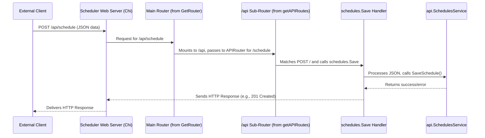

# Chapter 2: HTTP API Endpoints & Routing

In [Chapter 1: Schedule Blueprint (`schedule.Schedule`)](01_schedule_blueprint___schedule_schedule___.md), we learned all about the `schedule.Schedule` – our "recipe card" for tasks. We know how to define *what* task to run, *when* to run it, and *how often*. But a recipe card sitting on your desk doesn't cook the meal by itself, right? We need a way to submit this recipe to the chef – our `scheduler` system!

This chapter is all about how we communicate with the `scheduler` from the outside world. How do we send it new schedules? How do we ask it to delete old ones? How do we check if it's feeling okay? The answer is through **HTTP API Endpoints & Routing**.

## The Problem: Talking to the Scheduler

Imagine our `scheduler` is a busy office building. Inside, different departments handle various tasks: one department files new schedules, another shreds old ones, and yet another gives updates on the building's operational status.

If you, as an external client (another program, or even a person using a tool), want to interact with this office, you can't just barge in and shout your request. You need:
1.  **Specific Entrances (Endpoints):** You need to know which "door" or "reception desk" to go to for your specific request. Want to submit a new schedule? That's one desk. Want to check the system's health? That's a different desk.
2.  **A Directory Service (Routing):** Once you're at the right entrance, someone needs to guide your request to the correct internal department (the code that actually handles it).

HTTP API Endpoints and Routing provide exactly this structure for web-based services like our `scheduler`.

## Meet the "Reception Desks": HTTP API Endpoints

An **HTTP API Endpoint** is like a specific web address (URL) that you can send requests to. Each endpoint is designed for a particular type of interaction. "API" stands for Application Programming Interface – it's a way for programs to talk to each other. "HTTP" is the protocol used on the web, the same one your browser uses to fetch web pages.

Think of these endpoints as different reception desks in our "scheduler office building":
*   A desk for "New Schedule Submissions"
*   A desk for "Schedule Deletions"
*   A desk for "System Status Inquiries"

When you send a request to one of these endpoints, you're essentially handing over a form (your data, like a `schedule.Schedule` in JSON format) or asking a question.

## The "Directory Service": Routing

Once your request arrives at the `scheduler`'s main entrance (its network address), **Routing** is the process that looks at the specific endpoint you targeted (e.g., `/api/schedule` or `/api/status`) and the type of request you made (e.g., "create," "delete," "get information") and directs it to the correct "internal department" – a specific piece of code called a **handler function**.

In our `scheduler` project, a function named `routes.GetRouter` is responsible for setting up all these "reception desks" and the "directory service." It acts like the building manager who decides where each desk goes and trains the receptionists (the router itself) to send visitors to the right place.

## The "Office Workers": Handler Functions

A **handler function** is a piece of Go code that actually does the work for a specific request. For example:
*   If you send a request to create a new schedule, the router will pass it to a handler like `schedules.Save`. This handler takes the schedule details you sent, validates them, and then probably uses the [Schedule Management Service (`api.SchedulesService`)](03_schedule_management_service___api_schedulesservice___.md) to store it.
*   If you ask for the system status, the router directs your request to a handler like `status.Get`. This handler checks the system's health, perhaps using the [Application Health Monitor (`api.InstrumentationService`)](10_application_health_monitor___api_instrumentationservice___.md), and sends back a response.

These handlers often interact with a central coordinator called the [Core Services Aggregator (`api.Core`)](04_core_services_aggregator___api_core___.md) to get access to various services they need to fulfill the request.

## Our Main Use Case: Submitting a Daily Report Schedule

Let's say you've crafted a `schedule.Schedule` blueprint for a daily report, as we discussed in Chapter 1. Now, you want to submit it to the `scheduler`. You'll do this by sending an HTTP request to a specific endpoint.

**HTTP Methods: The Verbs of Your Request**

When you make an HTTP request, you also specify an "HTTP method." These are like verbs telling the server what kind of action you want to perform on the resource identified by the endpoint. Common ones include:
*   `POST`: Typically used to create a new resource (e.g., submit a new schedule).
*   `GET`: Used to retrieve information (e.g., get system status, get a list of schedules).
*   `DELETE`: Used to remove a resource (e.g., delete an existing schedule).
*   `PUT`: Often used to update an existing resource entirely.

**Submitting Our Schedule (POST Request)**

To submit your new daily report schedule, you would typically send an HTTP `POST` request to an endpoint like `/api/schedule`. The body of this request would contain your `schedule.Schedule` blueprint, usually in JSON format.

Let's imagine our schedule blueprint in JSON (simplified):
```json
// This is what we want to send
{
  "key": "daily-sales-report",
  "localExecutionTime": "2024-08-01T09:00:00Z",
  "timeLocation": "UTC",
  "recurrence": { "scheme": "DAILY" },
  "targetTopic": "reports-generation",
  "targetPayload": "eyJhY3Rpb24iOiAiZ2VuZXJhdGVfc2FsZXNfcmVwb3J0In0=" // Base64 for: {"action": "generate_sales_report"}
}
```

You could use a command-line tool like `curl` to send this (don't worry if `curl` is new to you, it's just a way to send HTTP requests):
```bash
# Example using curl (conceptual)
curl -X POST \
  http://your-scheduler-address/api/schedule \
  -H "Content-Type: application/json" \
  -d '{
        "key": "daily-sales-report",
        "localExecutionTime": "2024-08-01T09:00:00Z",
        "timeLocation": "UTC",
        "recurrence": { "scheme": "DAILY" },
        "targetTopic": "reports-generation",
        "targetPayload": "eyJhY3Rpb24iOiAiZ2VuZXJhdGVfc2FsZXNfcmVwb3J0In0="
      }'
```
*   `-X POST`: Specifies the HTTP POST method.
*   `http://your-scheduler-address/api/schedule`: The endpoint URL.
*   `-H "Content-Type: application/json"`: Tells the server we're sending JSON data.
*   `-d '{...}'`: The actual JSON data (our schedule blueprint).

**What Happens Next?**
1.  The `scheduler`'s web server receives this `POST` request to `/api/schedule`.
2.  The router sees `/api/schedule` and `POST`, and knows to send it to the `schedules.Save` handler function.
3.  The `schedules.Save` handler (which we'll see more of later) reads the JSON data, converts it into a `schedule.Schedule` Go object, and then uses the [Schedule Management Service (`api.SchedulesService`)](03_schedule_management_service___api_schedulesservice___.md) to save it.
4.  If successful, the `scheduler` sends back an HTTP response, typically `201 Created`.

**Other Common Interactions:**

*   **Deleting a Schedule (DELETE Request):**
    To delete the "daily-sales-report" schedule, you might send:
    ```bash
    curl -X DELETE http://your-scheduler-address/api/schedule/daily-sales-report
    ```
    The router would direct this to the `schedules.Delete` handler. If successful, you'd get a `200 OK` response.

*   **Checking System Status (GET Request):**
    To check if the scheduler is running and its version:
    ```bash
    curl -X GET http://your-scheduler-address/api/status
    ```
    The router would send this to the `status.Get` handler. You might get back a JSON response like:
    ```json
    {
      "status": 200,
      "time": "2024-07-15T12:30:00Z",
      "version": "v1.2.3"
    }
    ```

## Under the Hood: How Routing Works in `scheduler`

Let's peek into how the `scheduler` sets up these routes. The main file to look at is `api/cmd/scheduler-api/routes/routes.go`.

**1. The Main Router Setup (`GetRouter`)**

The `GetRouter` function is the starting point. It creates a new router object (using a popular Go library called `chi`) and configures it.

```go
// Simplified from: api/cmd/scheduler-api/routes/routes.go
package routes

import (
	// ... other imports
	"github.com/go-chi/chi"
	"github.com/nestoca/scheduler/api"
	// ... handlers like status, schedules
)

func GetRouter(c *api.Core) chi.Router {
	r := chi.NewRouter() // Creates a new router instance

	// r.Use(...) // Applies some standard "middleware" (explained below)
	r.Mount("/api", getAPIRoutes(c)) // All our API routes will start with /api

	return r
}
```
*   `chi.NewRouter()`: This creates the main router object.
*   `r.Mount("/api", getAPIRoutes(c))`: This is key! It says that any URL starting with `/api` should be handled by another set of routes defined in the `getAPIRoutes` function. The `c *api.Core` is an instance of the [Core Services Aggregator (`api.Core`)](04_core_services_aggregator___api_core___.md), which provides access to all necessary services for the handlers.

The `r.Use(...)` line (commented for brevity above, but present in the actual code) sets up "middleware." Middleware are like checkpoints that every request passes through before reaching the final handler. They can do things like log the request, check for authentication, or add information to the request.

**2. Defining API-Specific Routes (`getAPIRoutes`)**

The `getAPIRoutes` function defines the actual endpoints like `/status`, `/schedule`, etc.

```go
// Simplified from: api/cmd/scheduler-api/routes/routes.go
func getAPIRoutes(core *api.Core) http.Handler {
	r := chi.NewRouter() // A sub-router for /api paths

	// Status endpoint
	r.Get("/status", status.Get(core.HealthService))

	// Schedule endpoints
	r.Route("/schedule", func(r chi.Router) {
		// POST /api/schedule -> creates a new schedule
		r.Post("/", schedules.Save(core.SchedulesService))
		// DELETE /api/schedule/{key} -> deletes a schedule by its key
		r.Delete("/{key}", schedules.Delete(core.SchedulesService))
		// ... other schedule-related routes
	})
	
	// ... routes for instrumentation/metrics ...

	return r
}
```
Let's break this down:
*   `r.Get("/status", status.Get(core.HealthService))`:
    *   This says: If a `GET` request comes to `/api/status` (remember the `/api` prefix from `Mount`), then call the handler function returned by `status.Get(...)`.
    *   `status.Get` is a function (from `api/cmd/scheduler-api/status/get.go`) that takes the `core.HealthService` (an instance of [Application Health Monitor (`api.InstrumentationService`)](10_application_health_monitor___api_instrumentationservice___.md)) and returns the actual handler function.
*   `r.Route("/schedule", func(r chi.Router) { ... })`:
    *   This groups all routes that start with `/api/schedule`.
    *   `r.Post("/", schedules.Save(core.SchedulesService))`: For a `POST` request to `/api/schedule/` (the `/` here means the base of the `/schedule` route), use the handler from `schedules.Save(...)`. This handler gets the [Schedule Management Service (`api.SchedulesService`)](03_schedule_management_service___api_schedulesservice___.md) from the `core`.
    *   `r.Delete("/{key}", schedules.Delete(core.SchedulesService))`: For a `DELETE` request to `/api/schedule/some-schedule-key`, use the `schedules.Delete(...)` handler. The `{key}` part is a placeholder for the actual schedule key (e.g., "daily-sales-report"). The handler can extract this key.

**A Visual Flow of a Request:**

Here's how a request to create a schedule flows through the system:



**3. Inside a Handler Function (e.g., `schedules.Save`)**

Let's look at a simplified piece of a handler function, like `schedules.Save` from `api/cmd/scheduler-api/schedules/save.go`:

```go
// Simplified from: api/cmd/scheduler-api/schedules/save.go
package schedules

// ... imports ...
import (
	"github.com/nestoca/scheduler/api"
	"github.com/nestoca/scheduler/api/pkg/schedule"
)

func Save(s api.SchedulesService) http.HandlerFunc {
	return func(w http.ResponseWriter, r *http.Request) {
		// 1. Get the schedule data from the request body
		scheduleBlueprint, err := getSchedule(r) 
		if err != nil {
			// ... send an error response ...
			return
		}

		// 2. Use the SchedulesService to save it
		err = s.SaveSchedule(r.Context(), scheduleBlueprint)
		if err != nil {
			// ... send an error response ...
			return
		}

		// 3. Send a success response
		w.WriteHeader(http.StatusCreated) // 201 Created
	}
}
```
*   `Save(s api.SchedulesService)`: This function takes the [Schedule Management Service (`api.SchedulesService`)](03_schedule_management_service___api_schedulesservice___.md) as an argument (provided by `core.SchedulesService` when setting up the route) and returns the actual handler function `func(w http.ResponseWriter, r *http.Request)`.
*   `getSchedule(r)`: This helper function (also in `save.go`, shown in Chapter 1 context) reads the JSON data from the request body (`r.Body`) and decodes it into a `*schedule.Schedule` object.
*   `s.SaveSchedule(...)`: This is where the handler calls the actual service responsible for saving the schedule.
*   `w.WriteHeader(http.StatusCreated)`: If everything is successful, it sends back an HTTP status code `201 Created` to the client.

The other handlers like `schedules.Delete` or `status.Get` follow similar patterns: they receive the request, potentially extract information from it (like a URL parameter or request body), call the appropriate service from the `api.Core`, and then formulate an HTTP response.

## Conclusion

You've now seen how the `scheduler` opens its doors to the outside world! **HTTP API Endpoints** are the specific "reception desks" for different types of requests (create schedule, delete schedule, get status). **Routing** is the "directory service" (`routes.GetRouter` and `chi` router) that ensures your request reaches the correct **handler function** (like `schedules.Save` or `status.Get`). These handlers then do the actual work, often by using services provided by the [Core Services Aggregator (`api.Core`)](04_core_services_aggregator___api_core___.md).

So, we can create a `schedule.Schedule` blueprint (Chapter 1) and we know how to send it to the scheduler via an HTTP API (this chapter). But what exactly happens when `schedules.Save` calls `s.SaveSchedule()`? What does the [Schedule Management Service (`api.SchedulesService`)](03_schedule_management_service___api_schedulesservice___.md) do with our blueprint? That's what we'll explore in the next chapter!

---

Generated by [AI Codebase Knowledge Builder](https://github.com/The-Pocket/Tutorial-Codebase-Knowledge)