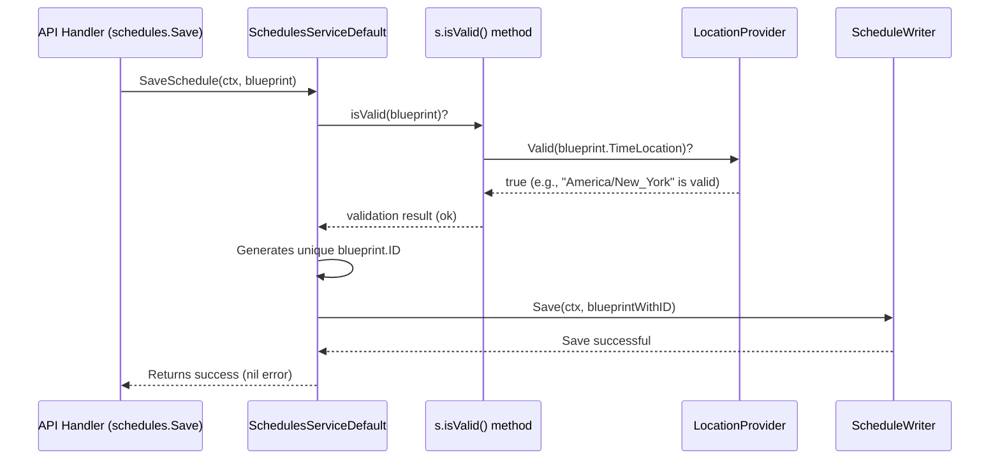

# Chapter 3: Schedule Management Service (`api.SchedulesService`)

In [Chapter 2: HTTP API Endpoints & Routing](02_http_api_endpoints___routing_.md), we saw how our `scheduler` system receives requests from the outside world, like a request to create a new schedule. We learned that an API handler function, such as `schedules.Save`, takes the schedule details and calls a service to do the actual work of saving it. That service is the star of this chapter: the **`api.SchedulesService`**.

So, you've handed your `schedule.Schedule` blueprint (your "recipe card" from [Chapter 1: Schedule Blueprint (`schedule.Schedule`)](01_schedule_blueprint___schedule_schedule___.md)) to the API. What happens next? How does the system ensure this blueprint is valid and store it safely?

## The Problem: Managing the "Recipe Card Collection"

Imagine our `scheduler` system is a grand library for task recipes (our `schedule.Schedule` blueprints). We can't just throw new recipes onto a pile! We need a librarian or an administrator to:
1.  **Check the recipe:** Is it complete? Does it make sense (e.g., is the cooking time in a valid timezone)?
2.  **File it properly:** Store it in a way that it can be found and used later.
3.  **Update it if needed:** If we change a recipe, the old one needs to be updated.
4.  **Remove it when done:** If a recipe is no longer needed, it should be discarded.
5.  **Help find future cooking times:** If it's a recipe that's made regularly (a recurring schedule), help figure out when it's next due.

The `api.SchedulesService` is this librarian or administrator for all our "schedule blueprints." It's the central point for managing the lifecycle of these `schedule.Schedule` objects.

## Meet the `api.SchedulesService`: Your Schedule Librarian

The `api.SchedulesService` is a core component in our `scheduler`. It's an interface (a contract defining what it can do) and has a default implementation (`SchedulesServiceDefault`). Its main job is to provide a clean way for other parts of the system (especially the API handlers) to manage schedule definitions.

Here are its key responsibilities:

*   **Creating New Schedules:** When you want to add a new task, you give the `schedule.Schedule` blueprint to this service.
*   **Validating Schedule Details:** Before saving, it checks if the blueprint is valid. For example:
    *   Is the `TimeLocation` (timezone) a real, recognized timezone?
    *   If it's a recurring schedule (e.g., "monthly"), are the recurrence rules sensible (e.g., does it specify which day of the month)?
    It uses a helper called a `LocationProvider` to check timezones.
*   **Saving Schedules Persistently:** Once validated, it saves the schedule. "Persistently" means it's stored somewhere durable, so it won't be lost if the program restarts. This is typically done via another helper called a `ScheduleWriter`, which often writes to a reliable system like Kafka (more on this in [Chapter 6: Kafka-based Schedule Persistence and Communication](06_kafka_based_schedule_persistence_and_communication_.md)).
*   **Calculating Next Execution Times:** For a given schedule (especially a recurring one), it can calculate when it should run next.
*   **Deleting Schedules:** When a task is no longer needed, this service handles its removal.

Let's look at the `SchedulesService` interface defined in `api/schedules.go`:
```go
// Simplified from: api/schedules.go
package api

import (
	"context"
	"time"
	"github.com/nestoca/scheduler/api/pkg/schedule"
)

// SchedulesService abstract representation of a SchedulesService
type SchedulesService interface {
	SaveSchedule(ctx context.Context, schedule *schedule.Schedule) error
	CalculateNextLocalExecutionTime(ctx context.Context, currentSchedule *schedule.Schedule) (time.Time, error)
	DeleteSchedule(ctx context.Context, scheduleKey string) error
	// Shutdown() error // For gracefully stopping the service
}
```
This tells us that any `SchedulesService` must know how to `SaveSchedule`, `CalculateNextLocalExecutionTime`, and `DeleteSchedule`.

## How the API Uses the `SchedulesService`

Let's revisit our use case from Chapter 2: submitting a new schedule for a daily report. The API handler `schedules.Save` receives the JSON blueprint, converts it into a `schedule.Schedule` object, and then calls `SchedulesService.SaveSchedule()`.

Here's a simplified snippet of how `schedules.Save` (from `api/cmd/scheduler-api/schedules/save.go`) uses the service:
```go
// Simplified from api/cmd/scheduler-api/schedules/save.go
package schedules

import (
	"net/http"
	"github.com/nestoca/scheduler/api" // Where SchedulesService lives
	"github.com/nestoca/scheduler/api/pkg/schedule"
)

func Save(s api.SchedulesService) http.HandlerFunc {
	return func(w http.ResponseWriter, r *http.Request) {
		// 1. Get the schedule blueprint from the HTTP request
		scheduleBlueprint, err := getSchedule(r) // Decodes JSON to schedule.Schedule
		if err != nil { /* handle error */ return }

		// 2. Use the SchedulesService to save it!
		err = s.SaveSchedule(r.Context(), scheduleBlueprint)
		if err != nil { /* handle error */ return }

		// 3. Send a success response (e.g., HTTP 201 Created)
		w.WriteHeader(http.StatusCreated)
	}
}
```
The `s` variable here is an instance of `api.SchedulesService`. The handler doesn't need to know *how* the schedule is validated or stored; it just trusts the `SchedulesService` to do it correctly.

**Input to `SaveSchedule`:**
*   `r.Context()`: A context object (common in Go for managing request lifecycles, timeouts, etc.).
*   `scheduleBlueprint`: The `*schedule.Schedule` object we want to save.

**What happens (at a high level) when `s.SaveSchedule()` is called:**
1.  The `SchedulesService` validates the `scheduleBlueprint`.
2.  If valid, it assigns a unique ID to this version of the schedule.
3.  It then tells its `ScheduleWriter` to persist this blueprint.
4.  If any step fails (e.g., validation error, storage error), it returns an error. Otherwise, it returns `nil` (success).

## Under the Hood: A Look Inside `SchedulesServiceDefault`

The `scheduler` project provides `SchedulesServiceDefault` as the standard implementation of the `SchedulesService` interface. It's defined in `api/schedules.go`.

**1. What's Inside `SchedulesServiceDefault`?**

It needs two helpers to do its job:
*   `writer ScheduleWriter`: This is responsible for actually writing the schedule data to a persistent store (like Kafka).
*   `locationProvider LocationProvider`: This helps validate timezones.

```go
// Simplified from: api/schedules.go
package api

// ... (ScheduleWriter and LocationProvider interfaces are also in this file) ...

// SchedulesServiceDefault default implementation of SchedulesService
type SchedulesServiceDefault struct {
	writer           ScheduleWriter
	locationProvider LocationProvider
}

// NewSchedulesService creates a new SchedulesService
func NewSchedulesService(writer ScheduleWriter, locationProvider LocationProvider) *SchedulesServiceDefault {
	// ... (nil check) ...
	return &SchedulesServiceDefault{
		writer:           writer,
		locationProvider: locationProvider,
	}
}
```
When an instance of `SchedulesServiceDefault` is created (usually when the application starts, as part of setting up the [Core Services Aggregator (`api.Core`)](04_core_services_aggregator___api_core___.md)), it's given these two helpers.

**2. The `SaveSchedule` Method in Detail**

Let's follow the journey of a `schedule.Schedule` blueprint when `SaveSchedule` is called:



Now, let's look at the simplified code for `SaveSchedule` in `api/schedules.go`:
```go
// Simplified from: api/schedules.go
func (s SchedulesServiceDefault) SaveSchedule(ctx context.Context, sch *schedule.Schedule) error {
	if sch == nil {
		return fmt.Errorf("supplied no schedule")
	}

	// Step 1: Validate the schedule details
	if err := s.isValid(sch); err != nil {
		return err // If invalid, return the error
	}

	// Step 2: Generate a unique ID for this schedule instance.
	// This ID might change for each run of a recurring schedule.
	sch.ID = uuid.NewString() 

	// Step 3: Pass it to the writer to be saved.
	return s.writer.Save(ctx, sch)
}
```
*   First, it checks if the schedule (`sch`) itself is provided.
*   Then, it calls its own private method `s.isValid(sch)` to perform validation.
*   If valid, it assigns a new unique `ID` (using `uuid.NewString()`) to the `sch.ID` field. This `ID` is an internal system identifier, different from the `Key` you provide. For recurring schedules, each future instance might get a new `ID`.
*   Finally, it calls `s.writer.Save(ctx, sch)`, delegating the actual storage to the `ScheduleWriter`.

**3. The Validation Logic: `isValid()`**

The `isValid()` method (also in `SchedulesServiceDefault`) is crucial. It checks various parts of the `schedule.Schedule`.

```go
// Simplified from: api/schedules.go
func (s SchedulesServiceDefault) isValid(sched *schedule.Schedule) error {
	// Check 1: Is the TimeLocation valid?
	if !s.locationProvider.Valid(sched.TimeLocation) {
		return e.NewInvalidParameters("schedule time location") // Error if not valid
	}

	if sched.Recurrence == nil {
		return nil // No recurrence to validate
	}

	// Check 2: Are recurrence rules valid? (Example for monthly)
	switch sched.Recurrence.Scheme {
	case schedule.RecurrenceMonthly:
		dayStr, found := sched.Recurrence.Metadata[schedule.RecurrenceMetadataMonthlyPaymentDay]
		if !found {
			return e.NewInvalidParameters("missing day for monthly recurrence")
		}
		// ... (code to check if dayStr is a valid number 1-31) ...
	// ... (other cases for RecurrenceDaily, RecurrenceWeekly, etc.) ...
	case schedule.RecurrenceCustom:
		// ... (check if custom delta is a valid duration string) ...
	}
	return nil // All good!
}
```
*   It uses the `s.locationProvider` to confirm that `sched.TimeLocation` (e.g., `"America/New_York"`) is a recognized timezone.
*   If `sched.Recurrence` is set, it checks the `Scheme` and `Metadata`. For example, if `Scheme` is `schedule.RecurrenceMonthly`, it expects `Metadata` to contain `schedule.RecurrenceMetadataMonthlyPaymentDay` with a valid day number (1-31).

If any check fails, `isValid()` returns an error, which then `SaveSchedule` returns to the API handler, and ultimately back to the client who tried to save the schedule.

**4. Deleting a Schedule: `DeleteSchedule()`**

Deleting is simpler. The API handler (`schedules.Delete`) gets the `scheduleKey` from the URL, and calls `SchedulesService.DeleteSchedule()`:

```go
// Simplified from: api/schedules.go
func (s SchedulesServiceDefault) DeleteSchedule(ctx context.Context, scheduleKey string) error {
	if len(scheduleKey) == 0 {
		return fmt.Errorf("supplied invalid key")
	}
	// Just pass the key to the writer to handle deletion.
	return s.writer.Delete(ctx, scheduleKey)
}
```
The `SchedulesService` mostly just delegates this to its `ScheduleWriter`. The `ScheduleWriter` would then be responsible for telling the persistence layer (e.g., Kafka) to mark this schedule (identified by its `scheduleKey`) for deletion.

**5. Calculating Next Execution Time: `CalculateNextLocalExecutionTime()`**

This method helps figure out when a schedule should run next, based on its current definition and recurrence rules.

```go
// Simplified from: api/schedules.go
func (s SchedulesServiceDefault) CalculateNextLocalExecutionTime(
    ctx context.Context, 
    currentSchedule *schedule.Schedule,
) (time.Time, error) {
	if currentSchedule == nil { /* error */ }
	if err := s.isValid(currentSchedule); err != nil { /* error */ } // Must be valid

	// Delegates to a dedicated calculator function
	return scheduler.CalculateNextLocalExecutionTime(ctx, currentSchedule, s.locationProvider)
}
```
*   It first validates the provided `currentSchedule`.
*   Then, it calls a specialized function `scheduler.CalculateNextLocalExecutionTime` (from `api/pkg/scheduler/calculator.go`, not shown here). This function contains the logic to interpret `LocalExecutionTime`, `TimeLocation`, and `Recurrence` rules, using the `locationProvider` for timezone calculations, to determine the next run time. This is very useful for recurring tasks.

## Why is the `SchedulesService` So Important?

*   **Centralized Logic:** It keeps all the rules about what makes a schedule valid and how to manage its lifecycle in one place.
*   **Abstraction:** API Handlers (and other potential clients of this service) don't need to worry about the nitty-gritty details of validation or how schedules are stored. They just talk to the `SchedulesService`.
*   **Testability:** Because it's a well-defined interface, it's easier to test this component in isolation.
*   **Flexibility:** If we wanted to change *how* schedules are stored (e.g., move from Kafka to a database), we'd primarily change the `ScheduleWriter` implementation. The `SchedulesService` interface and its interaction with API handlers could remain largely the same.

## Conclusion

The `api.SchedulesService` acts as the diligent administrator for all our `schedule.Schedule` blueprints. It's responsible for receiving new schedule definitions, validating them thoroughly (using helpers like a `LocationProvider`), ensuring they are saved persistently (via a `ScheduleWriter`), calculating their future execution times, and handling their deletion. This service ensures that our "library of recipes" is well-organized, correct, and ready for the [Task Execution Engine (`api.Scheduler` / `scheduler.DefaultScheduler`)](05_task_execution_engine___api_scheduler_____scheduler_defaultscheduler___.md) to use.

We've seen that the `SchedulesService` relies on helpers like `ScheduleWriter` and `LocationProvider`. But how does it get these helpers? And how do the API handlers from Chapter 2 get an instance of `SchedulesService`? This is where the [Core Services Aggregator (`api.Core`)](04_core_services_aggregator___api_core___.md) comes in, which we'll explore in the next chapter!

---

Generated by [AI Codebase Knowledge Builder](https://github.com/The-Pocket/Tutorial-Codebase-Knowledge)