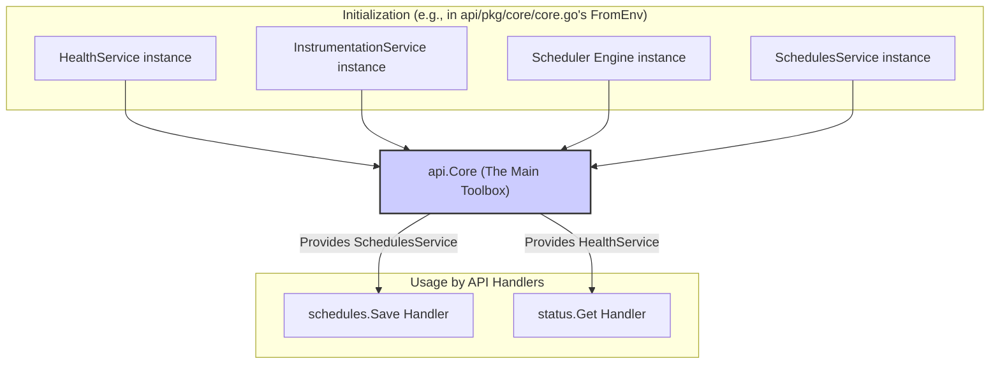

# Chapter 4: Core Services Aggregator (`api.Core`)

In [Chapter 3: Schedule Management Service (`api.SchedulesService`)](03_schedule_management_service___api_schedulesservice___.md), we learned how the `SchedulesService` acts as a librarian for our schedule blueprints. We saw it validates and saves schedules, often relying on other helpers. You might have wondered: how do different parts of our `scheduler` application, like the API handlers from [Chapter 2: HTTP API Endpoints & Routing](02_http_api_endpoints___routing_.md), get access to the `SchedulesService` or other essential tools? This chapter introduces the component that makes this possible: the **`api.Core`**.

## The Problem: Accessing Specialized Tools

Imagine you're building a complex machine, like a car. The car has many specialized systems: an engine, brakes, a steering system, and an electronics system for the radio and dashboard. For the car to work, these systems need to be connected and accessible. The driver (representing a user or another part of our application) needs a way to use these systems without knowing every single detail of how they are built. They just need a steering wheel, an accelerator pedal, and a brake pedal.

In our `scheduler` application, we have several specialized "tools" or "services":
*   The `SchedulesService` to manage schedule definitions.
*   A `HealthService` to check if the application is running correctly.
*   An `InstrumentationService` to gather performance metrics.
*   The `Scheduler` engine itself, which actually runs the tasks.

How can components like our API handlers easily get a reference to the specific service they need? If every handler had to create these services itself, it would be messy and inefficient. We need a central place that holds all these tools and makes them available.

## Meet `api.Core`: The Scheduler's Main Toolbox

Think of `api.Core` as the main **toolbox** or **control panel** for our `scheduler` application. It's a Go struct that doesn't perform tasks directly. Instead, its primary job is to **hold and provide access to all the essential, specialized services** needed for the application to operate.

It's the central hub that connects various parts of the application. Components like the web API handlers (which we met in Chapter 2) can ask `api.Core` for the specific service they need to perform their job.

Here's a look at the structure of `api.Core` from `api/core.go`:
```go
// Simplified from: api/core.go
package api

// Core represents the entrypoint to call the business logic.
type Core struct {
	HealthService          HealthService
	InstrumentationService InstrumentationService
	Scheduler              Scheduler
	SchedulesService       SchedulesService
}
```
As you can see, an `api.Core` object simply contains fields for each of the major services:
*   `HealthService`: Used for health checkups (e.g., for the `/api/status` endpoint).
*   `InstrumentationService`: Used for collecting performance metrics ([Application Health Monitor (`api.InstrumentationService`)](10_application_health_monitor___api_instrumentationservice___.md)).
*   `Scheduler`: This is the actual [Task Execution Engine (`api.Scheduler` / `scheduler.DefaultScheduler`)](05_task_execution_engine___api_scheduler_____scheduler_defaultscheduler___.md) responsible for running scheduled tasks.
*   `SchedulesService`: The [Schedule Management Service (`api.SchedulesService`)](03_schedule_management_service___api_schedulesservice___.md) we learned about in the previous chapter.

## How `api.Core` is Used: Connecting Handlers to Services

Let's revisit how our API routes and handlers are set up. In [Chapter 2: HTTP API Endpoints & Routing](02_http_api_endpoints___routing_.md), we saw a function `routes.GetRouter` that configures all the API endpoints. This function receives an `*api.Core` instance.

Here's a simplified snippet from `api/cmd/scheduler-api/routes/routes.go` showing how `api.Core` is used:
```go
// Simplified from: api/cmd/scheduler-api/routes/routes.go
package routes

import (
	"github.com/go-chi/chi"
	"github.com/nestoca/scheduler/api" // Where api.Core is defined
	// ... imports for status, schedules handlers
)

// GetRouter configures routes using a core.
func GetRouter(c *api.Core) chi.Router {
	r := chi.NewRouter()
	// ...
	r.Mount("/api", getAPIRoutes(c)) // Pass core to API route setup
	return r
}
```
The `GetRouter` function takes `c *api.Core` as an argument. This `c` is our "toolbox." It's then passed to `getAPIRoutes`.

Inside `getAPIRoutes`, the individual services from the `api.Core` instance are given to the specific handlers that need them:
```go
// Simplified from: api/cmd/scheduler-api/routes/routes.go
func getAPIRoutes(core *api.Core) http.Handler {
	r := chi.NewRouter()

	// Status endpoint needs the HealthService
	r.Get("/status", status.Get(core.HealthService))

	// Schedule endpoints need the SchedulesService
	r.Route("/schedule", func(r chi.Router) {
		r.Post("/", schedules.Save(core.SchedulesService))
		r.Delete("/{key}", schedules.Delete(core.SchedulesService))
		// ... other schedule routes ...
	})
	
	return r
}
```
Look closely:
*   `status.Get(core.HealthService)`: The `status.Get` handler function is created and given `core.HealthService` (the `HealthService` tool from our `api.Core` toolbox).
*   `schedules.Save(core.SchedulesService)`: The `schedules.Save` handler function is given `core.SchedulesService` (the `SchedulesService` tool from the toolbox).

This way, the `schedules.Save` handler doesn't need to know how to create or find a `SchedulesService`; it's simply handed one. The `api.Core` acts as a central provider.

## Under the Hood: Creating and Populating `api.Core`

So, where does this `api.Core` instance come from? How is the toolbox filled with its tools?

Typically, the `api.Core` instance is created once when the application starts up. There's a special function, `FromEnv()`, located in `api/pkg/core/core.go`, that is responsible for building all the necessary services and then packaging them into an `api.Core` struct.

**A Visual Analogy:**

Imagine a workshop preparing for a big project.
1.  First, specialized tools are forged or assembled (this is like `FromEnv()` creating each service like `HealthService`, `SchedulesService`, etc.).
2.  Then, all these tools are placed into a central toolbox (`api.Core`).
3.  When a worker (an API handler) needs a tool, they get it from this central toolbox.



**The `FromEnv()` Function (Highly Simplified)**

The `FromEnv()` function in `api/pkg/core/core.go` does a lot of work to initialize each service. This often involves reading configuration from environment variables (hence "FromEnv"), setting up connections to things like Kafka (which we'll see in [Chapter 6: Kafka-based Schedule Persistence and Communication](06_kafka_based_schedule_persistence_and_communication_.md)), and more.

For our purposes, the most important part is the end, where it assembles the `api.Core` struct:

```go
// Highly simplified concept from: api/pkg/core/core.go
package core

import (
	"github.com/nestoca/scheduler/api"
	// ... many other imports for creating actual services ...
)

// FromEnv creates the default instances of all services.
func FromEnv() *api.Core {
	// 1. Create HealthService instance (details omitted)
	healthSvc := api.NewHealthService() 

	// 2. Create InstrumentationService instance (details omitted)
	metricsStore := instrumentation.NewMetricsDataStore() // Example helper
	instrumentationSvc := api.NewInstrumentationService(metricsStore)

	// 3. Create SchedulesService instance (details omitted)
	//    This involves creating a ScheduleWriter, LocationProvider, etc.
	//    scheduleProducer := kafkaschedules.NewScheduleProducer(...)
	//    locationProvider := location.NewCachedProvider()
	//    schedulesSvc := api.NewSchedulesService(scheduleProducer, locationProvider)
	var schedulesSvc api.SchedulesService // Placeholder for actual creation
	// ... (actual complex creation of schedulesSvc here) ...


	// 4. Create Scheduler engine instance (details omitted)
	//    This involves creating stores, post-processors, DLQs, etc.
	//    store := scheduler.NewDailyScheduleConsumer(...)
	//    postProcessor := scheduler.NewSchedulePostProcessor(...)
	//    dlq := scheduler.NewDeadLetterQueue(...)
	//    actor := scheduler.NewConcurrentScheduleActor(...)
	//    schedulerEngine := scheduler.NewScheduler(store, postProcessor, dlq, actor)
	var schedulerEngine api.Scheduler // Placeholder for actual creation
	// ... (actual complex creation of schedulerEngine here) ...


	// 5. Assemble and return the api.Core struct
	return &api.Core{
		HealthService:          healthSvc,
		InstrumentationService: instrumentationSvc,
		Scheduler:              schedulerEngine, // The main scheduling engine
		SchedulesService:       schedulesSvc,    // Our schedule manager
	}
}
```
**Important:** The snippet above is *heavily* simplified. The actual `FromEnv()` function is much more complex because creating each service (like `SchedulesService` or `Scheduler`) involves setting up its own dependencies. For example, creating `SchedulesService` requires providing it with a `ScheduleWriter` and a `LocationProvider`, as we saw in Chapter 3.

The key takeaway is that `FromEnv()` acts as a "factory" that produces a fully populated `api.Core` instance. This instance is then typically passed to the parts of the application that need to set up routes or initialize other components. In our `scheduler-api` command, `main.go` would call `core.FromEnv()` and then pass the result to `routes.GetRouter()`.

## Why is `api.Core` Important?

The `api.Core` aggregator plays a vital role:

1.  **Centralization:** It provides a single, well-defined place to get access to all core application services. If you need a service, you know where to look.
2.  **Dependency Management (Simplified):** It helps manage dependencies. Components like API handlers don't need to create services themselves; they receive them. This is a form of "dependency injection."
3.  **Organization:** It keeps the application startup and wiring of components cleaner. The `main` function (or equivalent startup code) creates the `api.Core`, and then passes this single "toolbox" around, rather than passing many individual services.
4.  **Testability:** When testing a component that uses services (e.g., an API handler), it's easier to provide "mock" or "fake" versions of these services if they are accessed through a central point like `api.Core`. You could create an `api.Core` with mock services for your tests.

## Conclusion

You've now learned about `api.Core`, the central toolbox or control panel of our `scheduler` application. It doesn't do the heavy lifting itself, but it holds and provides convenient access to all the specialized services that do, such as `SchedulesService`, `HealthService`, `InstrumentationService`, and the `Scheduler` engine. This makes it easy for components like API handlers to get the tools they need and helps keep our application organized.

One of the most important tools held within `api.Core` is the `Scheduler` itself – the engine that actually picks up schedules and makes sure tasks get triggered. In the next chapter, we'll dive into this crucial component: [Chapter 5: Task Execution Engine (`api.Scheduler` / `scheduler.DefaultScheduler`)](05_task_execution_engine___api_scheduler_____scheduler_defaultscheduler___.md).

---

Generated by [AI Codebase Knowledge Builder](https://github.com/The-Pocket/Tutorial-Codebase-Knowledge)