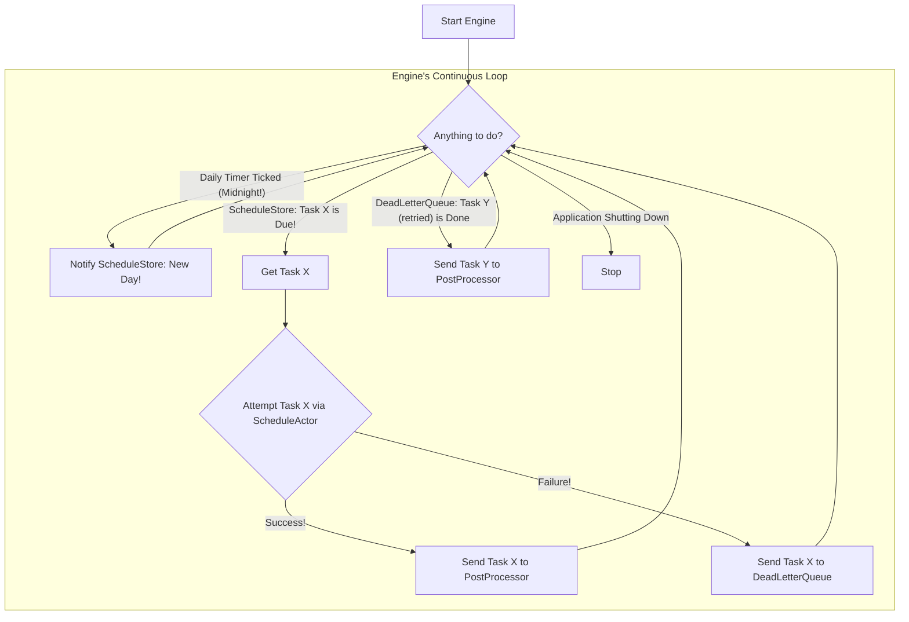

# Chapter 5: Task Execution Engine (`api.Scheduler` / `scheduler.DefaultScheduler`)

In [Chapter 4: Core Services Aggregator (`api.Core`)](04_core_services_aggregator___api_core___.md), we saw how `api.Core` acts as a central toolbox, holding all the essential services our `scheduler` application needs. One of the most critical tools in that toolbox is the `api.Scheduler` itself. This chapter focuses on this "engine" of our system, specifically its main implementation, `scheduler.DefaultScheduler`.

So far, we've learned how to:
1.  Define a task with its timing: a `schedule.Schedule` blueprint ([Chapter 1: Schedule Blueprint (`schedule.Schedule`)](01_schedule_blueprint___schedule_schedule___.md)).
2.  Send this blueprint to our system: via [HTTP API Endpoints & Routing](02_http_api_endpoints___routing_.md).
3.  Have the blueprint validated and prepared for storage: by the [Schedule Management Service (`api.SchedulesService`)](03_schedule_management_service___api_schedulesservice___.md).

But how does a stored blueprint actually cause something to happen at the scheduled time? Who is constantly watching the clock and saying, "Aha! Time to run this task!"? That's the job of the Task Execution Engine.

## The Problem: Making Scheduled Tasks Actually Happen

Imagine you've written down a list of chores on a to-do list with specific times for each:
*   "Take out trash - Tuesday 8:00 AM"
*   "Water plants - Wednesday 6:00 PM"
*   "Send weekly email summary - Friday 9:00 AM, repeat weekly"

Having this list is great, but it doesn't do the chores. You need someone (or something) to:
1.  Constantly check the list and the current time.
2.  When a chore's time arrives, actually *start* doing it.
3.  If it's a repeating chore, remember to schedule it for the next time.
4.  If something goes wrong while doing a chore, decide what to do (e.g., try again later).

In our `scheduler` project, the **Task Execution Engine (`api.Scheduler` / `scheduler.DefaultScheduler`)** is this diligent worker. It's like an automated conductor for an orchestra, ensuring each instrument plays at the right time, or the engine of a car, providing the power to move forward.

## Meet the `api.Scheduler` and `scheduler.DefaultScheduler`

The `api.Scheduler` is an interface (a contract) defining what a task execution engine should be able to do. It's very simple:

```go
// Simplified from: api/scheduler.go
package api

import "context"

// Scheduler Abstract representation of a scheduler
type Scheduler interface {
	StartBlocking(ctx context.Context) // Starts the engine's main work loop
	// ForceGenerationChange(ctx context.Context) // A way to signal internal changes
}
```
*   `StartBlocking(ctx context.Context)`: This is the main command to tell the engine to begin its work of monitoring and executing tasks. It's "blocking" because it will typically run continuously until the application is told to stop.

The primary implementation of this interface is `scheduler.DefaultScheduler` (found in `api/pkg/scheduler/scheduler.go`). This is the component that does the actual work.

**What `scheduler.DefaultScheduler` Does:**

Think of `scheduler.DefaultScheduler` as the main coordinator on the factory floor. It doesn't build everything itself, but it directs other specialized workers and machines:

1.  **Monitors for Due Tasks:** It continuously asks a component called the [Daily Task Organizer (`scheduler.DailyScheduleStoreDefault`)](07_daily_task_organizer___scheduler_dailyschedulestoredefault___.md) (let's call it the `ScheduleStore` for short): "Are there any tasks due *right now*?"
2.  **Triggers Task Execution:** When the `ScheduleStore` says, "Yes, this task is due!", the `DefaultScheduler` tells another component (an `ScheduleActor`) to actually perform the task. "Performing the task" in our system usually means sending a message (the `TargetPayload` from our `schedule.Schedule` blueprint) to a specific Kafka topic (the `TargetTopic`).
3.  **Handles Post-Execution:** After a task is attempted:
    *   If it was successful, the `DefaultScheduler` passes the task to the [Post-Execution Handler (`scheduler.SchedulePostProcessorDefault`)](08_post_execution_handler___scheduler_schedulepostprocessordefault___.md). This handler figures out if the task needs to be rescheduled (if it's recurring) or if it's done for good.
    *   If it failed, the `DefaultScheduler` sends it to the [Failed Task Retry Queue (`scheduler.DeadLetterQueueDefault`)](09_failed_task_retry_queue___scheduler_deadletterqueuedefault___.md). This queue will try to run the task again later.
4.  **Keeps Time:** It also manages a daily timer to know when a new day starts, which is important for the `ScheduleStore` to load tasks for the current day.

It ensures tasks are picked up and processed in a timely and orderly manner.

## How the Engine Starts and Works

When our `scheduler` application starts up (as seen in `api/cmd/scheduler-api/api.go`), it gets an instance of the `api.Scheduler` from the `api.Core` toolbox and tells it to start:

```go
// Simplified from: api/cmd/scheduler-api/api.go
func main() {
	// ... setup code ...
	c := core.FromEnv() // Gets the api.Core toolbox

	// ...
	// Run Scheduler async
	log.L.Infof("[START] starting scheduler")
	startScheduler(ctx, c.Scheduler, &wg, schedulerError) // c.Scheduler is our engine
	// ...
}

func startScheduler(ctx context.Context, s api.Scheduler, /*...*/) {
	// ...
	go func() { // Runs in a separate goroutine (like a parallel thread)
		// ...
		s.StartBlocking(ctx) // This kicks off the engine!
	}()
}
```
The `s.StartBlocking(ctx)` call is what makes the `scheduler.DefaultScheduler` spring to life.

**The Main Work Loop (Conceptual):**

Once started, `scheduler.DefaultScheduler` enters a continuous loop. Here's a simplified idea of what it's doing:


This loop continues, making the scheduler responsive to due tasks, daily rollovers, and retry completions.

## Under the Hood: The `scheduler.DefaultScheduler` and its Helpers

The `scheduler.DefaultScheduler` doesn't work in isolation. It relies on several helper components, which are given to it when it's created. This creation happens inside `api/pkg/core/core.go` as part of the `FromEnv()` function we saw in [Chapter 4: Core Services Aggregator (`api.Core`)](04_core_services_aggregator___api_core___.md).

```go
// Simplified from: api/pkg/core/core.go
// Inside FromEnv() function:

// ... (store, postProcessor, dlq, actor are created first) ...
// store is an instance of scheduler.ScheduleStore
// postProcessor is an instance of scheduler.Queue (for post-processing)
// dlq is an instance of scheduler.Queue (for dead letters)
// actor is an instance of scheduler.ScheduleActor

schedulerEngine := scheduler.NewScheduler(store, postProcessor, dlq, actor)

// This schedulerEngine is then put into api.Core
// return &api.Core{
//     Scheduler: schedulerEngine,
//     // ... other services
// }
```

The `scheduler.NewScheduler` function (which creates our `DefaultScheduler`) takes these key helpers:
*   `store ScheduleStore`: This is the [Daily Task Organizer (`scheduler.DailyScheduleStoreDefault`)](07_daily_task_organizer___scheduler_dailyschedulestoredefault___.md). The engine asks it for the next task that's due.
*   `schedulePostProcessor Queue`: This is the [Post-Execution Handler (`scheduler.SchedulePostProcessorDefault`)](08_post_execution_handler___scheduler_schedulepostprocessordefault___.md). Tasks go here after successful execution (or after exhausting retries) for final processing like rescheduling or deletion.
*   `deadLetterQueue Queue`: This is the [Failed Task Retry Queue (`scheduler.DeadLetterQueueDefault`)](09_failed_task_retry_queue___scheduler_deadletterqueuedefault___.md). Tasks that fail execution are sent here to be retried later.
*   `actor ScheduleActor`: This component is responsible for the actual "execution" of the task – typically, sending a Kafka message.

Let's look at a very simplified structure of `DefaultScheduler` and its `StartBlocking` method from `api/pkg/scheduler/scheduler.go`:

```go
// Simplified from: api/pkg/scheduler/scheduler.go
package scheduler

// ... (imports for context, sync, time, schedule package) ...

type DefaultScheduler struct {
	store                 ScheduleStore // Gets due tasks
	deadLetterQueue       Queue         // Handles failed tasks for retry
	schedulePostProcessor Queue         // Handles tasks after execution/retry
	actor                 ScheduleActor // Performs the task action

	dailyTimer *time.Timer // For midnight signal
	// ... (mutex for synchronization) ...
}

func NewScheduler(store ScheduleStore, schedulePostProcessor Queue, deadLetterQueue Queue, actor ScheduleActor) *DefaultScheduler {
	// ... (nil checks) ...
	return &DefaultScheduler{
		store:                 store,
		deadLetterQueue:       deadLetterQueue,
		schedulePostProcessor: schedulePostProcessor,
		actor:                 actor,
		dailyTimer:            time.NewTimer(calculateTimeToMidnight()), // Sets timer for next midnight
	}
}
```
This shows how the `DefaultScheduler` holds onto its helpers. The `dailyTimer` is set to fire at the next UTC midnight.

Now, a simplified look at the `StartBlocking` method:
```go
// Simplified from: api/pkg/scheduler/scheduler.go
func (s *DefaultScheduler) StartBlocking(ctx context.Context) {
	// ... (logging, waitgroup setup for graceful shutdown) ...

	// Start helper components (they run their own loops)
	// s.startLongLastingProcess(ctx, &wg, s.store.RunBlocking)
	// s.startLongLastingProcess(ctx, &wg, s.deadLetterQueue.RunBlocking)
	// s.startLongLastingProcess(ctx, &wg, s.schedulePostProcessor.RunBlocking)

readLoop:
	for {
		select { // Waits for any of these events
		case <-s.dailyTimer.C:
			// Midnight reached!
			s.store.MidnightReachedChannel() <- struct{}{} // Signal the store
			s.dailyTimer.Reset(calculateTimeToMidnight())  // Reset timer for next midnight

		case sched := <-s.store.ProduceChannel(): // A task is due from the store!
			log.G(ctx).Tracef("[SCHED] Task %s ready", sched.Key)
			err := s.actor.IssueSchedule(ctx, sched) // Tell actor to run it
			if err == nil {
				// Success! Send to post-processor for cleanup/rescheduling
				s.schedulePostProcessor.PushChannel() <- sched
			} else {
				// Failure! Send to dead-letter queue for retry
				s.deadLetterQueue.PushChannel() <- sched
			}

		case sched := <-s.deadLetterQueue.ExitChannel(): // Task finished retries (success or fail)
			// Send to post-processor for final handling
			s.schedulePostProcessor.PushChannel() <- sched
		
		case err := <-s.store.ConsumeErrorChannel(): // An error from the store
			log.G(ctx).Errorf("[SCHED] Store error: %s", err.Error())

		case <-ctx.Done(): // Application is shutting down
			break readLoop // Exit the loop
		}
	}
}
```

**Let's break down the `select` block, the heart of the engine:**

1.  `case <-s.dailyTimer.C:`
    *   The `dailyTimer` (which was set to fire at midnight) has gone off.
    *   The engine sends a signal to the `s.store.MidnightReachedChannel()`. This tells the [Daily Task Organizer (`scheduler.DailyScheduleStoreDefault`)](07_daily_task_organizer___scheduler_dailyschedulestoredefault___.md) that it's a new day, so it might need to load schedules for this new day.
    *   The `dailyTimer` is reset for the *next* midnight.

2.  `case sched := <-s.store.ProduceChannel():`
    *   The engine receives a `schedule.Schedule` (named `sched`) from the `s.store.ProduceChannel()`. This means the [Daily Task Organizer (`scheduler.DailyScheduleStoreDefault`)](07_daily_task_organizer___scheduler_dailyschedulestoredefault___.md) has determined this task is due *right now*.
    *   It calls `s.actor.IssueSchedule(ctx, sched)`. The `ScheduleActor` attempts to "issue" the task (e.g., send its payload to a Kafka topic).
    *   If `IssueSchedule` returns no error (`err == nil`), the task was successfully issued. It's then sent to the `s.schedulePostProcessor.PushChannel()`. The [Post-Execution Handler (`scheduler.SchedulePostProcessorDefault`)](08_post_execution_handler___scheduler_schedulepostprocessordefault___.md) will take care of it (e.g., if it's a daily task, it will calculate the next run time and save a new schedule instance for tomorrow).
    *   If `IssueSchedule` returns an error, the task failed. It's sent to the `s.deadLetterQueue.PushChannel()`. The [Failed Task Retry Queue (`scheduler.DeadLetterQueueDefault`)](09_failed_task_retry_queue___scheduler_deadletterqueuedefault___.md) will try to run it again later.

3.  `case sched := <-s.deadLetterQueue.ExitChannel():`
    *   A task has "exited" the [Failed Task Retry Queue (`scheduler.DeadLetterQueueDefault`)](09_failed_task_retry_queue___scheduler_deadletterqueuedefault___.md). This means the DLQ has finished its retry attempts for this task (either it eventually succeeded, or it reached the maximum number of retries).
    *   This task is then sent to the `s.schedulePostProcessor.PushChannel()` for final processing, just like a task that succeeded on its first try. The post-processor will handle its removal or logging as appropriate.

4.  `case err := <-s.store.ConsumeErrorChannel():`
    *   If the [Daily Task Organizer (`scheduler.DailyScheduleStoreDefault`)](07_daily_task_organizer___scheduler_dailyschedulestoredefault___.md) has a problem (e.g., trouble reading from its data source like Kafka), it can send an error here. The engine logs this error.

5.  `case <-ctx.Done():`
    *   The `context` (`ctx`) has been "canceled." This is the signal for the application to shut down gracefully.
    *   The `break readLoop` statement exits the `for` loop, and the `StartBlocking` method will eventually return, stopping the engine.

**A Visual Summary of Interactions:**

Here's how `DefaultScheduler` coordinates with its main helpers for a typical task lifecycle:

```mermaid
sequenceDiagram
    participant Store as ScheduleStore
    participant Engine as DefaultScheduler
    participant Actor as ScheduleActor
    participant PostProc as SchedulePostProcessor
    participant DLQ as DeadLetterQueue

    Store->>Engine: Task `S` is due! (via ProduceChannel)
    Engine->>Actor: Issue Task `S`
    alt Task S succeeds
        Actor-->>Engine: Success!
        Engine->>PostProc: Handle Task `S` (via PushChannel)
    else Task S fails
        Actor-->>Engine: Failed!
        Engine->>DLQ: Retry Task `S` (via PushChannel)
        DLQ-->>Engine: Task `S` finished retries (via ExitChannel)
        Engine->>PostProc: Handle Task `S` (via PushChannel)
    end
```

## Why is the Task Execution Engine So Important?

*   **The Heartbeat:** It's the component that makes the scheduler "live." Without it, schedules would just be data sitting in storage.
*   **Orchestration:** It masterfully coordinates several other specialized components (`ScheduleStore`, `ScheduleActor`, `SchedulePostProcessor`, `DeadLetterQueue`) to ensure the entire lifecycle of a task is managed.
*   **Reliability:** By integrating with a dead-letter queue, it provides a mechanism for retrying failed tasks, increasing the overall reliability of the system.
*   **Timeliness:** Its core loop, driven by signals from the `ScheduleStore` and internal timers, ensures tasks are picked up when they are due.

## Conclusion

The Task Execution Engine, primarily `scheduler.DefaultScheduler`, is the automated conductor at the heart of our `scheduler` project. It doesn't do everything itself but intelligently uses other components:
*   It gets due tasks from the [Daily Task Organizer (`scheduler.DailyScheduleStoreDefault`)](07_daily_task_organizer___scheduler_dailyschedulestoredefault___.md).
*   It uses a `ScheduleActor` to trigger the task's action (like sending a message).
*   It sends successfully completed (or fully retried) tasks to the [Post-Execution Handler (`scheduler.SchedulePostProcessorDefault`)](08_post_execution_handler___scheduler_schedulepostprocessordefault___.md) for cleanup and rescheduling.
*   It sends failed tasks to the [Failed Task Retry Queue (`scheduler.DeadLetterQueueDefault`)](09_failed_task_retry_queue___scheduler_deadletterqueuedefault___.md).

This orchestration ensures that the "recipe cards" (`schedule.Schedule` blueprints) we create are actually acted upon at the right times.

Now, we've seen tasks being "issued" or "produced," often involving Kafka. But how exactly are schedules stored in Kafka, and how do components like the `ScheduleStore` or `ScheduleActor` use Kafka to communicate? That's what we'll explore in the next chapter: [Chapter 6: Kafka-based Schedule Persistence and Communication](06_kafka_based_schedule_persistence_and_communication_.md).

---

Generated by [AI Codebase Knowledge Builder](https://github.com/The-Pocket/Tutorial-Codebase-Knowledge)