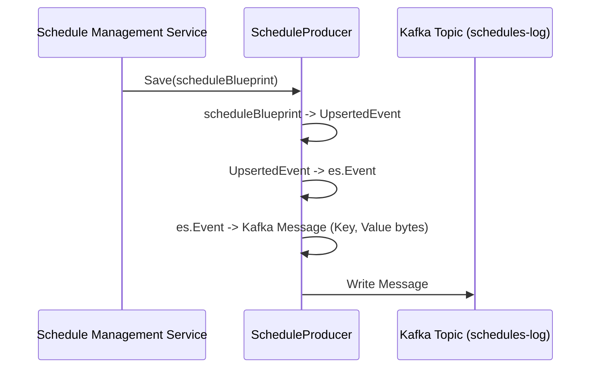
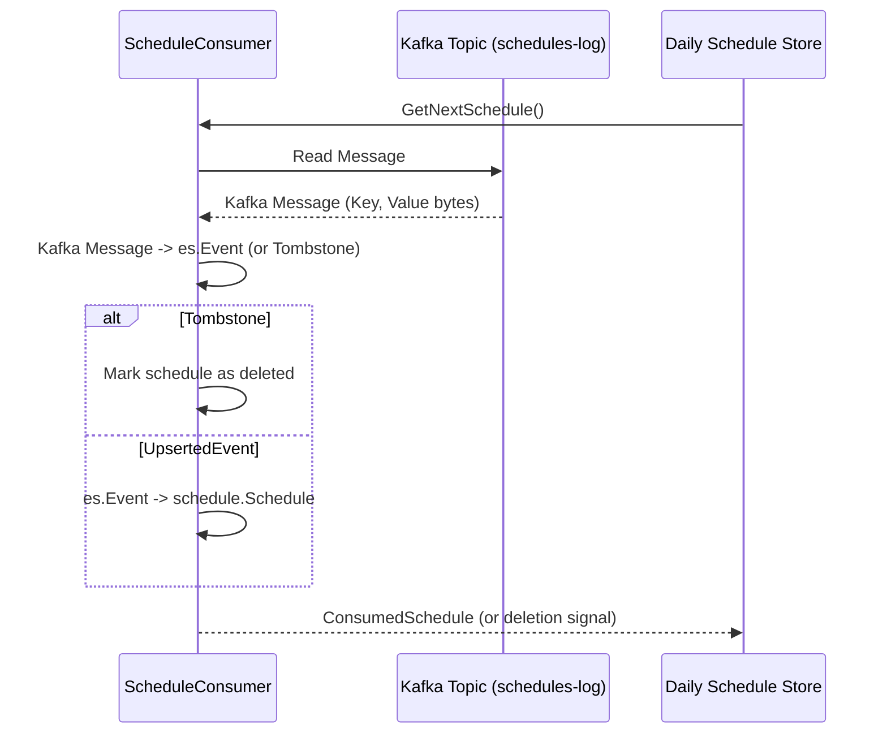

# Chapter 6: Kafka-based Schedule Persistence and Communication

Welcome to Chapter 6! In [Chapter 5: Task Execution Engine (`api.Scheduler` / `scheduler.DefaultScheduler`)](05_task_execution_engine___api_scheduler_____scheduler_defaultscheduler___.md), we saw how the scheduler engine orchestrates task execution. We learned that it gets tasks from a `ScheduleStore` and uses an `ScheduleActor` to issue tasks. But where does the `ScheduleStore` get its information? And how do different parts of our `scheduler` system stay in sync about all the schedule definitions, especially if components restart or if we have multiple instances running?

This chapter dives into **Apache Kafka**, the technology our `scheduler` uses as a robust "event bus" (a way to send messages) and a "persistence layer" (a way to store data reliably) for schedules.

## The Problem: Reliable Schedule Storage and Announcements

Imagine our `scheduler` system is a busy train station.
*   **New Schedules are like New Train Routes:** When someone wants to schedule a new task (like our daily report from [Chapter 1: Schedule Blueprint (`schedule.Schedule`)](01_schedule_blueprint___schedule_schedule___.md)), it's like announcing a new train route.
*   **Updates are Timetable Changes:** If a schedule changes, it's like a train timetable update.
*   **Deletions are Route Cancellations:** If a schedule is removed, the route is cancelled.

We need a central, super-reliable announcement system and archive for all these train routes and timetable changes.
1.  **Durability:** Announcements must not be lost, even if the station master (one part of our program) goes home and a new one comes on duty (the program restarts).
2.  **Broadcasting:** All relevant departments in the station (different parts of our `scheduler` system) need to hear these announcements. For example, the department that displays "upcoming trains" (our [Daily Task Organizer (`scheduler.DailyScheduleStoreDefault`)](07_daily_task_organizer___scheduler_dailyschedulestoredefault___.md)) needs to know about new routes and changes.
3.  **Order:** It's helpful if announcements are kept in order.

This is where Kafka comes in.

## Meet Kafka: Our Reliable, Distributed Postal Service

Think of **Kafka** as a highly reliable, distributed postal service combined with a public archive of all sent mail.
*   **Topics:** A Kafka **topic** is like a specific mailbox or a public bulletin board dedicated to a certain kind of information. For our schedules, we'll have a topic, let's call it `schedules-log`.
*   **Messages:** Each piece of information (a new schedule, an update, a deletion) is sent as a **message** (a "letter" or a "bulletin post") to this topic.
*   **Producers:** Components that *write* or *send* messages to a Kafka topic are called **Producers**. They are like people dropping letters into the mailbox.
*   **Consumers:** Components that *read* or *receive* messages from a Kafka topic are called **Consumers**. They are like people checking the mailbox or reading the bulletin board.

Kafka ensures that once a message is successfully sent to a topic, it's stored durably (it won't get lost easily) and can be read by any authorized consumer, even much later.

## Key Players in Our Kafka-Powered Scheduler

In our `scheduler` project, we have specific components that interact with Kafka:

1.  **`ScheduleProducer` (The Mail Sender for Schedules)**
    *   Found in: `api/pkg/schedule/kafka/producer.go`
    *   This component is responsible for writing schedule information to our Kafka `schedules-log` topic.
    *   When you create a new schedule (via the API and the [Schedule Management Service (`api.SchedulesService`)](03_schedule_management_service___api_schedulesservice___.md)), the `SchedulesService` uses the `ScheduleProducer` to send a "new schedule" message to Kafka.
    *   It also sends messages for updates or deletions.

2.  **`ScheduleConsumer` (The Mail Reader for Schedules)**
    *   Found in: `api/pkg/schedule/kafka/consumer.go`
    *   This component reads the schedule messages from the Kafka `schedules-log` topic.
    *   Other parts of the system, like the [Daily Task Organizer (`scheduler.DailyScheduleStoreDefault`)](07_daily_task_organizer___scheduler_dailyschedulestoredefault___.md) (which we'll see in the next chapter), use a `ScheduleConsumer` to learn about all active schedules.

3.  **Kafka Messages: The "Letters"**
    *   A message typically contains the details of a `schedule.Schedule` blueprint, packaged in a standard format.
    *   Our system converts the `schedule.Schedule` object into a byte array (a sequence of 0s and 1s) to send it over Kafka, and then converts it back when reading. This is called **serialization** and **deserialization**.

4.  **"Tombstones": Marking Schedules for Deletion**
    *   How do you delete something from Kafka? You can't just erase a message that's already written.
    *   Instead, Kafka uses a special kind of message called a **tombstone**. If we want to delete a schedule with `Key: "daily-report"`, the `ScheduleProducer` sends a message to Kafka with `Key: "daily-report"` but with an empty (or `nil`) body.
    *   Consumers see this "tombstone" message and understand that the schedule identified by `"daily-report"` should be considered deleted.

5.  **`ConsumerGroup`: A Team of Mail Sorters**
    *   Kafka allows multiple `ScheduleConsumer` instances to work together as a **Consumer Group**.
    *   Imagine having several mail sorters for the same `schedules-log` mailbox. Kafka cleverly divides the work among them.
    *   **Benefits:**
        *   **Scalability:** If there are many messages, more consumers can share the load.
        *   **Fault Tolerance:** If one consumer in the group crashes, another one can take over its work, ensuring no messages are missed.
    *   The `api/pkg/schedule/kafka/client/consumer_group.go` file provides the underlying mechanism for this, ensuring our `ScheduleConsumer` can be part of such a resilient team.

## How It Works: Storing and Communicating Schedules

Let's trace how a schedule makes its way into Kafka and how it's read.

### 1. Saving a New Schedule (or Updating an Existing One)

When you submit a new `schedule.Schedule` blueprint (or update an existing one):
1.  The [Schedule Management Service (`api.SchedulesService`)](03_schedule_management_service___api_schedulesservice___.md) validates it.
2.  It then calls `Save()` on our `ScheduleProducer`.

Here's a simplified look at what `ScheduleProducer.Save()` does:
```go
// Simplified from: api/pkg/schedule/kafka/producer.go
func (p *ScheduleProducer) Save(ctx context.Context, s *schedule.Schedule) error {
	// 1. Convert our schedule (s) into an "UpsertedEvent" format.
	//    "Upserted" means it's for an insert (new) or update.
	upsertData := toUpsertScheduleEvent(s) // From producer.go

	// 2. Package this data into a standard "event" envelope.
	//    This helps track changes systematically.
	event := &es.Event{
		ID:      uuid.New(), // A unique ID for this event itself
		Type:    /* type like "schedule.UpsertedEvent" */,
		Data:    upsertData, // Our schedule details
		Created: time.Now().UTC(),
	}

	// 3. Create the actual Kafka "letter" (message).
	//    s.Key (e.g., "daily-report") is the address label for this schedule.
	//    p.dataStoreTopic is the main mailbox for all schedule definitions.
	//    p.eventHandler helps turn the `event` into bytes.
	kafkaMessage, err := ToDataStoreMessage(s.Key, event, p.eventHandler, p.dataStoreTopic) // From converter.go
	if err != nil { return err }

	// 4. Send the letter! The `p.producer` is a generic Kafka message writer.
	return p.producer.WriteMessage(ctx, *kafkaMessage)
}
```
*   `toUpsertScheduleEvent(s)`: This helper (also in `producer.go`) takes your `schedule.Schedule` object and converts some fields (like `LocalExecutionTime`) into strings, preparing it for storage.
    ```go
    // Simplified from: api/pkg/schedule/kafka/producer.go
    func toUpsertScheduleEvent(s *schedule.Schedule) *schedule.UpsertedEvent {
        return &schedule.UpsertedEvent{ // This is defined in schedule/events.go
            ID:                 s.ID,    // The schedule's system-generated ID
            LocalExecutionTime: s.LocalExecutionTime.Format("2006-01-02 15:04"), // Time as string
            TimeLocation:       s.TimeLocation,
            Recurrence:         s.Recurrence,
            TargetTopic:        s.TargetTopic,
            TargetKey:          s.TargetKey,
            TargetPayload:      s.TargetPayload,
        }
    }
    ```
*   `ToDataStoreMessage(...)`: This helper from `converter.go` actually creates the Kafka message structure. The `eventHandler` turns the `event` struct into bytes (`[]byte`).
    ```go
    // Simplified from: api/pkg/schedule/kafka/converter.go
    func ToDataStoreMessage(key string, event *es.Event, eventHandler es.EventHandler, dataStoreTopic string) (*kafkaclient.Message, error) {
        // Convert the 'event' (which contains our schedule data) into bytes
        eventBytes, /* schemaID */ _, err := eventHandler.Marshal(event) 
        if err != nil { return nil, err }
        // ... (schema ID might be added to eventBytes for versioning) ...

        return &kafkaclient.Message{
            Topic: dataStoreTopic, // The mailbox name
            Key:   key,            // The schedule's unique name (e.g., "daily-report")
            Value: eventBytes,     // The schedule data, as bytes
        }, nil
    }
    ```

**Visualized: Saving a Schedule**

Now, the schedule blueprint is safely stored in Kafka!

### 2. Deleting a Schedule

When `ScheduleProducer.Delete()` is called:
```go
// Simplified from: api/pkg/schedule/kafka/producer.go
func (p *ScheduleProducer) Delete(ctx context.Context, scheduleKey string) error {
	// 1. Create a special "tombstone" message.
	//    It has the scheduleKey, but its Value (body) is nil.
	tombstoneMessage, err := ToDataStoreTombstoneMessage(scheduleKey, p.dataStoreTopic) // From converter.go
	if err != nil { return err }

	// 2. Send this tombstone message to Kafka.
	return p.producer.WriteMessage(ctx, *tombstoneMessage)
}
```
*   `ToDataStoreTombstoneMessage(...)` from `converter.go`:
    ```go
    // Simplified from: api/pkg/schedule/kafka/converter.go
    func ToDataStoreTombstoneMessage(key string, dataStoreTopic string) (*kafkaclient.Message, error) {
        return &kafkaclient.Message{
            Topic: dataStoreTopic,
            Key:   key,   // The schedule's unique name
            Value: nil,   // Empty body signifies a tombstone!
        }, nil
    }
    ```
Kafka and its consumers understand this `nil` value as a "delete" instruction for the given `key`.

### 3. Reading Schedules (The `ScheduleConsumer` in Action)

Components like the [Daily Task Organizer (`scheduler.DailyScheduleStoreDefault`)](07_daily_task_organizer___scheduler_dailyschedulestoredefault___.md) need to get the list of schedules. They use the `ScheduleConsumer`.
```go
// Simplified from: api/pkg/schedule/kafka/consumer.go
func (c *ScheduleConsumer) GetNextSchedule(ctx context.Context) (*schedule.ConsumedSchedule, error) {
	// 1. Read the next raw message from the Kafka topic.
	//    This `c.consumer` is a generic Kafka message reader.
	kafkaMessage, err := c.consumer.ReadFirstAvailableMessageNonBlocking(ctx)
	if err != nil { return nil, err } // e.g., no new messages right now

	// 2. Convert the raw Kafka message back into our schedule event format.
	//    `c.eventHandler` helps decode the message bytes.
	scheduleKey, event, err := FromDataStoreKafkaMessage(kafkaMessage, c.eventHandler) // From converter.go
	if err != nil { return nil, err }

	if event == nil {
		// It's a tombstone! This schedule (identified by scheduleKey) was deleted.
		// Return a special marker for deletion.
		return schedule.NewConsumedSchedule( /* metadata */, &schedule.Schedule{Key: scheduleKey, TargetTopic: schedule.TombstoneIdentifier}), nil
	}

	// 3. If it's not a tombstone, it's an event (e.g., UpsertedEvent).
	//    Extract the schedule data from the event.
	s, err := fromUpsertScheduleEvent(scheduleKey, event.Data.(*schedule.UpsertedEvent)) // From consumer.go
	if err != nil { return nil, err }
	
	return schedule.NewConsumedSchedule( /* metadata */, s), nil
}
```
*   `FromDataStoreKafkaMessage(...)` from `converter.go`:
    ```go
    // Simplified from: api/pkg/schedule/kafka/converter.go
    func FromDataStoreKafkaMessage(message kafkaclient.Message, eventHandler es.EventHandler) (string, *es.Event, error) {
        if message.Value == nil {
            // This is a tombstone message (deletion)!
            return message.Key, nil, nil 
        }

        // ... (schema ID might be removed from message.Value before unmarshalling) ...
        // Convert the bytes back into an `es.Event` struct
        event, err := eventHandler.Unmarshal(message.Value, /* schemaID */)
        if err != nil { return "", nil, err }

        return message.Key, event, nil
    }
    ```
*   `fromUpsertScheduleEvent(...)` from `consumer.go`:
    ```go
    // Simplified from: api/pkg/schedule/kafka/consumer.go
    func fromUpsertScheduleEvent(key string, eventData *schedule.UpsertedEvent) (*schedule.Schedule, error) {
        // Convert string time back to time.Time object
        execTime, _ := time.Parse("2006-01-02 15:04", eventData.LocalExecutionTime)

        return &schedule.Schedule{
            ID:                 eventData.ID,
            LocalExecutionTime: execTime,
            TimeLocation:       eventData.TimeLocation,
            Recurrence:         eventData.Recurrence,
            Key:                key, // The key comes from the Kafka message itself
            TargetTopic:        eventData.TargetTopic,
            TargetKey:          eventData.TargetKey,
            TargetPayload:      eventData.TargetPayload,
        }, nil
    }
    ```

**Visualized: Reading a Schedule**


### 4. Communicating Task Execution (Bonus Kafka Use!)

Kafka isn't just for storing schedule *definitions*. It's also used to send the actual task *payloads* when it's time for a task to run.
The [Task Execution Engine (`api.Scheduler` / `scheduler.DefaultScheduler`)](05_task_execution_engine___api_scheduler_____scheduler_defaultscheduler___.md), through its `ScheduleActor`, uses `ScheduleProducer.IssueOnTargetTopic()`:

```go
// Simplified from: api/pkg/schedule/kafka/producer.go
func (p *ScheduleProducer) IssueOnTargetTopic(ctx context.Context, s *schedule.Schedule) error {
	// 1. Create a Kafka message destined for the schedule's `TargetTopic`.
	//    The body of this message is the schedule's `TargetPayload`.
	targetMessage, err := ToTargetMessage(s) // From converter.go
	if err != nil { return err }

	// 2. Send this "task payload" message.
	//    Another system (or another part of this system) will be listening
	//    on `s.TargetTopic` to actually perform the work.
	return p.producer.WriteMessage(ctx, *targetMessage)
}
```
*   `ToTargetMessage(...)` from `converter.go`:
    ```go
    // Simplified from: api/pkg/schedule/kafka/converter.go
    func ToTargetMessage(s *schedule.Schedule) (*kafkaclient.Message, error) {
        return &kafkaclient.Message{
            Topic: s.TargetTopic,     // The topic specified in the schedule blueprint
            Key:   s.TargetKey,       // The key specified in the schedule blueprint
            Value: s.TargetPayload,   // The actual work data!
            Headers: { /* schedule ID, timestamp, etc. */ },
        }, nil
    }
    ```
This decouples the scheduler (which decides *when* to run) from the worker that actually *does* the task.

## Why Kafka? The Advantages for Our Scheduler

Using Kafka as the backbone for schedule persistence and communication offers several benefits:

*   **Durability & Reliability:** Schedule definitions are safely stored and won't be lost if a component restarts.
*   **Decoupling:** The `ScheduleProducer` doesn't need to know who the `ScheduleConsumers` are, and vice-versa. They only need to agree on the Kafka topic and message format. This makes the system more flexible.
*   **Scalability:** Kafka is designed to handle a high volume of messages and many consumers. If our scheduler gets very busy, Kafka can keep up.
*   **Fault Tolerance:** With consumer groups, if one instance of a `ScheduleConsumer` fails, others can take over, ensuring continuous processing.
*   **Central Log:** The Kafka topic acts as a chronological log of all changes to schedules. This can be useful for auditing or debugging.
*   **Asynchronous Communication:** Components can send messages without waiting for an immediate response, which can improve performance and responsiveness.

## Conclusion

You've now seen how Apache Kafka serves as the reliable "postal service" and "archive" for our `scheduler` system. The `ScheduleProducer` writes schedule information (new tasks, updates, and "tombstone" deletions) as messages to a Kafka topic. The `ScheduleConsumer` (often as part of a resilient `ConsumerGroup`) reads these messages. This ensures that schedule definitions are durably stored and can be processed by different parts of the scheduler system, keeping everything in sync even if components restart or scale out. Kafka is also used to send the actual task payloads to their designated target topics when it's time for execution.

But how does a component like the `ScheduleConsumer` intelligently manage all these schedule messages from Kafka to figure out which tasks are due *today* or *right now*? That's where the [Daily Task Organizer (`scheduler.DailyScheduleStoreDefault`)](07_daily_task_organizer___scheduler_dailyschedulestoredefault___.md) comes in, and we'll explore it in the next chapter!

---

Generated by [AI Codebase Knowledge Builder](https://github.com/The-Pocket/Tutorial-Codebase-Knowledge)