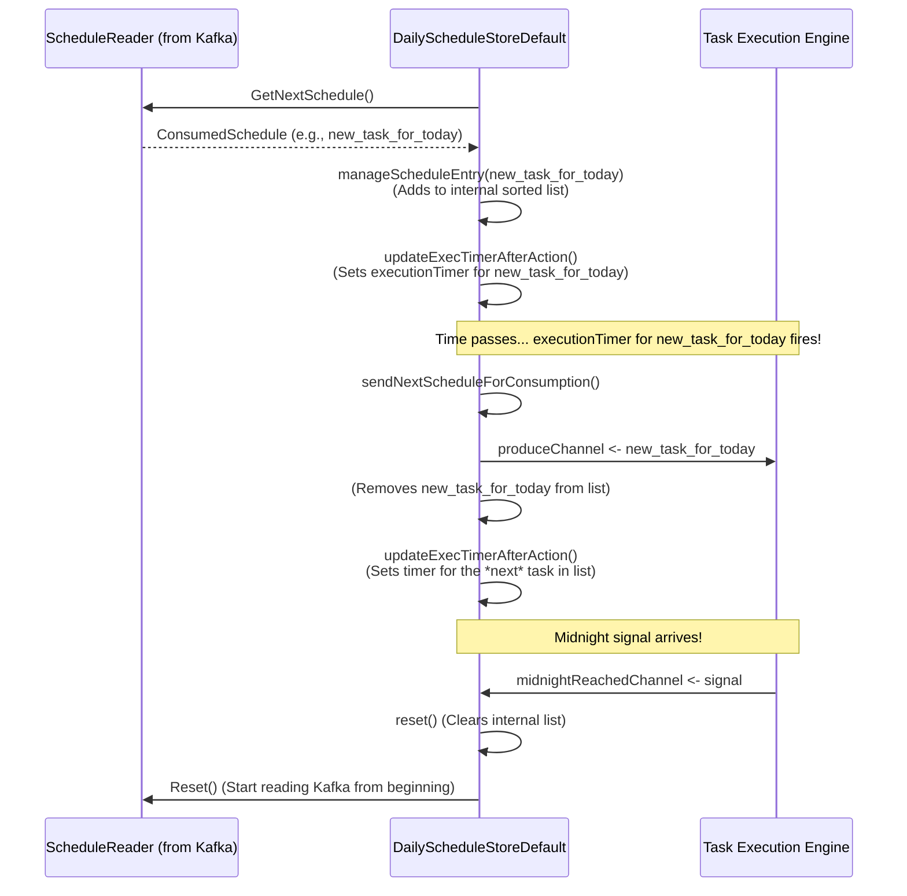

# Chapter 7: Daily Task Organizer (`scheduler.DailyScheduleStoreDefault`)

In [Chapter 6: Kafka-based Schedule Persistence and Communication](06_kafka_based_schedule_persistence_and_communication_.md), we learned how our `scheduler` system uses Kafka as a reliable way to store all the "recipe cards" for tasks (`schedule.Schedule` blueprints). Kafka acts like a giant, permanent library of every schedule we've ever defined. But if the [Task Execution Engine (`api.Scheduler` / `scheduler.DefaultScheduler`)](05_task_execution_engine___api_scheduler_____scheduler_defaultscheduler___.md) had to sift through this entire library every second to see what's due, it would be very inefficient!

This chapter introduces the **`scheduler.DailyScheduleStoreDefault`**, our "Daily Task Organizer." It's like a smart personal assistant who focuses only on what needs to be done *today*.

## The Problem: Focusing on Today's Tasks

Imagine you have a master calendar with all your appointments for the entire year (that's like our Kafka topic). Every morning, you don't want to re-read the whole year's calendar. Instead, you'd probably:
1.  Look at the master calendar once in the morning.
2.  Write down *only today's* appointments on a small notepad, in order of time.
3.  Throughout the day, you just glance at this notepad to see what's next.
4.  At the end of the day (or at midnight), you throw away the notepad and prepare a new one for tomorrow.

The `DailyScheduleStoreDefault` does exactly this for our `scheduler`. It needs to:
*   Efficiently find out which tasks are relevant for the current day.
*   Keep them sorted by time.
*   Make a task available precisely when its scheduled time arrives.
*   Clear out old tasks and prepare for the next day (the "midnight reset").

## Meet the `scheduler.DailyScheduleStoreDefault`: Your Daily Planner

The `scheduler.DailyScheduleStoreDefault` acts like a meticulous daily planner or a short-term memory for the scheduler. Its main job is to take all the schedule definitions it reads from Kafka (via a `ScheduleReader`) and organize a focused list of tasks specifically for the current day.

Here's what it does:

1.  **Reads from Kafka:** It continuously reads schedule messages (new schedules, updates, deletions) from the Kafka topic where all schedules are stored. It uses a helper called a `ScheduleReader` for this.
2.  **Filters for "Today":** It looks at each schedule's execution time and decides if it falls within the current day's active window. This "window" is typically from a little before "now" (e.g., 5 minutes in the past, to catch anything slightly delayed) up to the next midnight.
3.  **Maintains an Ordered List:** It keeps an internal, sorted list of all tasks scheduled for this "today" window, ordered by their execution time. This way, it always knows which task is next.
4.  **Provides Due Tasks:** When a task's scheduled time arrives, this organizer makes it available to the [Task Execution Engine (`api.Scheduler` / `scheduler.DefaultScheduler`)](05_task_execution_engine___api_scheduler_____scheduler_defaultscheduler___.md) for execution. It does this by sending the task on a Go channel (a way for different parts of a Go program to communicate).
5.  **Handles Midnight Reset:** When it's notified that midnight has passed (usually by the Task Execution Engine), it clears its internal list of "today's" tasks and starts building a new list for the new day by re-reading from Kafka.

Think of it as the scheduler's highly efficient secretary, ensuring the boss (the Task Execution Engine) only sees the tasks that are immediately relevant.

## How It Works: A Day in the Life of the Organizer

Let's follow the `DailyScheduleStoreDefault` through its daily routine:

1.  **Morning Prep (Initialization or after Midnight):**
    *   The organizer starts with a blank slate.
    *   It begins reading *all* schedule definitions from the Kafka topic using its `ScheduleReader`. This is like getting the master list of all possible tasks.
    *   For each schedule, it checks if its `LocalExecutionTime` falls within the current day's active window.
    *   If a schedule is for "today," it's added to an internal, sorted list. If it's a deletion message (a "tombstone" from Kafka), the corresponding task is removed.

2.  **During the Day (Continuous Operation):**
    *   The organizer has a timer set for the *very next* task in its sorted list.
    *   When this timer goes off, it means that task is now due!
    *   It takes this due task and sends it to the [Task Execution Engine (`api.Scheduler` / `scheduler.DefaultScheduler`)](05_task_execution_engine___api_scheduler_____scheduler_defaultscheduler___.md) through a special communication pipe called a Go channel (`ProduceChannel`).
    *   The task is then removed from its internal list of "today's" tasks.
    *   The organizer then looks at the *new* next task in its list and resets its timer for that task's execution time.
    *   It also continues to listen for new schedule messages from Kafka. If a new task for "today" is added or an existing one is updated/deleted, the internal list and the timer are adjusted accordingly.

3.  **Midnight! (The Reset):**
    *   The [Task Execution Engine (`api.Scheduler` / `scheduler.DefaultScheduler`)](05_task_execution_engine___api_scheduler_____scheduler_defaultscheduler___.md) sends a signal to the organizer: "It's midnight!"
    *   The organizer stops its current timer, throws away its entire internal list of "today's" tasks.
    *   It then tells its `ScheduleReader` to "reset," meaning it should start reading all schedules from the beginning of the Kafka topic again.
    *   The process then repeats from "Morning Prep" for the new day.

This cycle ensures that the scheduler is always working with an up-to-date, focused list of tasks.

## Under the Hood: A Peek Inside `DailyScheduleStoreDefault`

The `DailyScheduleStoreDefault` is defined in `api/pkg/scheduler/daily_schedule_store.go`. Let's look at its key parts and how it's created.

**1. Key Components Held by `DailyScheduleStoreDefault`:**

When a `DailyScheduleStoreDefault` is created (usually by the `NewDailyScheduleConsumer` function), it's given several helpers:

```go
// Simplified from: api/pkg/scheduler/daily_schedule_store.go
package scheduler

// ... (other imports) ...
import (
	"github.com/nestoca/scheduler/api/pkg/schedule"
)

type DailyScheduleStoreDefault struct {
	executionTimer *storeTimer // A timer for the next due schedule
	scheduleReader ScheduleReader // Reads schedules from Kafka

	// Channel to send due schedules to the Task Execution Engine
	produceChannel chan *schedule.Schedule 
	// Channel to receive the "midnight has arrived" signal
	midnightReachedChannel chan struct{} 
	// Channel to send very old/problematic schedules to the Dead Letter Queue
	deadLetterChannel chan<- *schedule.Schedule 

	// Internal storage for today's schedules, conceptually a sorted list.
	// (Actual implementation uses 'dailySchedules' map for Kafka partitions)
	dailySchedules dailyScheduleStore 
	
	locationProvider LocationProvider // Helps with timezone calculations
	// ... (other fields for metrics, retry logic, etc.) ...
}

// scheduleEntry stores a schedule and its specific execution time.
type scheduleEntry struct {
	schedule           *schedule.Schedule
	localExecutionTime time.Time // The actual time.Time object for execution
	destination        string    // e.g., "OUTPUT" or "DEAD_LETTER_QUEUE"
}

// dailyScheduleStore is a map where keys are Kafka partition IDs and values
// are partitions, each holding a list of scheduleEntry.
// For simplicity, think of this as managing one combined sorted list.
type dailyScheduleStore map[int]*dailyScheduleStorePartition
type dailyScheduleStorePartition struct {
    entries         []scheduleEntry // Sorted list of tasks for this partition for today
    // ... (fields for readiness tracking) ...
}
```
*   `executionTimer`: A smart timer that's always set to fire when the *next* schedule in its internal list is due.
*   `scheduleReader`: An instance of the `ScheduleReader` interface (which we learned about in [Chapter 6: Kafka-based Schedule Persistence and Communication](06_kafka_based_schedule_persistence_and_communication_.md)) to fetch schedule definitions.
*   `produceChannel`: This is how it "produces" or "outputs" due schedules to the [Task Execution Engine (`api.Scheduler` / `scheduler.DefaultScheduler`)](05_task_execution_engine___api_scheduler_____scheduler_defaultscheduler___.md).
*   `midnightReachedChannel`: It listens on this channel for a signal indicating a new day has begun.
*   `deadLetterChannel`: If it encounters a schedule that is too old (e.g., its execution time was hours ago and missed), it sends it here.
*   `dailySchedules`: This is its internal "notepad" for today's tasks. Although the actual structure is a bit more complex to handle Kafka partitions efficiently, you can think of it as maintaining one big, sorted list of `scheduleEntry` items for the current day. Each `scheduleEntry` holds a `schedule.Schedule` and its precisely calculated `localExecutionTime`.
*   `locationProvider`: Essential for correctly interpreting timezones from `schedule.Schedule` blueprints.

**2. The Main Loop (`RunBlocking`)**

The `RunBlocking` method is the heart of the `DailyScheduleStoreDefault`. It runs in a continuous loop, waiting for different events:

```go
// Simplified from: api/pkg/scheduler/daily_schedule_store.go
func (s *DailyScheduleStoreDefault) RunBlocking(ctx context.Context) {
	// ... (setup) ...
	for { // Infinite loop
		select {
		case <-s.executionTimer.C: // Timer for the next schedule fired!
			log.G(ctx).Tracef("[Store] Execution time of schedule reached")
			s.sendNextScheduleForConsumption() // Send it out

		case <-s.midnightReachedChannel: // Midnight signal received!
			log.G(ctx).Tracef("[Store] Midnight boundary reached, we must reset")
			s.reset(s.consumeErrorChannel, true) // Clear list, prepare for new day

		case <-s.readRetryTimer.C: // Time to try reading a new schedule from Kafka
			s.readRetryTimer.Stop() // Stop this timer first
			sched, err := s.scheduleReader.GetNextSchedule(ctx) // Get a schedule
			if err == nil && sched != nil {
				s.manageScheduleEntry(sched, s.consumeErrorChannel) // Process it
			}
			// ... (handle errors, reset readRetryTimer for next read attempt) ...
			
		case <-ctx.Done(): // Application is shutting down
			return // Exit the loop
		// ... (other cases like new generation events) ...
		}
	}
}
```
*   **`<-s.executionTimer.C`**: The `executionTimer` has fired. This means the task at the top of its internal "today's list" is due. The `sendNextScheduleForConsumption()` method is called.
*   **`<-s.midnightReachedChannel`**: A signal arrives telling the store it's midnight. The `reset()` method is called to clear everything for the new day.
*   **`<-s.readRetryTimer.C`**: It's time to attempt to read another message from the `scheduleReader` (which gets data from Kafka). If a schedule is read, `manageScheduleEntry()` is called. This timer ensures the store periodically checks Kafka for new or updated schedules.
*   **`<-ctx.Done()`**: The application is shutting down, so the loop exits.

**3. Processing a Schedule (`manageScheduleEntry`)**

When a new schedule (`sched`) is read from Kafka, `manageScheduleEntry` decides what to do:

```go
// Simplified logic of manageScheduleEntry from api/pkg/scheduler/daily_schedule_store.go
func (s *DailyScheduleStoreDefault) manageScheduleEntry(
    consumedSched *schedule.ConsumedSchedule, 
    errChan chan<- error) {

	actualSchedule := consumedSched.Schedule() // The schedule.Schedule blueprint

	// If this schedule already exists in our list, remove the old one first.
	idx, found := s.findKeyMatch(consumedSched) 
	if found {
		s.deleteEntry(consumedSched.Partition(), idx, actualSchedule)
	}

	// If it's a "tombstone" (delete message), we're done with it.
	if isTombstone(actualSchedule) {
		s.updateExecTimerAfterAction("deletion") // May need to update timer
		return
	}

	// Add the schedule to our internal "today's list" if it's relevant.
	// This involves checking if it's within time boundaries for today.
	// addEntry returns true if the new entry is now the *very next* one.
	if s.addEntry(consumedSched.Partition(), actualSchedule, s.lowBoundaryFunc, s.highBoundaryFunc) {
		s.updateExecTimerAfterAction("insertion") // Update timer if next task changed
	}
}
```
*   It first checks if this schedule (by its `Key`) is already in the internal list. If so, the old version is removed (`deleteEntry`).
*   If the message from Kafka is a "tombstone" (meaning the schedule was deleted), then nothing more is done for this key.
*   Otherwise (`addEntry`), it checks if the schedule's `LocalExecutionTime` is within the "today" window (using `lowBoundaryFunc` and `highBoundaryFunc`).
    *   `lowBoundaryFunc`: Checks if the task is not too old (e.g., not older than 5 minutes ago). If it is, it might be sent to a dead-letter queue.
    *   `highBoundaryFunc`: Checks if the task is before the next midnight.
    *   If it's for today, it's inserted into the internal sorted list.
*   `updateExecTimerAfterAction` is called to potentially reset the `executionTimer` if the newly added/deleted schedule affects which task is next.

**4. Sending a Due Schedule (`sendNextScheduleForConsumption`)**

When `executionTimer` fires:

```go
// Simplified logic of sendNextScheduleForConsumption from api/pkg/scheduler/daily_schedule_store.go
func (s *DailyScheduleStoreDefault) sendNextScheduleForConsumption() {
	// Find the very next schedule from our internal sorted list.
	entry, partition := s.findNextScheduleToExecute()
	if entry == nil { // No tasks left for today or store not ready
		s.executionTimer.Stop() // Stop timer
		return
	}

	// Check if all parts of the store are ready (relevant for Kafka partitions).
	// For simplicity, let's assume it's ready.

	// Send the schedule to the correct channel.
	if entry.destination == scheduleDestinationDLQ { // Too old
		s.deadLetterChannel <- entry.schedule
	} else { // It's due now!
		s.produceChannel <- entry.schedule // Send to Task Execution Engine
	}

	// Remove this task from our internal list.
	s.deleteEntry(partition, 0, entry.schedule) // 0 is the index of the first item

	// Set the timer for the NEW next schedule.
	s.updateExecTimerAfterAction("execution")
}
```
*   It gets the task at the top of its sorted list (`findNextScheduleToExecute`).
*   It sends this `schedule.Schedule` object to the `produceChannel` (if it's not too old). The [Task Execution Engine (`api.Scheduler` / `scheduler.DefaultScheduler`)](05_task_execution_engine___api_scheduler_____scheduler_defaultscheduler___.md) is listening on this channel.
*   It removes the task from its list and then calls `updateExecTimerAfterAction` to set the `executionTimer` for the next task in the list.

**5. Midnight Reset (`reset`)**

When the midnight signal arrives:

```go
// Simplified logic of reset from api/pkg/scheduler/daily_schedule_store.go
func (s *DailyScheduleStoreDefault) reset(errChan chan<- error, forceEndOfGeneration bool) {
	s.executionTimer.Stop() // Stop the main timer
	s.readRetryTimer.Stop() // Stop trying to read from Kafka for a moment

	// Clear the internal list of "today's" schedules.
	clear(s.dailySchedules) // 'clear' is a Go built-in for maps

	// Tell the ScheduleReader to reset its position in Kafka,
	// so it starts reading all schedules from the beginning for the new day.
	if err := s.scheduleReader.Reset(); err != nil {
		errChan <- err // Report error if reset fails
	}
	
	// ... (reset metrics) ...

	// Start the Kafka reading process again for the new day.
	s.readRetryTimer.Reset(s.readRetryStrategy.ResetSequence()) 
}
```
*   It stops all its timers.
*   It completely clears its `dailySchedules` internal storage (the "notepad" is wiped clean).
*   Crucially, it calls `s.scheduleReader.Reset()`. This tells the component reading from Kafka to go back to the beginning of the topic and re-process all schedule definitions, so the store can build a fresh list for the new day.
*   It then restarts its `readRetryTimer` to begin populating its list for the new day.

**Visualizing the Flow:**

Here's a simplified diagram of how the `DailyScheduleStoreDefault` interacts:



## Why is the Daily Task Organizer So Important?

*   **Efficiency:** It prevents the core [Task Execution Engine (`api.Scheduler` / `scheduler.DefaultScheduler`)](05_task_execution_engine___api_scheduler_____scheduler_defaultscheduler___.md) from having to constantly scan *all* schedules in Kafka. It only deals with a small, relevant subset.
*   **Focus:** It maintains a clear, short-term view of tasks due "today," making the system responsive.
*   **Timeliness:** By keeping an ordered list and using a precise timer, it ensures tasks are made available for execution exactly when they are scheduled.
*   **Cleanliness:** The "midnight reset" provides a clean way to roll over to the next day, discarding completed or outdated tasks from the active set and rebuilding with fresh data.

## Conclusion

The `scheduler.DailyScheduleStoreDefault` is like the scheduler's dedicated daily assistant. It diligently reads all potential tasks from Kafka (via `ScheduleReader`), filters them to create an ordered to-do list for just the current day, and hands over tasks to the [Task Execution Engine (`api.Scheduler` / `scheduler.DefaultScheduler`)](05_task_execution_engine___api_scheduler_____scheduler_defaultscheduler___.md) precisely when they are due. Its "midnight reset" ensures each day starts fresh. This component is crucial for keeping the scheduler efficient and focused on what needs to happen *now*.

Now that a task has been picked up by the Daily Task Organizer and sent for execution, what happens *after* the Task Execution Engine attempts to run it? How are recurring tasks rescheduled for their next run? What if a task needs special handling after it's done? That's what we'll explore in the next chapter: [Chapter 8: Post-Execution Handler (`scheduler.SchedulePostProcessorDefault`)](08_post_execution_handler___scheduler_schedulepostprocessordefault___.md).

---

Generated by [AI Codebase Knowledge Builder](https://github.com/The-Pocket/Tutorial-Codebase-Knowledge)