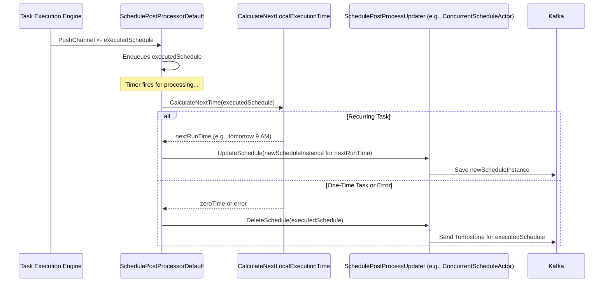

# Chapter 8: Post-Execution Handler (`scheduler.SchedulePostProcessorDefault`)

In [Chapter 7: Daily Task Organizer (`scheduler.DailyScheduleStoreDefault`)](07_daily_task_organizer___scheduler_dailyschedulestoredefault___.md), we saw how our scheduler efficiently manages and provides tasks that are due for execution "today." The [Task Execution Engine (`api.Scheduler` / `scheduler.DefaultScheduler`)](05_task_execution_engine___api_scheduler_____scheduler_defaultscheduler___.md) then picks up these due tasks and attempts to run them.

But what happens *after* a task has been successfully executed (or has completed its retries)? Is it just forgotten? What if it's a task that needs to run every day? This is where our **Post-Execution Handler**, the `scheduler.SchedulePostProcessorDefault`, steps in.

## The Problem: What To Do After the Work is Done?

Imagine you have a personal assistant who helps you with your daily tasks.
*   If you had a one-time task like "Mail a birthday card to Alex," once it's done, your assistant should probably cross it off your list for good.
*   But if you have a recurring task like "Water the plants every Monday," after your assistant does it this Monday, they need to remember to schedule it again for *next* Monday.

The `scheduler.SchedulePostProcessorDefault` acts like this diligent administrative assistant or a cleanup crew for our tasks. After a task finishes its journey through the execution engine, this handler takes charge of the follow-up actions.

## Meet `scheduler.SchedulePostProcessorDefault`: The After-Task Admin

The `scheduler.SchedulePostProcessorDefault` (let's call it "PostProcessor" for short) is a crucial component that ensures tasks are handled correctly *after* they've been processed by the [Task Execution Engine (`api.Scheduler` / `scheduler.DefaultScheduler`)](05_task_execution_engine___api_scheduler_____scheduler_defaultscheduler___.md).

Its main responsibilities are:

1.  **Handling One-Time Tasks:** If a task was a one-off event (meaning its `Recurrence` from the [Schedule Blueprint (`schedule.Schedule`)](01_schedule_blueprint___schedule_schedule___.md) is set to `RecurrenceNone` or its recurrence period has ended), the PostProcessor ensures this task is marked for deletion from the system. We don't want to keep old, completed one-time tasks cluttering our schedule list.
2.  **Rescheduling Recurring Tasks:** If a task is meant to repeat (e.g., daily, weekly, hourly), the PostProcessor calculates the *next* time this task should run based on its `Recurrence` rules. It then updates the schedule definition, effectively re-scheduling it for the future. This "update" usually means creating a new `schedule.Schedule` instance with the new execution time and saving it (often back to Kafka, as we saw in [Chapter 6: Kafka-based Schedule Persistence and Communication](06_kafka_based_schedule_persistence_and_communication_.md)).

It uses a helper component called a `SchedulePostProcessUpdater` to perform these deletions or updates.

## How the PostProcessor Gets Involved

As we saw in [Chapter 5: Task Execution Engine (`api.Scheduler` / `scheduler.DefaultScheduler`)](05_task_execution_engine___api_scheduler_____scheduler_defaultscheduler___.md), when the Task Execution Engine successfully issues a task, or when a task finishes its retries from the [Failed Task Retry Queue (`scheduler.DeadLetterQueueDefault`)](09_failed_task_retry_queue___scheduler_deadletterqueuedefault___.md), it sends the `schedule.Schedule` object to the PostProcessor.

Here's a simplified view of that interaction from the `DefaultScheduler`'s `StartBlocking` method:
```go
// Simplified from: api/pkg/scheduler/scheduler.go
// Inside DefaultScheduler's main loop:

// ... (when a task `sched` is successfully issued by `s.actor`) ...
s.schedulePostProcessor.PushChannel() <- sched

// ... (or when a task `sched` exits the deadLetterQueue) ...
s.schedulePostProcessor.PushChannel() <- sched
```
The `s.schedulePostProcessor` is our `SchedulePostProcessorDefault`. It receives the just-processed schedule on its `PushChannel()`.

## A Day in the Life of the PostProcessor

Let's consider two scenarios:

**Scenario 1: A One-Time Abandoned Cart Reminder**
1.  An "Abandoned Cart Reminder" task (which is a one-time task) for `user123` is successfully executed.
2.  The Task Execution Engine sends this `schedule.Schedule` object to the PostProcessor.
3.  The PostProcessor looks at the schedule's `Recurrence` settings. It sees it's `RecurrenceNone`.
4.  It then instructs its `SchedulePostProcessUpdater` to "delete" this schedule (e.g., `user123-cart-reminder`). The updater will typically send a "tombstone" message to Kafka.

**Scenario 2: A Daily Sales Report Task**
1.  The "Daily Sales Report" task (which runs daily at 9 AM) is successfully executed today.
2.  The Task Execution Engine sends this `schedule.Schedule` to the PostProcessor.
3.  The PostProcessor sees the `Recurrence` is `RecurrenceDaily`.
4.  It calculates the next execution time: tomorrow at 9 AM.
5.  It creates a new `schedule.Schedule` instance (or modifies the existing one) with this new `LocalExecutionTime` and a new unique internal `ID`.
6.  It then tells its `SchedulePostProcessUpdater` to "update" (effectively, save) this new schedule instance. The updater will typically save this new blueprint to Kafka.

## Under the Hood: Inside `SchedulePostProcessorDefault`

The `SchedulePostProcessorDefault` is defined in `api/pkg/scheduler/schedule_postprocessor.go`. Let's explore its inner workings.

**1. Key Components:**
The PostProcessor needs a few helpers:
```go
// Simplified from: api/pkg/scheduler/schedule_postprocessor.go
package scheduler

type SchedulePostProcessorDefault struct {
	postProcessUpdater SchedulePostProcessUpdater // To save or delete schedules
	locationProvider   LocationProvider        // To help with time calculations

	postProcessInputChannel chan *schedule.Schedule // Receives schedules to process
	scheduleQueue           *schedule.Queue         // Internal queue for schedules
	// ... (timers, metrics, retry logic) ...
}
```
*   `postProcessUpdater`: This is an instance of `SchedulePostProcessUpdater`. It's the component that actually performs the save (for rescheduling) or delete operations. Often, this is an instance of `ConcurrentScheduleActor` which writes to Kafka.
*   `locationProvider`: Used to correctly interpret timezones when calculating next execution times.
*   `postProcessInputChannel`: The channel where it receives schedules from the Task Execution Engine.
*   `scheduleQueue`: An internal queue to hold schedules waiting for post-processing.

**2. The Main Loop (`RunBlocking`)**
The PostProcessor runs its own loop, much like other core components:
```go
// Simplified from: api/pkg/scheduler/schedule_postprocessor.go
func (s SchedulePostProcessorDefault) RunBlocking(ctx context.Context) {
	for {
		select {
		case schedule := <-s.postProcessInputChannel: // New schedule arrived!
			s.scheduleQueue.Enqueue(schedule) // Add to internal queue
			// ... (logic to start/reset a processing timer if needed) ...

		case <-s.processTimer.timer.C: // Internal timer fired, time to process
			// Calls a helper that uses s.selectActionAndPrepareQueue()
			processQueueEntry(ctx, s.scheduleQueue, /*...other args...*/, s.selectActionAndPrepareQueue(ctx))

		case <-ctx.Done(): // Application shutting down
			return // Exit loop
		// ... (other cases like generation changes) ...
		}
	}
}
```
*   When a schedule arrives on `postProcessInputChannel`, it's added to an internal `scheduleQueue`.
*   A timer (`s.processTimer`) ensures that schedules in the queue are processed. When this timer fires, `processQueueEntry` is called, which eventually uses the logic from `selectActionAndPrepareQueue`.

**3. The Decision Maker: `selectActionAndPrepareQueue`**
This is where the core logic resides for deciding what to do with a schedule:
```go
// Simplified from: api/pkg/scheduler/schedule_postprocessor.go
func (s *SchedulePostProcessorDefault) selectActionAndPrepareQueue(ctx context.Context) actionFunc {
	sched := s.scheduleQueue.Dequeue() // Get next schedule from internal queue
	if sched == nil {
		return noOpAction // Nothing to do
	}
	defer s.scheduleQueue.Requeue(sched) // Put it back if processing fails & needs retry

	// Calculate when this schedule should run next.
	nextLocalExecutionTime, err := CalculateNextLocalExecutionTime(ctx, sched, s.locationProvider)
	if err != nil {
		// Problem calculating next time, probably delete it.
		return s.deleteScheduleProxy()
	}

	if nextLocalExecutionTime.IsZero() {
		// If next time is zero, it means no more recurrences. Delete it.
		return s.deleteScheduleProxy()
	}

	// Otherwise, it needs to be rescheduled (updated).
	return s.updateScheduleProxy()
}
```
*   It takes a schedule (`sched`) from its internal queue.
*   It calls `CalculateNextLocalExecutionTime` (a helper function also in this file) to determine the next run time.
*   If `CalculateNextLocalExecutionTime` returns an error or a "zero" time (meaning no further runs), it decides to delete the schedule (`s.deleteScheduleProxy()`).
*   Otherwise, it decides to update (reschedule) it (`s.updateScheduleProxy()`).

**4. Calculating the Next Run: `CalculateNextLocalExecutionTime`**
This helper function checks the `sched.Recurrence` rules and current `sched.LocalExecutionTime` to figure out the next one.
```go
// Simplified from: api/pkg/scheduler/schedule_postprocessor.go
func CalculateNextLocalExecutionTime(ctx context.Context, sched *schedule.Schedule, provider LocationProvider) (time.Time, error) {
	recurrenceScheme := schedule.RecurrenceNone
	if sched.Recurrence != nil {
		recurrenceScheme = sched.Recurrence.Scheme
	}

	nextTime := time.Time{} // A "zero" time.Time
	switch recurrenceScheme {
	case schedule.RecurrenceDaily:
		nextTime = sched.LocalExecutionTime.AddDate(0, 0, 1) // Add 1 day
	case schedule.RecurrenceHourly:
		nextTime = sched.LocalExecutionTime.Add(1 * time.Hour) // Add 1 hour
	// ... (cases for RecurrenceWeekly, RecurrenceMonthly, RecurrenceCustom, etc.) ...
	case schedule.RecurrenceNone:
		// No recurrence, nextTime remains zero.
	}
	return nextTime, nil // Error handling omitted for simplicity
}
```
*   For `RecurrenceDaily`, it adds 1 day. For `RecurrenceHourly`, 1 hour, and so on.
*   If `RecurrenceNone`, `nextTime` remains zero, signaling it's a one-time task.

**5. Taking Action: `updateScheduleProxy` and `deleteScheduleProxy`**
These functions return the actual "action" to be performed on the schedule, using the `s.postProcessUpdater`.
```go
// Simplified from: api/pkg/scheduler/schedule_postprocessor.go
func (s *SchedulePostProcessorDefault) updateScheduleProxy() actionFunc {
	return func(ctx context.Context, sched *schedule.Schedule) (*schedule.Schedule, error) {
		// Recalculate next time (important for retries)
		nextLocalExecutionTime, _ := CalculateNextLocalExecutionTime(ctx, sched, s.locationProvider)
		
		updateSchedule := sched.Clone() // Work on a copy
		updateSchedule.LocalExecutionTime = nextLocalExecutionTime
		updateSchedule.ID = uuid.NewString() // Give new instance a new system ID

		// Use the updater to save this new version
		err := s.postProcessUpdater.UpdateSchedule(ctx, updateSchedule)
		return updateSchedule, err
	}
}

func (s *SchedulePostProcessorDefault) deleteScheduleProxy() actionFunc {
	return func(ctx context.Context, sched *schedule.Schedule) (*schedule.Schedule, error) {
		// Use the updater to delete this schedule
		err := s.postProcessUpdater.DeleteSchedule(ctx, sched)
		return sched, err
	}
}
```
*   `updateScheduleProxy`: Clones the original schedule, sets its `LocalExecutionTime` to the newly calculated next run time, assigns a fresh `ID`, and then calls `s.postProcessUpdater.UpdateSchedule()`.
*   `deleteScheduleProxy`: Simply calls `s.postProcessUpdater.DeleteSchedule()`.

**6. The `SchedulePostProcessUpdater` Interface**
This interface defines what the actual updater component must do:
```go
// From: api/pkg/scheduler/schedule_postprocessor.go
type SchedulePostProcessUpdater interface {
	UpdateSchedule(ctx context.Context, schedule *schedule.Schedule) error
	DeleteSchedule(ctx context.Context, schedule *schedule.Schedule) error
}
```
As mentioned, the `ConcurrentScheduleActor` (from `api/pkg/scheduler/concurrent_schedule_actor.go`) often implements this. Its `UpdateSchedule` method calls `writer.Save()` and `DeleteSchedule` calls `writer.Delete()`. The `writer` is usually a `ScheduleProducer` that writes these changes to Kafka.

**Visualizing the Post-Execution Flow:**


## Why is the Post-Execution Handler So Important?

*   **Automates Task Lifecycle:** It ensures that recurring tasks are automatically rescheduled, keeping the system running smoothly without manual intervention.
*   **Keeps System Tidy:** It cleans up one-time tasks after they are done, preventing the accumulation of obsolete schedule definitions.
*   **Centralizes Post-Execution Logic:** All the rules about what to do after a task runs are concentrated in this component, making the system easier to understand and maintain.
*   **Enables Recurrence:** Without it, recurring schedules would just run once and then stop. This handler is the engine that drives continuous, repeated execution.

## Conclusion

The `scheduler.SchedulePostProcessorDefault` is the vital "after-action report" handler for our scheduler. Once a task has been executed by the [Task Execution Engine (`api.Scheduler` / `scheduler.DefaultScheduler`)](05_task_execution_engine___api_scheduler_____scheduler_defaultscheduler___.md), this PostProcessor steps in. It intelligently decides whether to mark the task for deletion (if it was a one-time event) or to calculate its next run time and re-submit it for future execution (if it's a recurring task). This is done using a `SchedulePostProcessUpdater` that typically writes these changes back to Kafka. This ensures the scheduler can handle both one-off jobs and continuously repeating tasks effectively.

We've seen tasks get executed successfully and then handled by the PostProcessor. But what if a task *fails* during its execution attempt? How does our scheduler handle such failures and try again? That's the topic of our next chapter: [Chapter 9: Failed Task Retry Queue (`scheduler.DeadLetterQueueDefault`)](09_failed_task_retry_queue___scheduler_deadletterqueuedefault___.md).

---

Generated by [AI Codebase Knowledge Builder](https://github.com/The-Pocket/Tutorial-Codebase-Knowledge)