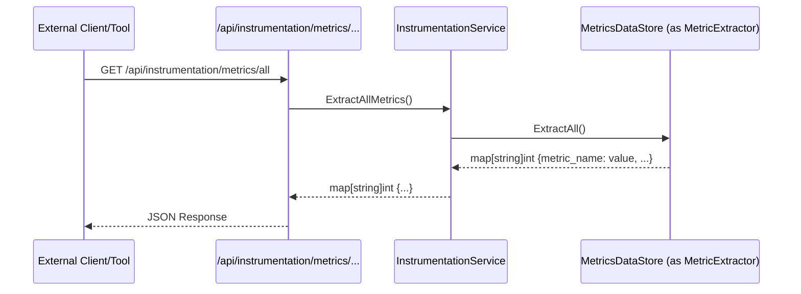

# Chapter 10: Application Health Monitor (`api.InstrumentationService`)

Welcome to the final chapter of our `scheduler` project tutorial! In [Chapter 9: Failed Task Retry Queue (`scheduler.DeadLetterQueueDefault`)](09_failed_task_retry_queue___scheduler_deadletterqueuedefault___.md), we explored how our system handles tasks that fail, giving them a second chance through a retry mechanism. We've covered a lot, from defining schedules to executing them and handling various outcomes. Now, let's look at how we can keep an eye on the overall health and performance of our scheduler.

## The Problem: Knowing How Your Scheduler is Doing

Imagine you've built a complex machine, like our `scheduler`. It's running, processing tasks, handling retries, and more. But how do you know if it's running smoothly?
*   Is it processing tasks quickly, or is there a growing backlog?
*   How many tasks are currently waiting in the retry queue?
*   Are tasks being successfully executed, or are many ending up deleted after post-processing?

Without a way to see these "vital signs," troubleshooting problems or understanding the system's load becomes very difficult. It's like driving a car without a dashboard – you wouldn't know your speed, fuel level, or if the engine is overheating until it's too late!

We need a system that acts like this dashboard, or like a doctor performing a checkup, providing real-time information about how the scheduler is performing. This is crucial for:
*   **Observability:** Understanding what's happening inside the system.
*   **Monitoring Health:** Quickly identifying if something is wrong.
*   **Debugging:** Pinpointing bottlenecks or areas of high error rates.
*   **Capacity Planning:** Knowing if the system is handling its current load or if it needs more resources.

## Meet the `api.InstrumentationService`: Your Scheduler's Dashboard

The `api.InstrumentationService` is our scheduler's built-in health and performance monitoring system. It provides a way to collect and expose various **metrics** – numerical data points that represent some aspect of the scheduler's operation.

Think of it like this:
*   Different parts of the scheduler (like the [Daily Task Organizer (`scheduler.DailyScheduleStoreDefault`)](07_daily_task_organizer___scheduler_dailyschedulestoredefault___.md) or the [Failed Task Retry Queue (`scheduler.DeadLetterQueueDefault`)](09_failed_task_retry_queue___scheduler_deadletterqueuedefault___.md)) are like sensors in your car.
*   These "sensors" report data (e.g., "one task entered the queue," "one task was processed").
*   This data is collected and stored by a component called `instrumentation.MetricsDataStore`.
*   The `api.InstrumentationService` then acts as the interface to read this collected data, much like how your car's dashboard displays information from the sensors.

Other systems, or even human operators, can then query this service (usually via API endpoints) to get a snapshot of the scheduler's current status.

## Key Concepts of the Health Monitor

Let's break down the main parts involved:

1.  **Metrics (The "Vital Signs"):**
    These are specific counts or values that tell us something about the system. Our `scheduler` tracks various metrics, defined as constants in `api/pkg/instrumentation/supported_metrics.go`:
    ```go
    // From: api/pkg/instrumentation/supported_metrics.go
    package instrumentation

    const (
        MetricDataStoreReadFromTopic = "metrics.dataStore.read"       // Schedules read by DailyStore
        MetricDataStoreStored        = "metrics.dataStore.stored"     // Schedules sent to DailyStore's output
        MetricDataStoreExited        = "metrics.dataStore.exited"     // Schedules too old for DailyStore

        MetricDeadLetterQueueEntered = "metrics.dlq.entered"        // Tasks entering DLQ
        MetricDeadLetterQueueExited  = "metrics.dlq.exited"         // Tasks leaving DLQ (succeeded/failed)

        MetricPostProcessorEntered     = "metrics.postProcessor.entered"  // Tasks entering PostProcessor
        MetricPostProcessorRescheduled = "metrics.postProcessor.rescheduled" // Tasks rescheduled
        MetricPostProcessorDeleted     = "metrics.postProcessor.deleted"     // Tasks deleted by PostProcessor
    )
    ```
    These are just examples. A real system might have many more, like "tasks_successfully_issued," "tasks_failed_permanently," etc. Each metric is a simple counter.

2.  **`instrumentation.MetricsDataStore` (The "Data Collector and Storage"):**
    *   Found in: `api/pkg/instrumentation/metrics_data_store.go`
    *   This component is responsible for actually storing the current values of all metrics.
    *   Other parts of the system (like the `DailyScheduleStoreDefault` or `DeadLetterQueueDefault`) "register" the metrics they care about with the `MetricsDataStore`.
    *   When an event happens (e.g., a task enters the DLQ), the relevant component tells the `MetricsDataStore` to `Increment()` the corresponding metric (e.g., `MetricDeadLetterQueueEntered`).
    *   The `MetricsDataStore` keeps all these counts in memory, protected by a mutex for safe access from multiple parts of the program.

3.  **`api.MetricExtractor` (The "Data Retriever Contract"):**
    *   Found in: `api/instrumentation.go`
    *   This is an interface that defines how metrics can be extracted (retrieved).
    ```go
    // From: api/instrumentation.go
    package api
    // ...
    type MetricExtractor interface {
        ListSupported(ctx context.Context) []string
        Extract(ctx context.Context, metric string) (int, error)
        ExtractAll(ctx context.Context) map[string]int
    }
    ```
    *   The `instrumentation.MetricsDataStore` implements this interface, meaning it knows how to list available metrics, get a specific one, or get all of them.

4.  **`api.InstrumentationService` (The "Dashboard Interface"):**
    *   Found in: `api/instrumentation.go`
    *   This is the service that other parts of the application (like API handlers) will use to get metric data.
    *   It's a very simple service; its main job is to delegate requests to a `MetricExtractor` (which is typically our `MetricsDataStore`).
    ```go
    // From: api/instrumentation.go
    package api
    // ...
    type InstrumentationService interface {
        ListSupportedMetrics(ctx context.Context) []string
        ExtractMetric(ctx context.Context, metric string) (int, error)
        ExtractAllMetrics(ctx context.Context) map[string]int
    }

    type InstrumentationServiceDefault struct { // The implementation
        extractor MetricExtractor
    }
    // ... (NewInstrumentationService and method implementations)
    ```

## How to Use the Health Monitor: Checking the Scheduler's Pulse

You typically interact with the `api.InstrumentationService` through HTTP API endpoints, which we learned about in [Chapter 2: HTTP API Endpoints & Routing](02_http_api_endpoints___routing_.md). The `scheduler` provides a few endpoints specifically for metrics, usually under a path like `/api/instrumentation/metrics`.

These endpoints are defined in `api/cmd/scheduler-api/routes/routes.go` and use handler functions from `api/cmd/scheduler-api/instrumentation/metrics.go`.

Let's see how you might use them with a tool like `curl` (a command-line tool for making HTTP requests):

**1. Listing Supported Metrics:**
You want to know what metrics are even available.
*   **Request:** Send a `GET` request to `/api/instrumentation/metrics` (or a similar path depending on router setup).
    ```bash
    curl http://your-scheduler-address/api/instrumentation/metrics
    ```
*   **Handler:** The `instrumentation.ListSupportedMetrics` handler (from `api/cmd/scheduler-api/instrumentation/metrics.go`) is called. It uses the `InstrumentationService`'s `ListSupportedMetrics` method.
    ```go
    // From: api/cmd/scheduler-api/instrumentation/metrics.go
    func ListSupportedMetrics(s api.InstrumentationService) http.HandlerFunc {
        return func(w http.ResponseWriter, r *http.Request) {
            metrics := s.ListSupportedMetrics(r.Context()) // Calls service

            w.Header().Set("Content-Type", "application/json")
            w.WriteHeader(http.StatusOK)
            json.NewEncoder(w).Encode(metrics) // Sends response
        }
    }
    ```
*   **Output (Example JSON):**
    ```json
    [
      "metrics.dataStore.read",
      "metrics.dataStore.stored",
      "metrics.dlq.entered",
      "metrics.dlq.exited",
      "metrics.postProcessor.rescheduled"
    ]
    ```
    This tells you the names of metrics you can query.

**2. Getting a Specific Metric:**
You want to know the current value of `metrics.dlq.entered`.
*   **Request:** Send a `GET` request to `/api/instrumentation/metrics/{metric_name}`.
    ```bash
    curl http://your-scheduler-address/api/instrumentation/metrics/metrics.dlq.entered
    ```
*   **Handler:** The `instrumentation.GetMetric` handler is called.
    ```go
    // From: api/cmd/scheduler-api/instrumentation/metrics.go
    func GetMetric(s api.InstrumentationService) http.HandlerFunc {
        return func(w http.ResponseWriter, r *http.Request) {
            metricName, _ := getMetricName(r) // Extracts "metrics.dlq.entered"
            val, err := s.ExtractMetric(r.Context(), metricName) // Calls service
            // ... (error handling) ...
            json.NewEncoder(w).Encode(val) // Sends value
        }
    }
    ```
*   **Output (Example JSON):**
    ```json
    15
    ```
    This means 15 tasks have entered the Dead Letter Queue since the counter was last reset (or since the application started).

**3. Getting All Metrics:**
You want a snapshot of all current metric values.
*   **Request:** Send a `GET` request to `/api/instrumentation/metrics/all` (or similar).
    ```bash
    curl http://your-scheduler-address/api/instrumentation/metrics/all
    ```
*   **Handler:** The `instrumentation.GetAllMetrics` handler is called.
    ```go
    // From: api/cmd/scheduler-api/instrumentation/metrics.go
    func GetAllMetrics(s api.InstrumentationService) http.HandlerFunc {
        return func(w http.ResponseWriter, r *http.Request) {
            metricsMap := s.ExtractAllMetrics(r.Context()) // Calls service
            // ...
            json.NewEncoder(w).Encode(toArray(metricsMap)) // Sends array
        }
    }
    ```
    The `toArray` helper converts the map of metrics into an array of objects for the JSON response.
*   **Output (Example JSON):**
    ```json
    [
      { "name": "metrics.dataStore.read", "value": 1052 },
      { "name": "metrics.dataStore.stored", "value": 1000 },
      { "name": "metrics.dlq.entered", "value": 15 },
      { "name": "metrics.dlq.exited", "value": 12 },
      { "name": "metrics.postProcessor.rescheduled", "value": 980 }
    ]
    ```

This data gives you a rich overview of the scheduler's activity!

## Under the Hood: How Metrics are Collected and Served

Let's trace the journey of a metric from its origin to being displayed.

**Step-by-Step Flow:**

1.  **Registration:** When a component (e.g., `DeadLetterQueueDefault`) starts, it tells the `MetricsDataStore` about the metrics it will manage.
    *   Example: `DeadLetterQueueDefault` calls `MetricsDataStore.RegisterForManagement("metrics.dlq.entered")`.
    *   The `MetricsDataStore` initializes this metric to `0`.
    *   It returns an `MetricIncrementor` and `MetricResetter` to the `DeadLetterQueueDefault`.

2.  **Incrementing:** When an event occurs (e.g., a task enters the `DeadLetterQueueDefault`), it uses its `MetricIncrementor` to update the count.
    *   Example: `DeadLetterQueueDefault` calls `dlqEnteredIncrementor.Increment()`.
    *   The `MetricsDataStore` (behind the scenes) safely increases the value of `"metrics.dlq.entered"`.

3.  **Extraction Request:** A user or monitoring tool makes an API call (e.g., `GET /api/instrumentation/metrics/all`).

4.  **Service Call:** The API handler calls the `api.InstrumentationService` (e.g., `ExtractAllMetrics()`).

5.  **Extractor Call:** The `InstrumentationServiceDefault` implementation simply calls its `MetricExtractor` (which is our `MetricsDataStore`).
    ```go
    // From: api/instrumentation.go
    func (i *InstrumentationServiceDefault) ExtractAllMetrics(ctx context.Context) map[string]int {
        return i.extractor.ExtractAll(ctx) // Delegates to extractor
    }
    ```

6.  **Data Retrieval:** The `MetricsDataStore` retrieves the current values of all its stored metrics.
    ```go
    // From: api/pkg/instrumentation/metrics_data_store.go
    func (s *MetricsDataStore) ExtractAll(ctx context.Context) map[string]int {
        s.mutex.RLock() // Read lock for safety
        defer s.mutex.RUnlock()
        return s.metrics // Returns the internal map
    }
    ```

7.  **Response:** The data flows back through the service and API handler to the client.

**Visualizing the Metric Retrieval Flow:**



### Diving into `MetricsDataStore`

The `instrumentation.MetricsDataStore` is the heart of metric collection.
File: `api/pkg/instrumentation/metrics_data_store.go`

1.  **Structure:**
    ```go
    // From: api/pkg/instrumentation/metrics_data_store.go
    type MetricsDataStore struct {
        metrics map[string]int // Where the counts are stored
        mutex   sync.RWMutex   // For thread-safe access
    }
    ```
    It's a simple map to hold metric names and their integer values, with a `sync.RWMutex` to prevent issues if multiple parts of the program try to read or write metrics at the same time.

2.  **Registering a Metric:**
    ```go
    // From: api/pkg/instrumentation/metrics_data_store.go
    func (s *MetricsDataStore) RegisterForManagement(metric string) (MetricIncrementor, MetricResetter, error) {
        s.mutex.Lock() // Exclusive lock for modification
        defer s.mutex.Unlock()

        if _, found := s.metrics[metric]; found {
            return nil, nil, fmt.Errorf("metric is already under management")
        }
        s.metrics[metric] = 0 // Initialize to zero

        // Return functions that can increment/reset this specific metric
        inc := func() { s.increment(metric) }
        res := func() { s.reset(metric) }
        return metricIncrementAction(inc), metricResetAction(res), nil
    }
    ```
    When a component registers a metric (e.g., `MetricDeadLetterQueueEntered`), the `MetricsDataStore` adds it to its internal `metrics` map (initialized to 0). It then returns two small functions (wrapped as `MetricIncrementor` and `MetricResetter`) that are tied *specifically* to that metric name.

3.  **Incrementing a Metric:**
    The `MetricIncrementor` returned by `RegisterForManagement` calls this internal `increment` method:
    ```go
    // From: api/pkg/instrumentation/metrics_data_store.go
    func (s *MetricsDataStore) increment(metric string) {
        s.mutex.Lock() // Exclusive lock
        defer s.mutex.Unlock()

        val, found := s.metrics[metric]
        if !found { return } // Should not happen if registered
        s.metrics[metric] = val + 1
    }
    ```
    This safely finds the metric in the map and adds 1 to its value.

### How Other Components Update Metrics

Components like `DeadLetterQueueDefault` or `DailyScheduleStoreDefault` integrate with this system.
The file `api/pkg/scheduler/metrics.go` shows a helper struct:
```go
// From: api/pkg/scheduler/metrics.go
package scheduler
import "github.com/nestoca/scheduler/api/pkg/instrumentation"

type metricModifier struct {
	instrumentation.MetricIncrementor
	instrumentation.MetricResetter
}
```
A component (e.g., `DeadLetterQueueDefault`) would typically:
1.  Have fields for each `MetricIncrementor` it needs (e.g., `dlqEnteredCounter`).
2.  During its initialization, it calls `MetricsDataStore.RegisterForManagement()` for each metric it's responsible for and stores the returned `MetricIncrementor`.
3.  When a relevant event occurs (e.g., a schedule enters the DLQ), it calls `dlqEnteredCounter.Increment()`.

This design keeps the `MetricsDataStore` as a central, simple collector, and lets individual components manage their own metric updates cleanly.

## Why is the Application Health Monitor So Important?

*   **Visibility:** It shines a light into the "black box" of the scheduler, letting you see what it's doing.
*   **Proactive Problem Detection:** By monitoring key metrics (e.g., queue sizes, error rates), you can often detect problems before they become critical.
*   **Performance Tuning:** Metrics can help identify bottlenecks. If `metrics.dataStore.read` is very high but `metrics.dataStore.stored` is low, it might indicate a problem in the `DailyScheduleStoreDefault`'s filtering or processing.
*   **Foundation for Alerting:** Monitoring systems can use these metrics to trigger alerts if values go outside expected ranges (e.g., "DLQ size > 100 for 5 minutes").

## Conclusion

The `api.InstrumentationService`, powered by the `instrumentation.MetricsDataStore` and various `MetricIncrementor`s throughout the application, provides a vital "dashboard" for our `scheduler`. It collects key performance indicators (metrics) like queue lengths, items processed, and errors encountered. This data is then exposed via API endpoints, allowing operators and monitoring tools to observe the system's health, diagnose issues, and understand its performance characteristics. This capability is essential for running any robust application in a production environment.

Congratulations on completing this tutorial series on the `scheduler` project! You've journeyed through defining tasks with `schedule.Schedule`, exposing functionality via [HTTP API Endpoints & Routing](02_http_api_endpoints___routing_.md), managing schedules with `api.SchedulesService`, understanding the `api.Core` aggregator, seeing the `api.Scheduler` execution engine in action, learning about [Kafka-based Schedule Persistence and Communication](06_kafka_based_schedule_persistence_and_communication_.md), how tasks are organized daily by `scheduler.DailyScheduleStoreDefault`, handled post-execution by `scheduler.SchedulePostProcessorDefault`, retried with `scheduler.DeadLetterQueueDefault`, and finally, how the system's health is monitored. We hope this gives you a solid foundation for understanding and working with the `scheduler`!

---

Generated by [AI Codebase Knowledge Builder](https://github.com/The-Pocket/Tutorial-Codebase-Knowledge)