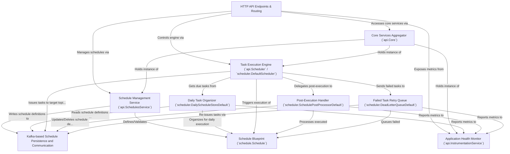

# Tutorial: scheduler

This project implements a **task scheduling system**. It allows users to define *tasks* (what to do, like sending a Kafka message) and *schedules* (when and how often to do it). These schedules are reliably stored and communicated using **Kafka**. The system's *engine* then picks up due tasks, *executes* them by, for example, sending a message to a target Kafka topic, handles *recurring tasks* by rescheduling them, and manages *failed tasks* through a retry mechanism. It also offers *monitoring* of its operations through metrics.

**Source Repository:** [None](None)

## Chapters

1. [Schedule Blueprint (`schedule.Schedule`)
](01_schedule_blueprint___schedule_schedule___.md)
2. [HTTP API Endpoints & Routing
](02_http_api_endpoints___routing_.md)
3. [Schedule Management Service (`api.SchedulesService`)
](03_schedule_management_service___api_schedulesservice___.md)
4. [Core Services Aggregator (`api.Core`)
](04_core_services_aggregator___api_core___.md)
5. [Task Execution Engine (`api.Scheduler` / `scheduler.DefaultScheduler`)
](05_task_execution_engine___api_scheduler_____scheduler_defaultscheduler___.md)
6. [Kafka-based Schedule Persistence and Communication
](06_kafka_based_schedule_persistence_and_communication_.md)
7. [Daily Task Organizer (`scheduler.DailyScheduleStoreDefault`)
](07_daily_task_organizer___scheduler_dailyschedulestoredefault___.md)
8. [Post-Execution Handler (`scheduler.SchedulePostProcessorDefault`)
](08_post_execution_handler___scheduler_schedulepostprocessordefault___.md)
9. [Failed Task Retry Queue (`scheduler.DeadLetterQueueDefault`)
](09_failed_task_retry_queue___scheduler_deadletterqueuedefault___.md)
10. [Application Health Monitor (`api.InstrumentationService`)
](10_application_health_monitor___api_instrumentationservice___.md)

---

Generated by [AI Codebase Knowledge Builder](https://github.com/The-Pocket/Tutorial-Codebase-Knowledge)