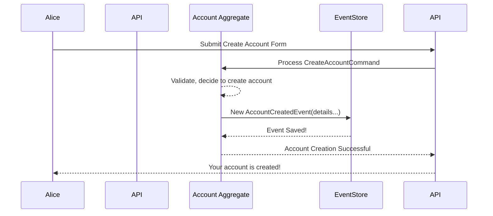

# Chapter 1: Event

Welcome to the `corebanking` project tutorial! We're thrilled to have you on board. In this first chapter, we'll dive into one of the most fundamental concepts in our system: the **Event**.

## What's the Big Deal with Events?

Imagine you're building a brand new digital bank. A customer, let's call her Alice, wants to open a new savings account. She fills out a form, clicks "Submit," and voilà, her account is created.

But how does the bank *remember* that this account was created? How does it keep a permanent, trustworthy record of this action? What if we need to look back and see exactly when Alice's account was opened or what its initial details were?

This is where **Events** come into play.

In our `corebanking` system, an **Event** is an **immutable record of something significant that has already happened**. Think of it like an official entry in a historical logbook or a diary. Once an entry is written, it's not changed.

When something important occurs in the system, like Alice's account being created, we record this fact as an Event. For example, after successfully processing Alice's request to create an account (which we'll later learn is a [Command](02_command_.md)), an `AccountCreatedEvent` is generated.

## Key Characteristics of an Event

Events have a few defining features:

1.  **Immutable Record:** Once an Event is recorded, it **cannot be changed**. It's a statement of fact about something that happened in the past. Like carving something in stone.
2.  **Significant Happenings:** We don't create Events for every tiny operation. They are reserved for actions that have a meaningful impact on the system's state. Examples: `AccountCreatedEvent`, `FundsDepositedEvent`, `CustomerAddressUpdatedEvent`.
3.  **Past Tense:** Event names usually reflect that the action has already completed. Notice the "ed" or "d" at the end: `AccountCreatedEvent`, `PaymentDeviceLinkedEvent`.
4.  **Source of Truth:** Events are the ultimate, undeniable truth for what has occurred. If we ever need to understand the current state of something (like an account's balance or status), we can, in theory, replay all the Events related to it from the very beginning. It's like re-reading a ship's log to know its entire journey.
5.  **Result of a [Command](02_command_.md):** Typically, an Event is produced after the system processes a [Command](02_command_.md). A [Command](02_command_.md) is a request to do something (e.g., "Create Account"). If the command is successful and changes the system's state, one or more Events are generated as a result.

## Events in Action: Creating Alice's Account

Let's revisit Alice creating her savings account:

1.  Alice submits her request (this is a [Command](02_command_.md)).
2.  The `corebanking` system processes this request. It checks if Alice can open an account, if she provided all necessary details, etc.
3.  If everything is okay, the system changes its state: a new account for Alice now exists!
4.  To record this fact, the system generates an `AccountCreatedEvent`. This Event will contain all the crucial information: Alice's customer ID, the new account ID, the type of account, the currency, the date and time of creation, etc.
5.  This `AccountCreatedEvent` is then durably stored, perhaps in a special database. It becomes part of the bank's permanent history.

##What Does an Event Look Like? (A Peek at the Code)

In Go, an Event is often represented as a struct. There's a general structure for all events, and then specific data for each type of event.

Here's a simplified general `Event` structure from our system:

```go
// From: api/events.go

// Event represents an event
type Event struct {
	ID            uuid.UUID   // Unique ID for this specific event instance
	AggregateID   uuid.UUID   // ID of the entity this event pertains to (e.g., Account ID)
	AggregateType string      // Type of the entity (e.g., "Account")
	Type          string      // Specific type of event (e.g., "AccountCreatedEvent")
	Data          interface{} // The actual data specific to this event type
	Created       time.Time   // When the event was created
	// ... other general fields like Actor, TenantID ...
}
```

*   `ID`: Every single event occurrence gets its own unique identifier.
*   `AggregateID`: This tells us which specific entity the event is about. For an `AccountCreatedEvent`, this would be the ID of the newly created account. We'll learn more about [Aggregates](03_aggregate_.md) later.
*   `AggregateType`: The kind of entity, like "Account" or "Customer".
*   `Type`: A string that clearly states what kind of event this is, e.g., `com.nesto.corebanking.accounts.events.AccountCreatedEvent`.
*   `Data`: This is the payload, containing the specific details of *what happened*. For an `AccountCreatedEvent`, this would hold the account category, currency, etc.
*   `Created`: A timestamp indicating when the event occurred.

The `Data` field itself would be another struct, specific to the event type. For example, an `AccountCreatedEvent` might have data like this (simplified):

```go
// From: api/account_aggregate.go

// AccountCreatedEvent represents a created account.
type AccountCreatedEvent struct {
	Category            string      `avro:"category"`
	Product             *AccountProduct `avro:"product"`
	AvailableCurrencies []string    `avro:"availableCurrencies"`
	CustomerIDs         []uuid.UUID `avro:"customerIds"`
	// ... other fields like Parameters, Metadata ...
}
```
This `AccountCreatedEvent` struct holds all the specific details that are relevant when a new account is made.

## How an Event is "Born" - The Internals

Let's look under the hood to see how an `AccountCreatedEvent` comes to life.

1.  **A Request Arrives:** Alice's request to create an account comes in as a [Command](02_command_.md) (e.g., `CreateAccountCommand`).
2.  **Processing by an [Aggregate](03_aggregate_.md):** An [Aggregate](03_aggregate_.md) is responsible for handling commands related to a specific entity (like an `AccountAggregate` for accounts). It takes the `CreateAccountCommand`.
3.  **Validation and State Change:** The `AccountAggregate` checks if the command is valid (e.g., are all required fields present?). If valid, it determines what state changes are needed. For a new account, this means setting its initial properties.
4.  **Event Generation:** Because the state changed, the `AccountAggregate` now creates an `AccountCreatedEvent`, filling it with details from the command and any system-generated data (like the creation timestamp).
5.  **Event Storage:** This newly minted event is then passed to an "Event Store" (a specialized database or system component) to be saved permanently.

Here's a simplified sequence diagram:



Let's look at a snippet from `api/account_aggregate.go` where an event is created within the `HandleCommand` method. This method is part of the [Aggregate](03_aggregate_.md) (which we'll cover in detail later).

```go
// Simplified from api/account_aggregate.go
// Inside AccountAggregate's HandleCommand method:

case *CreateAccountCommand: // This is the request to create an account
    // ... (some validation and setup logic) ...

    // Prepare the specific data for our AccountCreatedEvent
    data := &AccountCreatedEvent{
        Category:            c.Category,
        Product:             c.Product,
        AvailableCurrencies: c.AvailableCurrencies,
        CustomerIDs:         c.CustomerIDs,
        // ... other relevant details from the command ...
    }

    // This is the magic moment! An Event is created.
    // a.NewEvent() wraps 'data' with general event info (ID, timestamp, etc.)
    event = a.NewEvent(command, data)

    // ... (logic to apply this event to the aggregate's state and save it) ...
    a.ApplyChangeHelper(a, event, true)
```
In this code:
*   We receive a `CreateAccountCommand` (aliased as `c`).
*   We gather the necessary details into an `AccountCreatedEvent` struct (`data`).
*   `a.NewEvent(command, data)` is a helper method that takes the original command and the event-specific `data` to construct the full `Event` object, including its unique ID, timestamp, and type.
*   `a.ApplyChangeHelper` is another crucial step. After an event is "born," the [Aggregate](03_aggregate_.md) itself uses this event to update its own internal state. This ensures the [Aggregate's](03_aggregate_.md) in-memory representation reflects the new reality.

The `ApplyChange` method (or a helper it calls) looks at the type of event and updates the [Aggregate's](03_aggregate_.md) fields accordingly:

```go
// Simplified from api/account_aggregate.go
// Inside AccountAggregate's ApplyChange method:

func (a *AccountAggregate) ApplyChange(event es.Event) {
	switch e := event.Data.(type) { // e is the specific event data
	case *AccountCreatedEvent:
		a.ID = event.AggregateID // The aggregate now knows its ID
		a.Category = e.Category
		a.Status = AccountStatusCreated // Set initial status
		a.Created = event.Created       // Record creation time
		// ... update other fields based on AccountCreatedEvent ...
	case *AccountActivatedEvent:
		a.Status = AccountStatusActivated
		// ...
	// ... other event types ...
	}
}
```
This ensures that the `AccountAggregate`'s state is consistent with the events it has produced and processed.

## Why Immutability and "Facts" Matter So Much

The fact that Events are immutable historical records is incredibly powerful:

*   **Reliability & Auditability:** You have a perfect, trustworthy audit trail of everything significant that has happened. Need to know why an account is in a particular state? Replay its events! This is invaluable for debugging, compliance, and understanding system behavior.
*   **State Reconstruction:** If, for some reason, the current "snapshot" of an account's data gets corrupted, you can rebuild it by replaying all its historical Events in order.
*   **Decoupling:** Other parts of the system can subscribe to events and react to them independently, without needing to know the intricate details of how the event was produced. For example, a notification service could listen for `AccountCreatedEvent` and send a welcome email to Alice.

## Conclusion

Events are the bedrock of our `corebanking` system's memory. They are **immutable facts** representing **significant past occurrences**. Each Event tells a small part of a larger story, like the story of Alice's bank account. By recording and storing these Events, we build a reliable, auditable, and resilient system.

We've seen that Events are often born from processing requests. In the next chapter, we'll take a closer look at these requests themselves. Get ready to learn about the [Command](02_command_.md)!

---

Generated by [AI Codebase Knowledge Builder](https://github.com/The-Pocket/Tutorial-Codebase-Knowledge)