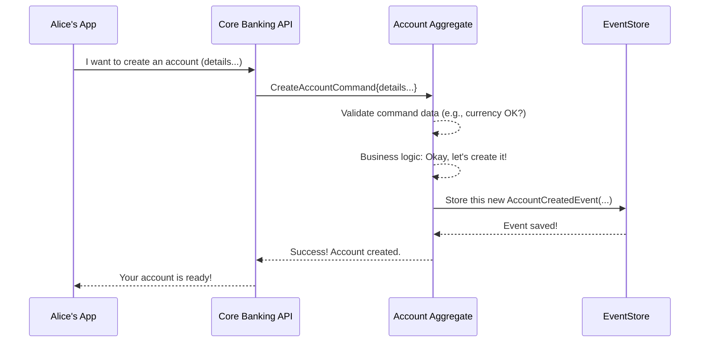

# Chapter 2: Command

In our [previous chapter](01_event_.md), we learned about [Events](01_event_.md) – the immutable records of things that have already happened in our `corebanking` system. For example, when Alice successfully created her bank account, an `AccountCreatedEvent` was generated and stored.

But how did Alice *tell* the bank she wanted to create an account in the first place? How does she ask the bank to do something, like deposit money or change her address? This is where **Commands** come in.

## What's a Command? The Bank's Instruction Slip

Imagine you walk into a physical bank. To make a deposit, you fill out a deposit slip. To open an account, you fill out an application form. These forms are your formal instructions to the bank.

In the `corebanking` system, a **Command** is very similar. It's like an **instruction or a formal request** you submit to the system. It represents an **intent** to change something.

Think of it this way:
*   An [Event](01_event_.md) says: "This happened!" (e.g., `AccountCreatedEvent`)
*   A **Command** says: "I want this to happen!" (e.g., `CreateAccountCommand`)

Commands are specific, named operations that carry all the necessary data to perform an action. They are the primary way external users or other systems interact with the core logic of our bank to request changes.

## Key Characteristics of a Command

1.  **Intent to Act:** A Command expresses a desire for the system to perform an action. It's a request, not a statement of fact.
2.  **Specific Operation:** Each Command has a clear name that describes the intended action, like `CreateAccountCommand`, `DepositFundsCommand`, or `UpdateCustomerAddressCommand`.
3.  **Carries Data:** A Command bundles all the information needed to execute the desired action. For instance, a `CreateAccountCommand` would include details like who the customer is, what type of account they want, and in what currency.
4.  **Sent for Processing:** Commands are typically sent to a specific part of our system called an [Aggregate](03_aggregate_.md) (we'll learn about Aggregates in the next chapter!). The [Aggregate](03_aggregate_.md) is responsible for deciding if the Command is valid and then carrying out the action.
5.  **May Result in [Events](01_event_.md):** If a Command is successfully processed and leads to a change in the system's state, one or more [Events](01_event_.md) are usually generated to record that change. If the Command is invalid (e.g., trying to deposit into a non-existent account), it might be rejected, and no [Events](01_event_.md) related to the intended change would be created.

## Commands in Action: Alice's Account Creation (The "How")

Let's go back to Alice wanting to open her savings account:

1.  **Alice Expresses Her Intent:** Alice, through a web form or a mobile app, indicates she wants a new account. She provides her details (customer ID, desired currency, etc.).
2.  **The `CreateAccountCommand` is Born:** The application she's using takes this information and packages it into a `CreateAccountCommand`. This command now holds all the data needed to open the account.
3.  **Command is Sent:** This `CreateAccountCommand` is sent to the `corebanking` system.
4.  **Processing by an [Aggregate](03_aggregate_.md):** An `AccountAggregate` (which is responsible for managing account-related operations) receives the `CreateAccountCommand`.
5.  **Validation & Logic:** The `AccountAggregate` checks:
    *   Is the customer ID valid?
    *   Is the currency supported?
    *   Are all required fields present?
    *   Any other business rules?
6.  **Success and [Event](01_event_.md) Generation:** If everything is valid, the `AccountAggregate` proceeds to create the account. As a result of this successful operation, it generates an `AccountCreatedEvent` (which we saw in Chapter 1!).
7.  **Failure:** If the command is invalid (e.g., Alice provides an unsupported currency), the `AccountAggregate` rejects the command, and no `AccountCreatedEvent` is generated. An error message would typically be returned to Alice.

## What Does a Command Look Like? (A Peek at the Code)

In Go, just like [Events](01_event_.md), Commands are often represented as structs. They carry the data necessary for the operation.

Here's a simplified look at the `CreateAccountCommand` from our `corebanking` project (`api/account_aggregate.go`):

```go
// From: api/account_aggregate.go

// CreateAccountCommand represents the creation of an account.
type CreateAccountCommand struct {
	es.BaseCommand // Provides common fields for all commands
	Category            string      `json:"category"`
	Product             *AccountProduct `json:"product"` // Details about the specific account product
	AvailableCurrencies []string    `json:"availableCurrencies"`
	CustomerIDs         []uuid.UUID `json:"customerIds"`
	// ... other fields like Parameters, Metadata ...
}
```

Let's break this down:
*   `es.BaseCommand`: This is a standard part of many commands in our system. It usually includes an `AggregateID`. For `CreateAccountCommand`, this `AggregateID` will be the ID of the *new* account we want to create. For a command like `DepositFundsCommand`, the `AggregateID` would be the ID of the *existing* account to deposit into.
*   `Category`: What kind of account is it (e.g., "ASSET", "LIABILITY").
*   `Product`: Specifies the type of banking product (e.g., "Savings Account Basic", "Current Account Premium").
*   `AvailableCurrencies`: Which currencies can this account hold (e.g., `["USD", "EUR"]`).
*   `CustomerIDs`: A list of customer IDs associated with this account.

Each field in the command provides a piece of information that the system needs to fulfill the request.

Another example, a `CloseAccountCommand`, would be simpler:

```go
// From: api/account_aggregate.go

// CloseAccountCommand represents the closing of an account.
type CloseAccountCommand struct {
	es.BaseCommand // Contains the ID of the account to close
	Reason string `json:"reason"` // Why is the account being closed?
}
```
This command needs to know *which* account to close (via `BaseCommand`'s `AggregateID`) and optionally, a reason for closing it.

## How a Command is Processed: Under the Hood

When a command arrives, how does the system handle it?

1.  **Dispatch:** The command is typically sent from an API layer (like a web server handling Alice's request) to the core business logic.
2.  **Targeting an [Aggregate](03_aggregate_.md):** The command is routed to the correct [Aggregate](03_aggregate_.md). An [Aggregate](03_aggregate_.md) is like a guardian for a specific piece of data (e.g., an `AccountAggregate` guards a specific bank account). If it's a `CreateAccountCommand`, a new `AccountAggregate` instance might be effectively created to handle it. If it's `DepositFundsCommand`, it's sent to the existing `AccountAggregate` for that account.
3.  **Validation:** The [Aggregate](03_aggregate_.md) first validates the command. Can this action be performed? Is all the data correct and complete?
4.  **Business Logic:** If valid, the [Aggregate](03_aggregate_.md) executes the business rules associated with the command.
5.  **[Event](01_event_.md) Generation:** If the business logic results in a state change, the [Aggregate](03_aggregate_.md) creates one or more [Events](01_event_.md) to describe what happened.

Here's a simplified sequence diagram illustrating the flow for creating an account:



Let's look at a snippet from `api/account_aggregate.go` where an `AccountAggregate` handles a `CreateAccountCommand`. This happens inside a method called `HandleCommand`:

```go
// Simplified from AccountAggregate.HandleCommand in api/account_aggregate.go

// ... (inside HandleCommand method) ...
switch c := command.(type) { // 'c' is the incoming command
case *CreateAccountCommand:
    // 1. Check if a product is specified and valid (simplified)
    if c.Product != nil {
        // ... (logic to validate product exists) ...
    }

    // 2. The command carries the intended ID for the new account
    a.ID = command.GetAggregateID() // 'a' is the AccountAggregate

    // 3. Prepare the data for the Event that will be created
    eventData := &AccountCreatedEvent{
        Category:            c.Category,
        Product:             c.Product,
        CustomerIDs:         c.CustomerIDs,
        AvailableCurrencies: c.AvailableCurrencies,
        // ... other details from the command 'c' ...
    }

    // 4. Create the actual Event (as we saw in Chapter 1)
    event := a.NewEvent(command, eventData)

    // 5. Apply the event to change the aggregate's state and record it
    a.ApplyChangeHelper(a, event, true) // This stores the event for saving
```

In this snippet:
1.  The `HandleCommand` method receives the `CreateAccountCommand` (aliased as `c`).
2.  It performs some initial validation (like checking the product).
3.  It uses the data *from the command* (`c.Category`, `c.Product`, etc.) to populate an `AccountCreatedEvent`.
4.  The `a.NewEvent(...)` function (which we touched on in Chapter 1) creates the full [Event](01_event_.md) object, adding things like a unique event ID and timestamp.
5.  `a.ApplyChangeHelper(...)` is a crucial step where the [Aggregate](03_aggregate_.md) updates its own state based on this new event and adds the event to a list of changes to be saved.

So, the **Command** provides the *intent* and the *data*, and the [Aggregate's](03_aggregate_.md) `HandleCommand` method uses that to *do the work* and produce [Events](01_event_.md).

## Commands vs. [Events](01_event_.md): A Quick Reminder

It's vital to distinguish between Commands and [Events](01_event_.md):

| Feature         | Command                                       | [Event](01_event_.md)                                         |
| :-------------- | :-------------------------------------------- | :------------------------------------------------------ |
| **Purpose**     | Request an action (intent)                    | Record a fact (something that happened)                 |
| **Tense**       | Present/Future (e.g., "Create Account")       | Past (e.g., "Account Created")                          |
| **Outcome**     | May succeed or fail                           | Is a record of a successful state change                |
| **Result of**   | User input, system process                    | Successful command processing                           |
| **Analogy**     | Filling out a request form                    | An entry in a historical logbook                        |

You send a `CreateAccountCommand` (your request). If it's successful, an `AccountCreatedEvent` (the historical record) is generated.

## Conclusion

Commands are the way we tell our `corebanking` system what we want to do. They are formal, data-rich instructions representing an **intent to change the system's state**. They are named operations like `CreateAccountCommand` or `DepositFundsCommand`.

When a Command is received, it's typically handled by an [Aggregate](03_aggregate_.md), which validates it, executes business logic, and, if successful, produces [Events](01_event_.md) to record the changes.

Now that we understand how we *ask* the system to do things (Commands) and how the system *remembers* what happened ([Events](01_event_.md)), it's time to meet the component responsible for processing these Commands and generating those Events. Let's dive into the world of the [Aggregate](03_aggregate_.md)!

---

Generated by [AI Codebase Knowledge Builder](https://github.com/The-Pocket/Tutorial-Codebase-Knowledge)