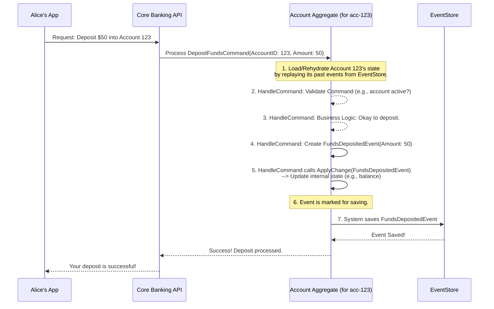

# Chapter 3: Aggregate

Welcome to Chapter 3! In our [previous chapter](02_command_.md), we learned about [Commands](02_command_.md) – how we tell the `corebanking` system what we want to do, like "Create an Account" or "Deposit Funds." We also know from [Chapter 1](01_event_.md) that when these [Commands](02_command_.md) are successful, [Events](01_event_.md) are generated to record what happened.

But who is in charge of receiving a [Command](02_command_.md), deciding if it's okay, and then creating the [Event](01_event_.md)? If Alice wants to deposit money into *her specific account*, how does the system make sure the change happens only to *her* account and follows all the rules? This is where the **Aggregate** steps in.

## Meet the Main Character: The Aggregate

Think of an **Aggregate** as the main character in a story, like a specific bank account (Account #12345) or a particular customer (Alice Wonderland). It's a self-contained unit that looks after its own information (its "state") and its own rules.

When a [Command](02_command_.md) arrives—like a request to deposit money into Account #12345—it's the `AccountAggregate` for Account #12345 that handles it. This Aggregate will:
1.  Check if the command is valid (e.g., "Is the account open?", "Is the deposit amount positive?").
2.  If everything is okay, it will change its state (e.g., increase its balance).
3.  Then, it will record this change as a fact by producing an [Event](01_event_.md) (e.g., `FundsDepositedEvent`).

This way, the Aggregate ensures that all changes to *its* data are consistent and follow the rules. It also provides a historical record of everything that has happened to it through the [Events](01_event_.md) it produces. Aggregates are a cornerstone of the Event Sourcing pattern used in our `corebanking` system.

## Key Ideas About Aggregates

1.  **A Guardian of Data:** An Aggregate is responsible for a specific piece of data or a small group of related data. For example, an `AccountAggregate` is responsible for *one specific bank account*. It manages the account's balance, status, customer links, etc.
2.  **Unique Identity:** Each Aggregate instance has a unique ID. So, `AccountAggregate` with ID `acc-123` is different from `AccountAggregate` with ID `acc-456`.
3.  **Manages Its Own State:** The "state" is the current information about the entity. For an account, this includes its balance, status (CREATED, ACTIVATED, CLOSED), currency, etc.
4.  **Enforces Business Rules:** Aggregates contain the logic to check if a requested action (a [Command](02_command_.md)) is allowed. Can you withdraw more money than you have? Can you close an account that has a pending transaction? The Aggregate knows!
5.  **Processes [Commands](02_command_.md):** It takes a [Command](02_command_.md) as input.
6.  **Produces [Events](01_event_.md):** If a [Command](02_command_.md) is valid and changes the state, the Aggregate creates one or more [Events](01_event_.md) to describe what happened.
7.  **Consistency Boundary:** All changes within a single Aggregate happen together (atomically). Either all changes are applied, or none are. This keeps the data for that specific entity consistent.

## Example: Alice Deposits Money

Let's imagine Alice (customer `cust-001`) has an account (`acc-123`) and wants to deposit $50.

1.  **A [Command](02_command_.md) is Sent:** Alice's banking app creates a `DepositFundsCommand` with details: `AccountID: "acc-123"`, `Amount: 50.00`.
2.  **The Right Aggregate is Found:** The system directs this command to the `AccountAggregate` responsible for account `acc-123`.
3.  **The Aggregate Works:**
    *   The `AccountAggregate` for `acc-123` loads its current state (perhaps its current balance is $100 and its status is "ACTIVATED").
    *   It checks business rules: Is the account "ACTIVATED"? Yes. Is $50 a valid amount? Yes.
    *   Since the command is valid, the Aggregate decides an `AccountCreditedEvent` (or similar) needs to happen.
4.  **An [Event](01_event_.md) is Born:** It creates an `AccountCreditedEvent` with details: `AmountCredited: 50.00`, `NewBalance: 150.00` (or the event might just state the amount credited, and the balance is recalculated).
5.  **State is Updated:** The Aggregate updates its own internal state. Its balance is now $150.
6.  **[Event](01_event_.md) is Stored:** The `AccountCreditedEvent` is saved permanently.

Now, account `acc-123` correctly reflects the deposit, and there's a permanent record of it.

## What Does an Aggregate Look Like? (A Peek at the Code)

In Go, an Aggregate is typically a struct. It often embeds a base struct that provides common functionalities and includes fields to hold its state.

Here's a very simplified view of an `AccountAggregate` from `api/account_aggregate.go`:

```go
// From: api/account_aggregate.go
// Simplified AccountAggregate structure
type AccountAggregate struct {
	es.BaseAggregate // Provides common aggregate features (like ID, event helpers)

	// State of the account (the actual data for *this* account instance)
	*AccountAggregateState

	// (Dependencies like repositories are omitted for simplicity here)
}
```
*   `es.BaseAggregate`: This is a helper struct from our event sourcing library (`es`). It provides common things an aggregate needs, like a place to store its ID, version, and methods for creating new [Events](01_event_.md).
*   `*AccountAggregateState`: This pointer field is where the actual data specific to *this* account instance is stored.

The `AccountAggregateState` itself is another struct:

```go
// From: api/account_aggregate.go
// AccountAggregateState holds the data for an account
type AccountAggregateState struct {
	Category string      // e.g., "ASSET", "LIABILITY"
	Status   string      // e.g., "CREATED", "ACTIVATED", "CLOSED"
	CustomerIDs []uuid.UUID // Which customers own this account
	// ... other fields like product info, currency, parameters ...
	Created  time.Time   // When the account was created
	// (The actual balance is often managed by postings and calculated,
	//  but for conceptual understanding, imagine it's part of the state)
}
```
This `AccountAggregateState` holds all the important details about one specific account. When we talk about an Aggregate's "state," we're talking about the values in these fields.

## How an Aggregate Handles a [Command](02_command_.md)

There are two main methods in an Aggregate that work together:
1.  `HandleCommand`: This is the entry point. It receives a [Command](02_command_.md), applies business rules, and if successful, creates [Event(s)](01_event_.md).
2.  `ApplyChange`: This method takes an [Event](01_event_.md) and uses it to update the Aggregate's internal state.

Let's look at simplified versions:

### 1. `HandleCommand`

When a [Command](02_command_.md) like `CreateAccountCommand` comes in:

```go
// Simplified from AccountAggregate.HandleCommand in api/account_aggregate.go
// This method decides what to do when a command arrives.
func (a *AccountAggregate) HandleCommand(ctx context.Context, command es.Command) error {
	var event es.Event // This will hold the event we generate

	switch c := command.(type) { // 'c' is the specific command (e.g., CreateAccountCommand)
	case *CreateAccountCommand:
		// 1. Validations (e.g., is product specified? are customers valid?)
		//    (Detailed validation logic omitted for brevity)
		if c.Product == nil {
			return errors.New("product is required") // Simplified error
		}

		// 2. Set the ID for this new account aggregate from the command
		//    The command carries the intended ID for the new entity.
		a.ID = command.GetAggregateID()

		// 3. Prepare data for the AccountCreatedEvent using info from the command
		eventData := &AccountCreatedEvent{
			Category:    c.Category,
			Product:     c.Product, // Details of the account type
			CustomerIDs: c.CustomerIDs,
			// ... other details from the CreateAccountCommand 'c' ...
		}

		// 4. Create the actual Event object using a helper from BaseAggregate
		event = a.NewEvent(command, eventData) // 'command' provides context

		// 5. Tell the aggregate to apply this change to itself
		//    and mark the event to be saved.
		a.ApplyChangeHelper(a, event, true)

	// case *DepositFundsCommand:
	//     // ... logic to handle deposit, create FundsDepositedEvent ...
	// case *ActivateAccountCommand:
	//     // ... logic to handle activation, create AccountActivatedEvent ...
	}
	return nil // If successful
}
```
*   The `switch` statement checks the type of [Command](02_command_.md).
*   For `CreateAccountCommand`, it performs validations.
*   It then prepares the data for an `AccountCreatedEvent` using information from the command.
*   `a.NewEvent(...)` is a helper (from `es.BaseAggregate`) that wraps `eventData` with standard event fields like a unique Event ID, timestamp, Aggregate ID, etc.
*   `a.ApplyChangeHelper(...)` is another crucial helper. It does two things:
    1.  Calls `a.ApplyChange(event)` (see below) to update the aggregate's in-memory state.
    2.  Adds the `event` to a list of "changes" that will be saved to the Event Store later.

### 2. `ApplyChange`

After an [Event](01_event_.md) is created by `HandleCommand`, the `ApplyChange` method is called to update the Aggregate's state. **The state of an Aggregate is *always* a result of applying its [Events](01_event_.md).**

```go
// Simplified from AccountAggregate.ApplyChange in api/account_aggregate.go
// This method updates the aggregate's state based on an event.
func (a *AccountAggregate) ApplyChange(event es.Event) {
	// 'e' is the specific event data (like AccountCreatedEvent details)
	switch e := event.Data.(type) {
	case *AccountCreatedEvent:
		// The aggregate's ID is usually set by BaseAggregate from the event
		a.ID = event.AggregateID
		// Now, update the AccountAggregateState fields
		a.Category = e.Category
		a.Product = e.Product // Store product info
		a.Status = AccountStatusCreated // Set initial status
		a.CustomerIDs = e.CustomerIDs
		a.Created = event.Created       // Record creation time
		// ... update other AccountAggregateState fields based on the event ...

	case *AccountActivatedEvent: // If an AccountActivatedEvent occurred
		a.Status = AccountStatusActivated // Update the status
		a.Updated = event.Created         // Update modification time

	// case *FundsDepositedEvent:
	//    a.Balance = a.Balance + e.AmountDeposited // Hypothetical balance update
	//    a.Updated = event.Created
	}
}
```
*   This method also uses a `switch` on the *type* of [Event](01_event_.md).
*   For an `AccountCreatedEvent`, it sets the initial properties of the `AccountAggregateState` (like `Category`, `Status`, `Created` timestamp).
*   For an `AccountActivatedEvent`, it would just update the `Status` field.
*   This ensures that the Aggregate's in-memory state accurately reflects all the [Events](01_event_.md) that have happened to it.

## The Life Cycle: Loading an Existing Aggregate

What if Alice wants to deposit into an *existing* account? The system doesn't just create a new `AccountAggregate`. Instead:
1.  It knows the `AccountID` (e.g., `acc-123`) from the `DepositFundsCommand`.
2.  It goes to the Event Store (where all [Events](01_event_.md) are saved).
3.  It fetches *all* the past [Events](01_event_.md) for `acc-123` in the order they happened.
4.  It creates a fresh `AccountAggregate` instance.
5.  It then "replays" each historical [Event](01_event_.md) by calling `ApplyChange` for each one.
    *   `ApplyChange(AccountCreatedEvent{...})` -> sets initial state.
    *   `ApplyChange(AccountActivatedEvent{...})` -> sets status to "ACTIVATED".
    *   `ApplyChange(SomeOtherEvent{...})` -> updates state further.
6.  After replaying all its history, the `AccountAggregate` is now in its correct, current state, ready to handle the new `DepositFundsCommand`.

This process of rebuilding state from [Events](01_event_.md) is fundamental to Event Sourcing.

## Why Aggregates are So Important

*   **Encapsulation:** They bundle data (state) and behavior (rules) together, making the system easier to understand and manage.
*   **Consistency:** They ensure that the data for a specific entity (like an account) is always valid and consistent according to business rules.
*   **Clear Responsibilities:** It's clear which Aggregate is responsible for which [Commands](02_command_.md) and which part of the system's data.
*   **Event Sourcing Enabler:** They are the primary producers of [Events](01_event_.md) in an Event Sourced system. The history of [Events](01_event_.md) an Aggregate produces *is* the history of that entity.

## The Big Picture: Processing a Command

Let's visualize how a command flows through an Aggregate to produce an Event.


This diagram shows that the Aggregate is the central processor. It loads its state, validates the [Command](02_command_.md), applies logic, creates an [Event](01_event_.md), updates itself based on that [Event](01_event_.md), and then the [Event](01_event_.md) gets stored.

## Conclusion

Aggregates are like mini-managers for specific entities in our system, such as individual bank accounts or customers. They are responsible for:
*   Guarding their own data (state).
*   Enforcing business rules.
*   Processing incoming [Commands](02_command_.md).
*   Producing [Events](01_event_.md) as a record of successful changes.

By doing this, Aggregates ensure data consistency and are the heart of how our `corebanking` system uses Event Sourcing. They take the "intent" from a [Command](02_command_.md) and, if valid, turn it into a historical "fact" as an [Event](01_event_.md).

Now that we understand how Aggregates work and how their state can be built from [Events](01_event_.md), you might be wondering: how are these Aggregates (and their [Events](01_event_.md)) actually loaded from and saved to storage? That's where our next topic comes in. Get ready to learn about the [Repository](04_repository_.md)!

---

Generated by [AI Codebase Knowledge Builder](https://github.com/The-Pocket/Tutorial-Codebase-Knowledge)