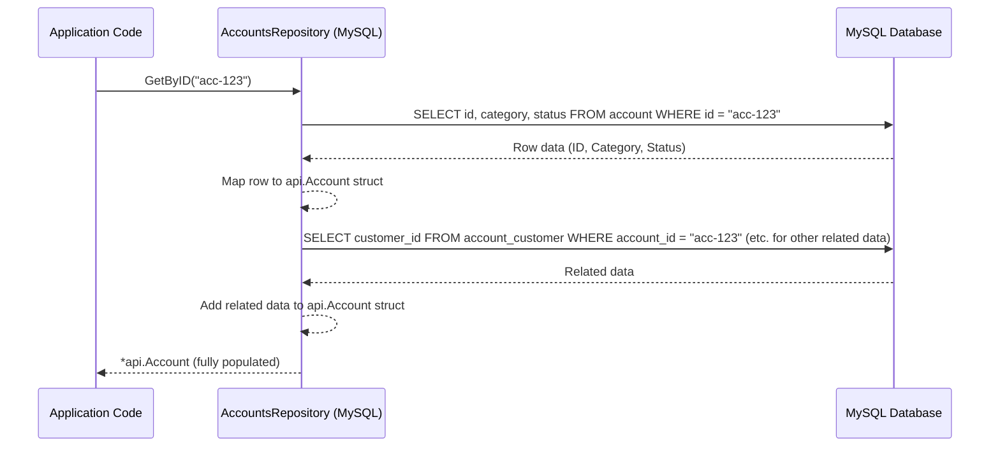
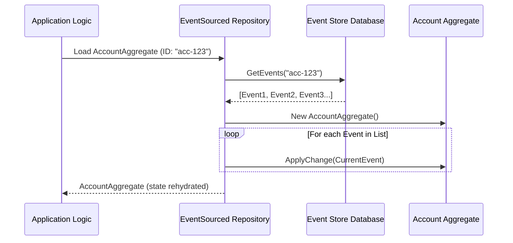

# Chapter 4: Repository

Welcome to Chapter 4! In the [previous chapter](03_aggregate_.md), we learned about [Aggregates](03_aggregate_.md), like our `AccountAggregate`. We saw how they manage their own state (like an account's balance or status) by processing [Commands](02_command_.md) and then producing [Events](01_event_.md) to record what happened.

Now, a couple of important questions arise:
1.  When an `AccountAggregate` needs to process a [Command](02_command_.md) for an *existing* account, how does it get its current state? Remember, its state is built by replaying its past [Events](01_event_.md). Where do these [Events](01_event_.md) come from?
2.  After an `AccountAggregate` processes a [Command](02_command_.md) and creates new [Events](01_event_.md), where do these new [Events](01_event_.md) get stored so they are not forgotten?
3.  Beyond [Aggregates](03_aggregate_.md), what if other parts of our bank system simply need to *read* account information – say, to display a list of Alice's accounts on a web page? How do they get this data without needing to understand all the [Events](01_event_.md)?

This is where the **Repository** pattern comes to our rescue!

## What is a Repository? The Bank's Diligent Archivist

Imagine a bank's large, old-fashioned archive room, filled with rows and rows of filing cabinets. This room has a team of dedicated archivists.

*   If a bank teller (let's say, an [Aggregate](03_aggregate_.md)) needs the history of a specific account to understand its current situation, they don't go rummaging through the cabinets themselves. They fill out a request slip and give it to an archivist. The archivist knows exactly where to find the files (the [Events](01_event_.md) or account data) and brings them back.
*   If the teller completes a transaction and needs to file away the record (a new [Event](01_event_.md) or updated account information), they hand it to the archivist, who ensures it's stored in the right place, safely and correctly.

A **Repository** in our `corebanking` system works just like this team of archivists. It's a component responsible for **persisting (saving) and retrieving data**. This data could be account details, customer information, transaction histories, or the [Events](01_event_.md) that make up an [Aggregate's](03_aggregate_.md) history.

The crucial part is that the Repository provides an **abstraction** over the actual data storage mechanism. This means other parts of the system (like [Aggregates](03_aggregate_.md) or [Services](07_service_.md) which we'll see later) don't need to know if the data is stored in a MySQL database, a different type of database, or even text files. They just talk to the Repository using simple, clear methods.

## Key Ideas About Repositories

1.  **Hides Storage Details:** The rest of the application doesn't care *how* or *where* data is stored. Is it SQL? Is it a NoSQL database? The Repository handles those details. This is like not needing to know the archivist's specific filing system, just that they can get you the file you need.
2.  **Defined Contract (Interface):** A Repository offers a clear set of operations, like `GetByID()`, `Save()`, or `Search()`. In Go, this "contract" is usually defined by an `interface`.
3.  **One Repository per Data Type (Usually):** You'll often have a specific repository for each main type of data you're managing. For example:
    *   An `AccountsRepository` to manage `Account` data.
    *   A `CustomersRepository` to manage `Customer` data.
4.  **Different Repositories for Different Needs:**
    *   **For [Aggregates](03_aggregate_.md) (Event Sourcing):** In an Event Sourced system like ours, [Aggregates](03_aggregate_.md) (like `AccountAggregate`) are special. They are not stored directly as a single row in a database. Instead, their state is derived from their history of [Events](01_event_.md). A specialized type of repository (often called an `EventSourcedRepository` or similar) is used:
        *   To **load** an [Aggregate](03_aggregate_.md): It fetches all its past [Events](01_event_.md) from an "Event Store" (a database optimized for storing events).
        *   To **save** an [Aggregate](03_aggregate_.md): It takes any new [Events](01_event_.md) the [Aggregate](03_aggregate_.md) has produced and stores them in the Event Store.
    *   **For Read Data (Projections/Views):** Sometimes, we need to query data that's already nicely formatted for display or reporting – this is often called a "read model" or "projection." For example, when displaying account details on a screen, we want the current status, balance, etc., directly, not a list of [Events](01_event_.md). Repositories are also used to fetch this kind of data. Our `AccountsRepository` in `api/accounts.go` is an example of this type.

## Using a Repository: Let's Look at Account Data

Let's focus on how we might get information about an account that's easy to read and display, using the `AccountsRepository` from our project. Imagine a [Service](07_service_.md) (a component we'll discuss later) needs to fetch Alice's account details.

### The Contract: The `AccountsRepository` Interface

First, there's an interface that defines what operations can be performed for accounts. This is like the list of services the archivists offer.

```go
// From: api/accounts.go

// AccountsRepository defines methods for account data storage
type AccountsRepository interface {
	Save(ctx context.Context, account *Account) error
	// UpdateStatus updates the status of an account
	UpdateStatus(ctx context.Context, accountID uuid.UUID, status string, updated time.Time) error
	GetByID(ctx context.Context, accountID uuid.UUID) (*Account, error)
	// ... other methods like Search, GetByIDs, SavePaymentDeviceLink etc.
}
```
*   This interface declares methods like `Save`, `UpdateStatus`, and `GetByID`.
*   It uses `*Account`, which is a struct (`api.Account`) representing the "read model" of an account – a snapshot of its current, easily readable state. This is different from the `AccountAggregate` which is focused on processing [Commands](02_command_.md) and [Events](01_event_.md).

### Getting Account Data

If a part of our system needs to get details for account `acc-123`, it would use an implementation of `AccountsRepository`:

```go
// Somewhere in our application (e.g., inside an Account Service)
var accountsRepo api.AccountsRepository // This would be a concrete implementation

// ...
accountID := uuid.FromString("acc-123") // The ID of the account we want
account, err := accountsRepo.GetByID(context.Background(), accountID)
if err != nil {
	// Handle error, maybe the account wasn't found
	fmt.Println("Error fetching account:", err)
	return
}

fmt.Println("Fetched Account Category:", account.Category)
fmt.Println("Fetched Account Status:", account.Status)
```
*   **Input:** The `GetByID` method takes a `context` and the `accountID`.
*   **Output:** It returns an `*api.Account` struct (containing the account's details like category, status, etc.) and an error (which will be `nil` if successful).

The code calling `accountsRepo.GetByID` doesn't know or care if the data came from MySQL, a different database, or even a text file. That's the beauty of the repository abstraction!

## Under the Hood: The `MySQLRepository` for Accounts

Our project has a concrete implementation of the `AccountsRepository` interface that uses a MySQL database. It's located in `api/pkg/accounts/mysql_repository.go`.

Let's see a simplified version of how its `GetByID` method might work:

```go
// Simplified from: api/pkg/accounts/mysql_repository.go

// MySQLRepository implements AccountsRepository using MySQL.
type MySQLRepository struct {
	// (Internal details, like how it gets a database connection, are hidden here)
}

// GetByID retrieves an account's projection (read model) by its ID from MySQL.
func (r *MySQLRepository) GetByID(ctx context.Context, accountID uuid.UUID) (*api.Account, error) {
	// 1. Get a database connection (simplified)
	conn, _ := repository.SQLConnection(ctx) 
	
	// 2. This struct holds the raw data fetched from the 'account' table
	var dbAccountData struct { // In real code, this is 'accountDbEntry'
		ID       uuid.UUID `db:"id"`
		Category string    `db:"category"`
		Status   string    `db:"status"`
		// ... other fields matching the database table columns ...
	}
	
	// 3. Build the SQL query to select account data
	sqlQuery := "SELECT id, category, status /*, ...other columns... */ FROM account WHERE id = ?"
	
	// 4. Execute the query against the MySQL database
	err := conn.GetContext(ctx, &dbAccountData, sqlQuery, accountID) 
	if err != nil {
		if errors.Is(err, sql.ErrNoRows) {
			return nil, e.NewEntityIDNotFound("account", accountID.String()) // Specific error for "not found"
		}
		// Some other database error occurred
		return nil, e.NewInternal(err) 
	}

	// 5. Convert the raw database data (dbAccountData) into the application's api.Account struct
	apiAccount := &api.Account{
		ID:       dbAccountData.ID,
		Category: dbAccountData.Category,
		Status:   dbAccountData.Status,
		// ... populate other fields ...
	}
	
	// 6. In the real code, it also fetches related data like customer links, parameters, 
	//    payment device links and populates them into apiAccount.
	//    Example (highly simplified):
	//    apiAccount.CustomerIDs, _ = r.getCustomersForAccount(ctx, accountID)
	//    apiAccount.Parameters, _ = r.getParametersForAccount(ctx, accountID)
	
	return apiAccount, nil
}
```
Let's break this down step-by-step:
1.  **Get Connection:** It first obtains a connection to the MySQL database.
2.  **Data Holder:** `dbAccountData` is a temporary struct to hold the data exactly as it comes from the database table.
3.  **SQL Query:** It defines the SQL `SELECT` statement to fetch data from the `account` table based on the `id`.
4.  **Execute Query:** The query is executed. If no account is found, it returns a "not found" error. Other database errors are also handled.
5.  **Map Data:** If data is found, the raw `dbAccountData` is converted into an `*api.Account` struct. This `api.Account` struct is what the rest of our application understands and expects.
6.  **Fetch Related Data:** An account might have associated customers, specific parameters, or linked payment devices. The full repository method would also query other tables to fetch this related information and populate the `api.Account` struct completely.

Here's a sequence diagram showing this:



Similarly, a `Save` method in `MySQLRepository` would take an `*api.Account` struct, convert its fields into a format suitable for the database, and then execute an `INSERT` or `UPDATE` SQL statement.

## What About [Aggregates](03_aggregate_.md) and Their [Events](01_event_.md)?

As mentioned earlier, [Aggregates](03_aggregate_.md) like `AccountAggregate` are handled a bit differently in an Event Sourced system. They also use a Repository, but it's a specialized one.

*   **Loading an [Aggregate](03_aggregate_.md):**
    When the system needs to load, say, `AccountAggregate` for `acc-123`:
    1.  It asks an `EventSourcedRepository` to `Load("acc-123")`.
    2.  This repository connects to an **Event Store** (a special database designed to store sequences of [Events](01_event_.md)).
    3.  It fetches all [Events](01_event_.md) ever recorded for `acc-123`.
    4.  It creates a new, empty `AccountAggregate` instance.
    5.  It then "replays" each historical [Event](01_event_.md) on this instance by calling its `ApplyChange(event)` method. This rebuilds the [Aggregate's](03_aggregate_.md) current state.
    6.  The fully rehydrated `AccountAggregate` is returned.

*   **Saving an [Aggregate](03_aggregate_.md):**
    After `AccountAggregate` processes a [Command](02_command_.md) and generates new [Events](01_event_.md):
    1.  The system calls `Save(accountAggregate)` on the `EventSourcedRepository`.
    2.  The repository gets the list of newly generated (uncommitted) [Events](01_event_.md) from the `accountAggregate`.
    3.  It appends these new [Events](01_event_.md) to the Event Store, associated with `acc-123`.
    4.  It then clears the list of uncommitted [Events](01_event_.md) from the `accountAggregate`.

Here's how loading an [Aggregate](03_aggregate_.md) via an EventSourced Repository looks:

This shows that the Repository pattern is flexible. We can have different repository implementations for different kinds of data (read models like `api.Account`) and different storage strategies (like an Event Store for [Aggregates](03_aggregate_.md)).

## Why is This Abstraction So Useful?

Using the Repository pattern brings several benefits:

1.  **Testability:** When testing parts of your application that need data, you don't always want to connect to a real database. It can be slow and complicated to set up. With repositories, you can create a "mock" or "fake" repository for your tests. This fake repository can pretend to be a database, returning predefined data or checking if `Save` was called correctly, all without any actual database interaction.
2.  **Flexibility (Change Your Database Later):** Imagine your bank starts with MySQL but later decides to switch to a different database, say PostgreSQL. If your application code directly uses MySQL-specific queries everywhere, changing the database would be a nightmare! With repositories, you only need to write a *new implementation* of the `AccountsRepository` interface (e.g., `PostgreSQLRepository`). The rest of your application code that uses the `AccountsRepository` interface doesn't need to change at all because it was only depending on the interface, not the specific MySQL details.
3.  **Clear Separation of Concerns:** Business logic (what the bank *does*) is kept separate from data access logic (how data is saved and retrieved). This makes the code cleaner, easier to understand, and maintain. [Aggregates](03_aggregate_.md) and [Services](07_service_.md) focus on their tasks without being cluttered by SQL queries.

## Conclusion

Repositories are like the organized and efficient archivists of our `corebanking` system. They handle all the details of storing and retrieving data, whether it's:
*   Fetching historical [Events](01_event_.md) to rebuild an [Aggregate's](03_aggregate_.md) state.
*   Saving new [Events](01_event_.md) produced by an [Aggregate](03_aggregate_.md).
*   Querying user-friendly "read models" (like an `api.Account`) from a database for display or reporting.

By providing a clean abstraction layer over data storage, Repositories make our system more maintainable, testable, and flexible. They ensure that other parts of the system can request or save data using simple methods, without needing to know the nitty-gritty details of how or where that data is actually stored.

Now that we know how data can be persisted and retrieved, how do external requests (like Alice trying to create an account through a mobile app) actually reach our core system and make use of these components? In the next chapter, we'll look at the entry points for such requests: the [API Handler](05_api_handler_.md).

---

Generated by [AI Codebase Knowledge Builder](https://github.com/The-Pocket/Tutorial-Codebase-Knowledge)