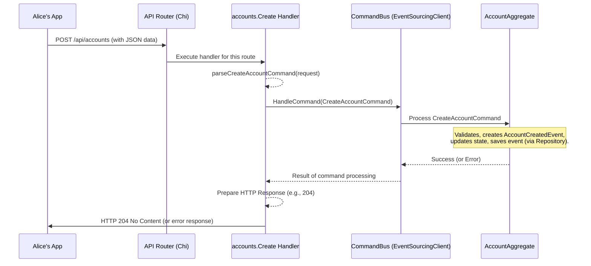

# Chapter 5: API Handler

Welcome to Chapter 5! In the [previous chapter](04_repository_.md), we explored [Repositories](04_repository_.md) and how they help us save and retrieve data, like account information or the history of [Events](01_event_.md) for an [Aggregate](03_aggregate_.md). We now know how our system manages its data.

But how does a request from the outside world, like Alice trying to open a new bank account using her mobile app, actually reach our `corebanking` system and start this whole process? How does Alice's app "talk" to our bank's brain? This is where the **API Handler** comes into play.

## What's an API Handler? The Bank's Welcome Desk

Imagine walking into a bank. You don't just wander into the vault or start talking to random employees. You usually go to a specific counter or desk:
*   "Account Opening" desk.
*   "Deposits & Withdrawals" window.
*   A specific online form for "Loan Application."

An **API Handler** in our `corebanking` system is just like that specific desk or form. It's the **official entry point** for any external request that wants to interact with our system. "API" stands for Application Programming Interface, which is a way for different software programs to communicate with each other.

Each API Handler is responsible for:
1.  A specific **URL path** (like a web address, e.g., `/api/accounts`).
2.  A specific **HTTP method** (like the type of action, e.g., `POST` for creating something, `GET` for fetching something).

When a request arrives matching its designated URL and method, the API Handler takes charge. Its job is to:
*   Understand the incoming request (e.g., read the data Alice submitted).
*   Translate this request into an instruction our system understands, like a [Command](02_command_.md) (e.g., "Please create an account with these details").
*   Or, it might ask a [Service](07_service_.md) to fetch some information.
*   Finally, it sends back an HTTP response to tell the requester what happened (e.g., "Account created successfully!" or "Sorry, there was an error.").

Essentially, API Handlers are the bridge connecting the "web world" (HTTP requests and responses) to the internal business logic of our bank.

## Key Responsibilities of an API Handler

Let's break down what an API Handler typically does:

1.  **Listens at a Specific Address:** Each handler is tied to a unique combination of a URL path and an HTTP method. For example:
    *   `POST /api/accounts`: Handler for creating new accounts.
    *   `GET /api/accounts/{accountId}`: Handler for fetching details of a specific account.
    *   `PUT /api/accounts/{accountId}/close`: Handler for closing an account.
2.  **Parses the Incoming Request:** When Alice submits her account application form, her details (name, desired currency, etc.) are often sent as a JSON payload in the body of an HTTP request. The API Handler needs to read this data and convert it into a format our Go code can understand (like a Go struct).
3.  **Basic Validation (Sometimes):** The handler might do some very basic checks, like "Is the JSON data correctly formatted?" or "Are essential fields like 'currency' present?". However, deep business rule validation (e.g., "Is this currency supported by our bank?") is usually done further inside the system by [Aggregates](03_aggregate_.md) or [Services](07_service_.md).
4.  **Translates to Internal Actions:** This is a crucial step.
    *   **For actions that change data (Writes):** The handler often creates a [Command](02_command_.md) object (like `CreateAccountCommand`) and populates it with the data from the request. It then sends this [Command](02_command_.md) to a "Command Bus," which is like a central dispatcher that routes the [Command](02_command_.md) to the correct [Aggregate](03_aggregate_.md) (e.g., `AccountAggregate`) for processing.
    *   **For actions that only read data (Reads):** The handler might directly call a [Service](07_service_.md) (e.g., an `AccountsService`) to fetch the requested information (like account details from a [Repository](04_repository_.md)).
5.  **Formats and Sends the Response:** After the [Command](02_command_.md) is processed or the [Service](07_service_.md) returns data, the API Handler takes the result and crafts an HTTP response. This includes:
    *   An **HTTP Status Code** (e.g., `200 OK` for success, `201 Created` if something new was made, `400 Bad Request` if the input was wrong, `500 Internal Server Error` if something went wrong on our side).
    *   A **Response Body** (often JSON data, like the details of the created account, or an error message).

## Alice Creates an Account: The API Handler's Role

Let's see how an API Handler helps Alice open her account:

1.  **Alice's App Sends a Request:** Alice fills out the "New Account" form on her banking app and taps "Submit." Her app sends an HTTP `POST` request to the URL `/api/accounts`. The body of this request contains her details in JSON format, like:
    ```json
    {
      "category": "ASSET",
      "product": { "id": "prod-savings-basic", "name": "Basic Savings" },
      "availableCurrencies": ["USD"],
      "customerIds": ["cust-alice-123"]
    }
    ```
2.  **The Correct Handler is Activated:** Our `corebanking` system's web server receives this request. It looks at the method (`POST`) and the path (`/api/accounts`) and finds the specific API Handler responsible for this combination.
3.  **Handler Parses the Request:** This API Handler (let's call it the `CreateAccountHandler`) takes the JSON data from the request's body. It uses a JSON parser to convert this data into a Go struct that matches the structure of a `CreateAccountCommand`.
4.  **Handler Creates and Dispatches a [Command](02_command_.md):** The handler now creates an instance of `api.CreateAccountCommand` and fills it with the details parsed from Alice's request. It then passes this command to something called a `CommandBus` (part of `core.EventSourcingClient` in our project).
    ```go
    // Inside the handler (conceptual)
    var cmd api.CreateAccountCommand
    // ... (parse JSON from request into cmd) ...
    err := commandBus.HandleCommand(context, &cmd)
    ```
5.  **Handler Waits and Responds:** The Command Bus ensures the `CreateAccountCommand` is processed (by an `AccountAggregate`, which generates an `AccountCreatedEvent`, as we saw in earlier chapters).
    *   If the command is processed successfully, the handler sends back an HTTP response like `204 No Content` (meaning "I did what you asked, and there's no specific content to return") or `201 Created` (if it were to return details of the created account).
    *   If there's an error (e.g., Alice provided an invalid customer ID), the [Aggregate](03_aggregate_.md) would signal an error, and the handler would send back an HTTP response like `400 Bad Request` with a JSON body describing the error.

## A Peek at the Code: An Account Creation Handler

Our project has API handlers defined in packages under `api/cmd/corebanking-api/`. For creating accounts, the relevant file is `api/cmd/corebanking-api/accounts/create.go`.

Let's look at a simplified version of the `Create` function, which acts as our API Handler:

```go
// Simplified from: api/cmd/corebanking-api/accounts/create.go

// 'cb' is a CommandBus, which knows how to send commands
// to the right part of our system.
func Create(cb es.CommandBus) http.HandlerFunc {
	return func(w http.ResponseWriter, r *http.Request) {
		// 1. Parse the request to get command data
		command, err := parseCreateAccountCommand(r)
		if err != nil {
			// If parsing fails, send an error response
			e.MarshallHTTP(err, w) // Helper to send formatted error
			return
		}

		// 2. Send the command for processing
		err = cb.HandleCommand(r.Context(), &command)
		if err != nil {
			// If command processing fails, send an error response
			e.MarshallHTTP(err, w)
			return
		}

		// 3. If everything is OK, send a success response
		w.WriteHeader(http.StatusNoContent) // "204 No Content"
	}
}
```
Let's break this down:
*   `func Create(cb es.CommandBus) http.HandlerFunc`: This function `Create` takes a `CommandBus` (our `es.EventSourcingClient`) as an argument and *returns* another function. This returned function is the actual handler that Go's HTTP server will call for each incoming request.
    *   `w http.ResponseWriter`: Used to write the HTTP response back to Alice's app.
    *   `r *http.Request`: Represents the incoming HTTP request from Alice's app.

Inside the returned function:
1.  **Parse Request:** `command, err := parseCreateAccountCommand(r)`
    This calls a helper function (we'll see it next) to read Alice's data from the request (`r`) and turn it into our `api.CreateAccountCommand` struct. If there's an error during parsing (e.g., malformed JSON), it sends an error response using `e.MarshallHTTP(err, w)`.
2.  **Send Command:** `err = cb.HandleCommand(r.Context(), &command)`
    This is where the magic happens! The parsed `command` is handed off to the `CommandBus` (`cb`). The `CommandBus` will make sure it gets to the right [Aggregate](03_aggregate_.md) for processing. If the [Aggregate](03_aggregate_.md) rejects the command (e.g., business rule violation), `HandleCommand` returns an error, which is then sent back as an HTTP error.
3.  **Success Response:** `w.WriteHeader(http.StatusNoContent)`
    If both parsing and command processing are successful, this line sends an HTTP status code `204 No Content` back to Alice's app, indicating success.

### Parsing the Request Data

The `parseCreateAccountCommand` helper function looks something like this (simplified):

```go
// Simplified from: api/cmd/corebanking-api/accounts/create.go
func parseCreateAccountCommand(r *http.Request) (api.CreateAccountCommand, error) {
	var command api.CreateAccountCommand // Prepare an empty command struct

	// Decode the JSON data from the request body into our 'command' struct
	if err := json.NewDecoder(r.Body).Decode(&command); err != nil {
		// If decoding fails, log it and return a "bad format" error
		log.G(r.Context()).WithError(err).Error("could not decode json")
		return command, e.NewBadFormat(err.Error())
	}

	return command, nil // Return the populated command and no error
}
```
*   `var command api.CreateAccountCommand`: An empty `CreateAccountCommand` struct is created.
*   `json.NewDecoder(r.Body).Decode(&command)`: This is standard Go for reading JSON. It takes the request's body (`r.Body`), creates a JSON decoder, and tries to fill the `command` struct with the data from the JSON.
*   If `Decode` fails (e.g., the JSON is broken or doesn't match the command structure), an error is logged and a specific "bad format" error is returned.

So, the handler first uses this parsing logic to understand the request, then dispatches the [Command](02_command_.md).

## How Does the System Know Which Handler to Call? Routing!

You might be wondering: if Alice's app sends a `POST` request to `/api/accounts`, how does our `corebanking` application know to call the `accounts.Create` handler function we just looked at?

This is done by a **router**. A router is like a traffic controller for web requests. It looks at the URL and HTTP method of an incoming request and directs it to the correct handler function. Our project uses a popular Go router called `chi`.

The setup for these routes is typically done in a file like `api/cmd/corebanking-api/routes/routes.go`. Here's a tiny snippet showing how the account creation route is defined:

```go
// Simplified from: api/cmd/corebanking-api/routes/routes.go

// 'core' contains things like our CommandBus (EventSourcingClient)
// and Services.
func getAPIRoutes(core *api.Core) http.Handler {
	r := chi.NewRouter() // Create a new router

	// ... other routes ...

	// This line tells the router:
	// If a POST request comes to "/accounts",
	// call the handler returned by accounts.Create(),
	// passing it the EventSourcingClient from 'core'.
	r.Post("/accounts", accounts.Create(core.EventSourcingClient))

	// Example of a GET request handler:
	// r.Get("/accounts/{id}", accounts.Get(core.AccountsService))

	// ... many other routes ...

	return r
}
```
*   `r := chi.NewRouter()`: Initializes a new router.
*   `r.Post("/accounts", accounts.Create(core.EventSourcingClient))`: This is the key line.
    *   `r.Post` means this rule applies to HTTP `POST` requests.
    *   `"/accounts"` is the URL path.
    *   `accounts.Create(core.EventSourcingClient)` is the handler function we want to execute. Notice that we *call* `accounts.Create(...)` here. This function, as we saw, *returns* the actual `http.HandlerFunc` that `chi` will use. We pass `core.EventSourcingClient` (which is our `CommandBus`) to it so the handler can dispatch commands.

For requests that read data, like getting account details, you'd see something like `r.Get("/accounts/{id}", accounts.Get(core.AccountsService))`. Here, `accounts.Get` would be another handler function, likely taking an `AccountsService` to fetch data.

## The Journey of a Request: From App to Response

Let's visualize the entire flow for Alice creating an account:


1.  Alice's app sends the `POST` request.
2.  The Web Router (Chi) finds the `accounts.Create` handler.
3.  The `CreateAccountHandler` parses the JSON into a `CreateAccountCommand`.
4.  It sends the command to the `CommandBus`.
5.  The `CommandBus` delivers it to the `AccountAggregate`.
6.  The `AccountAggregate` processes the command (validates, generates [Events](01_event_.md), updates its state, and ensures the [Events](01_event_.md) are saved via a [Repository](04_repository_.md) - this part was covered in detail in Chapters 1-4).
7.  The result (success/error) bubbles back up to the handler.
8.  The handler sends the appropriate HTTP response back to Alice's app.

## Conclusion

API Handlers are the vital "front doors" of our `corebanking` system. They listen for specific web requests (URLs and HTTP methods), parse the incoming data, and then translate these external requests into actions our internal system understands – usually by creating and dispatching [Commands](02_command_.md) for write operations or calling [Services](07_service_.md) for read operations. They then take the result of these actions and formulate an HTTP response to send back to the original requester.

By bridging the gap between the web world (HTTP) and our core business logic, API Handlers make our system accessible to external clients like mobile apps, websites, or even other banking systems.

Now that we've seen how requests enter our system, you might wonder: is there a central place that coordinates these actions, especially when a single request might involve multiple steps or components? That's where our next topic comes in. Get ready to learn about the [Core Facade](06_core_facade_.md)!

---

Generated by [AI Codebase Knowledge Builder](https://github.com/The-Pocket/Tutorial-Codebase-Knowledge)