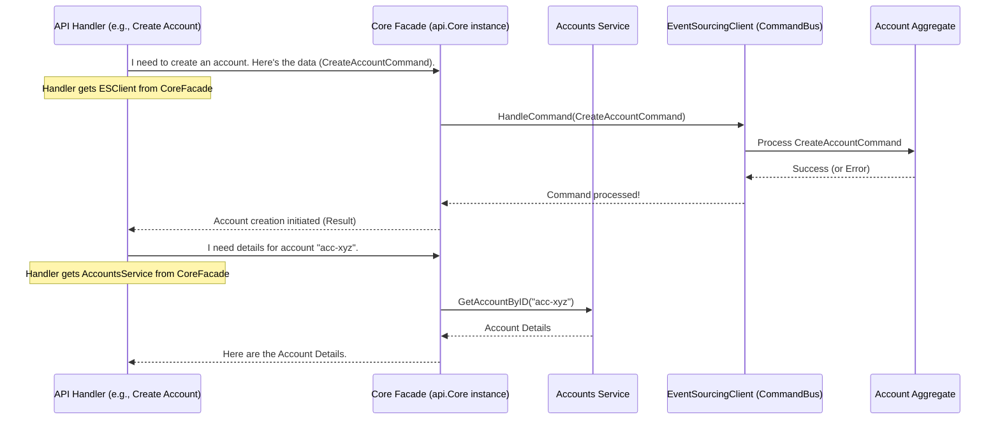

# Chapter 6: Core Facade

Welcome to Chapter 6! In our [previous chapter on API Handlers](05_api_handler_.md), we saw how external requests, like Alice wanting to create an account, enter our `corebanking` system through specific API endpoints. These [API Handlers](05_api_handler_.md) then need to interact with various parts of our bank's brain – maybe to send a [Command](02_command_.md) or to fetch some data.

But imagine an [API Handler](05_api_handler_.md) trying to juggle many different tools: one tool for sending [Commands](02_command_.md), another for looking up customer details, yet another for checking product information. It could get messy quickly! How do we keep this organized and simple for the [API Handler](05_api_handler_.md)?

This is where the **Core Facade** comes in.

## What is the Core Facade? The Bank's Main Office

Think of the `Core` struct (our Core Facade) as the **main reception desk or central switchboard** for our entire `corebanking` application. It's like a central office in a large company. If you (an [API Handler](05_api_handler_.md), for instance) need something from any department, you don't run around the building looking for them. You go to the main office, and they connect you to the right place.

The Core Facade brings together all the different specialized "departments" – which in our system are various [Services](07_service_.md) (like `AccountsService`, `CustomersService`) and other key components like the `EventSourcingClient` (our [Command](02_command_.md) bus) – into a **single, unified point of access**.

When an external part of the system, like the [API layer](05_api_handler_.md), needs to interact with the business logic, it simply talks to this `Core` facade. This keeps our overall architecture clean and makes it much easier to manage how different parts of the application interact.

Essentially, the Core Facade is like a well-organized toolbox for our [API Handlers](05_api_handler_.md). Instead of the handler needing to know about and hold onto dozens of individual tools, it just gets this one `Core` toolbox, which contains everything it might need.

## What Does the Core Facade Look Like? (The `Core` Struct)

In our Go code, the Core Facade is represented by a struct named `Core`, defined in `api/core.go`. Let's look at a simplified version:

```go
// From: api/core.go
// Core represents the entrypoint to call the business logic.
type Core struct {
	HealthService       HealthService
	EventSourcingClient es.EventSourcingClient // To send Commands!
	ParametersService   ParametersService
	AccountsService     AccountsService     // To read account data!
	CustomersService    CustomersService
	ProductsService     ProductsService
	// ... and many other services and clients ...
}
```
*   You can see that `Core` is a struct that holds various fields.
*   Each field represents a specific "department" or tool:
    *   `EventSourcingClient`: This is crucial for sending [Commands](02_command_.md) (like `CreateAccountCommand`) to our [Aggregates](03_aggregate_.md). We've seen this in action with [API Handlers](05_api_handler_.md).
    *   `AccountsService`: If an [API Handler](05_api_handler_.md) needs to fetch a list of accounts or details about a specific account (not through event sourcing, but from a read-friendly data store), it would use this [Service](07_service_.md). We'll learn more about [Services](07_service_.md) in the next chapter!
    *   `CustomersService`, `ProductsService`, etc.: These provide access to other areas of our banking logic.

So, the `Core` struct acts as a container, a "bag" holding all these important pieces of our application's core logic.

## How Do [API Handlers](05_api_handler_.md) Use the Core Facade?

Remember from [Chapter 5](05_api_handler_.md) how our [API Handlers](05_api_handler_.md) are set up using a router? The router is often given access to this `Core` facade instance. When an [API Handler](05_api_handler_.md) function is defined, it can be passed the specific service or client it needs *from* the `Core` facade.

Let's revisit a simplified example from `api/cmd/corebanking-api/routes/routes.go` where routes are defined:

```go
// Simplified from: api/cmd/corebanking-api/routes/routes.go

// 'core' here is an instance of our api.Core struct (the Facade!)
func getAPIRoutes(core *api.Core) http.Handler {
	r := chi.NewRouter() // Our web router

	// For creating accounts, the handler needs the EventSourcingClient (CommandBus)
	r.Post("/accounts", accounts.Create(core.EventSourcingClient))

	// For getting account details, a handler might need the AccountsService
	// (Example, actual handler for GET might be different)
	// r.Get("/accounts/{accountId}", accounts.GetDetails(core.AccountsService))

	// ... other routes using different parts of 'core' ...
	return r
}
```
*   The `getAPIRoutes` function receives an argument `core *api.Core`. This `core` object is our fully assembled Core Facade!
*   When setting up the route for `POST /accounts`, the `accounts.Create` handler function is given `core.EventSourcingClient`. This means the `CreateAccountHandler` doesn't need to find or create an `EventSourcingClient` itself; it gets it directly from the Core Facade.
*   Similarly, if we had a handler to fetch account details (e.g., `accounts.GetDetails`), it could be given `core.AccountsService`.

This way, the `Core` facade acts as a central provider. The [API Handlers](05_api_handler_.md) just ask the `Core` facade for the specific tool they need.

## How is the Core Facade Built? (The Making of the Toolbox)

You might be wondering: who creates this `Core` struct and fills it with all these services?

This happens when our `corebanking` application starts up. There's a special part of our code, primarily in a function called `FromEnv` in `api/pkg/core/core.go`, whose job is to:
1.  Initialize all the individual [Services](07_service_.md) (like `AccountsService`, `ProductsService`, etc.).
2.  Initialize the `EventSourcingClient`.
3.  Initialize [Repositories](04_repository_.md) and other necessary components.
4.  Then, it packages all of these initialized components into a single `api.Core` struct instance.

Let's look at a very simplified snippet from our application's main entry point (`api/cmd/corebanking-api/api.go`) to see where this happens:

```go
// Simplified from: api/cmd/corebanking-api/api.go main()
func main() {
	// ... (lots of initial setup: logging, configuration, etc.) ...

	// tenantsConfigManager is used for multi-tenancy configurations
	tenantsConfigManager := wiggumauto.NewConfigManager()
	tenantsConfigManager.MustInitialize(ctx)

	// Here! 'c' becomes our fully assembled Core Facade instance.
	// core.FromEnv does all the hard work of creating and wiring up services.
	c := core.FromEnv(tenantsConfigManager)

	// The Core Facade 'c' is then passed to the router setup.
	r := routes.GetRouter(c, tenantsConfigManager, monitoring)

	// ... (starts the web server with these routes) ...
	// ... (handles graceful shutdown, including c.EventSourcingClient.Close())
}
```
*   `c := core.FromEnv(tenantsConfigManager)`: This is the key line. The `core.FromEnv()` function (from `api/pkg/core/core.go`) is called. It sets up everything needed for the core logic (databases, event buses, all services) and returns a pointer to a fully populated `api.Core` struct. This `c` is our Core Facade.
*   `r := routes.GetRouter(c, ...)`: This `c` (our Core Facade) is then passed to the function that sets up all the API routes, as we saw in the previous section.

The `FromEnv` function itself is quite complex because it initializes many parts of the system, connecting them together. For a beginner, the important takeaway is that *there is a dedicated place* where the `Core` facade is carefully assembled when the application starts.

## The Flow: API Handler, Core Facade, and Beyond

Let's visualize how an [API Handler](05_api_handler_.md) uses the Core Facade:


This diagram shows two scenarios:
1.  **Creating an Account (a [Command](02_command_.md)):** The [API Handler](05_api_handler_.md) uses the `EventSourcingClient` *obtained from* the `CoreFacade` to send the `CreateAccountCommand`. The `CoreFacade` itself doesn't process the command but provides access to the component that does.
2.  **Getting Account Details (a Query):** The [API Handler](05_api_handler_.md) uses the `AccountsService` *obtained from* the `CoreFacade` to request account information. The `CoreFacade` directs this to the actual `AccountsService`.

## Benefits of the Core Facade

Using this Core Facade pattern provides several advantages:

1.  **Organization:** All core business functionalities are neatly bundled and accessible from one place.
2.  **Simplicity for Callers:** Components like [API Handlers](05_api_handler_.md) don't need to know about or manage dependencies on dozens of individual services. They just need the `Core` object.
3.  **Centralized Dependency Management:** The creation and wiring of all major services and components happen in one central place (like `core.FromEnv`). This makes it easier to manage the application's startup and overall structure.
4.  **Clear Entry Point:** It provides a clear and consistent entry point into the application's business logic for any external interface (like the API).

## Conclusion

The **Core Facade**, represented by our `api.Core` struct, acts as the central hub or main reception desk for our `corebanking` application. It doesn't do the business logic itself but holds references to all the specialized [Services](07_service_.md) and clients (like the `EventSourcingClient`) that do.

For components like [API Handlers](05_api_handler_.md), the Core Facade simplifies interaction with the system's core functionalities by providing a single, organized point of access. This keeps the architecture clean and manageable.

The Core Facade is filled with various "departments" or tools. One very common type of tool it holds is a "Service." In the next chapter, we'll dive deeper into what these [Services](07_service_.md) are and what role they play in our `corebanking` system.

---

Generated by [AI Codebase Knowledge Builder](https://github.com/The-Pocket/Tutorial-Codebase-Knowledge)