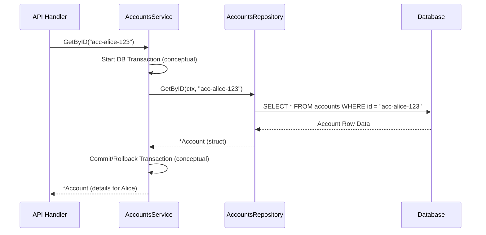

# Chapter 7: Service

Welcome to Chapter 7! In the [previous chapter](06_core_facade_.md), we learned about the [Core Facade](06_core_facade_.md), which acts as a central hub providing access to various parts of our `corebanking` system. One of the key components the [Core Facade](06_core_facade_.md) gives us access to are "Services."

But what exactly is a Service? And why do we need them?

## What's a Service? The Bank's Specialized Departments

Imagine you're at a bank. There isn't just one giant room where everything happens. Instead, there are specialized departments:
*   The "Account Opening" department helps new customers.
*   The "Loans" department handles loan applications and processing.
*   The "Customer Support" department answers your questions.

In our `corebanking` system, a **Service** is like one of these specialized departments. It's a component that groups together related business operations and logic for a specific area of the bank.

For example, we might have an `AccountsService`. This service would be responsible for all things related to bank accounts, such as:
*   Fetching the details of a specific account.
*   Searching for accounts based on certain criteria.
*   Potentially, initiating the creation of a new account (though, as we'll see, this is often done by sending a [Command](02_command_.md)).

Services help us organize the application's capabilities, making the system easier to understand, manage, and extend. They often act as a "facade" or an intermediary, receiving requests, interacting with [Repositories](04_repository_.md) to fetch or save data, or dispatching [Commands](02_command_.md) to [Aggregates](03_aggregate_.md) to perform actions.

## Key Ideas About Services

1.  **Specialized Focus:** Each Service handles a specific domain or business area (e.g., accounts, customers, product definitions).
2.  **Groups Business Operations:** It bundles related functions. For instance, an `AccountsService` might have functions like `GetAccountByID()`, `SearchAccounts()`, etc.
3.  **Orchestrates Logic:** A Service can coordinate multiple steps to fulfill a request. It might talk to a [Repository](04_repository_.md) to get data, perform some calculations or checks, and then return a result.
4.  **Interacts with Other Components:** Services often use [Repositories](04_repository_.md) to access data and can dispatch [Commands](02_command_.md) to [Aggregates](03_aggregate_.md) if changes to the system's state are needed.
5.  **Simplifies Interaction:** For other parts of the system (like [API Handlers](05_api_handler_.md)), Services provide a clean and focused interface to the business logic, hiding the underlying complexity.

## Using a Service: Fetching Account Details

Let's say an [API Handler](05_api_handler_.md) needs to display Alice's account details. It wouldn't directly query the database. Instead, it would use the `AccountsService`.

### The Contract: The `AccountsService` Interface

First, there's an interface that defines what operations the `AccountsService` offers. This is like the list of services a bank department provides.

```go
// From: api/accounts.go

// AccountsService manages accounts
type AccountsService interface {
	// ... (methods for creating/updating accounts - more on this later)
	Search(ctx context.Context, params *AccountSearchParameters) (Accounts, error)
	GetByID(ctx context.Context, accountID uuid.UUID) (*Account, error)
	GetByIDs(ctx context.Context, accountIDs []uuid.UUID) ([]*Account, error)
	// ... other methods ...
}
```
*   This interface declares methods like `Search`, `GetByID`, and `GetByIDs`.
*   Notice the `GetByID` method: it takes a `context` and an `accountID` and returns an `*Account` (a struct with account details) and an `error`.

### Calling the Service

An [API Handler](05_api_handler_.md) (or another part of the system) that has access to an `AccountsService` instance (perhaps via the [Core Facade](06_core_facade_.md)) can then call its methods:

```go
// Somewhere in an API Handler (conceptual)
var accountsSvc api.AccountsService // This would be provided by the CoreFacade

// ...
accountID := uuid.FromString("acc-alice-123") // Alice's account ID
accountDetails, err := accountsSvc.GetByID(context.Background(), accountID)

if err != nil {
	// Handle error (e.g., account not found)
	fmt.Println("Error fetching account:", err)
	return
}

// Now we can use accountDetails
fmt.Println("Account Status:", accountDetails.Status)
fmt.Println("Account Currency:", accountDetails.AvailableCurrencies[0])
```
*   **Input:** The `accountID` for Alice's account.
*   **Output:** The `accountDetails` struct (if found) or an `err`.

The [API Handler](05_api_handler_.md) doesn't need to know *how* the `AccountsService` gets this information. That's the Service's job!

## Under the Hood: How `AccountsServiceDefault.GetByID` Works

Our project has a concrete implementation of the `AccountsService` interface called `AccountsServiceDefault` (in `api/accounts.go`). Let's see how it's structured and how its `GetByID` method works.

First, the `AccountsServiceDefault` struct holds a reference to an `AccountsRepository`:

```go
// From: api/accounts.go
// AccountsServiceDefault represents the instance of a AccountsService.
type AccountsServiceDefault struct {
	connections repository.ConnectionsProvider // Manages DB connections
	repository  AccountsRepository         // The tool to talk to the database
}
```
When an `AccountsServiceDefault` is created, it's given an `AccountsRepository`:

```go
// From: api/accounts.go
// NewAccountsService return a new instance of the accounts service.
func NewAccountsService(
	connections repository.ConnectionsProvider,
	repository AccountsRepository,
) AccountsService {
	// ... (nil checks omitted for brevity) ...
	return &AccountsServiceDefault{
		connections: connections,
		repository:  repository,
	}
}
```
This means the service has the necessary tool ([Repository](04_repository_.md)) to fetch account data.

Now, let's look at a simplified version of its `GetByID` method:

```go
// Simplified from: api/accounts.go AccountsServiceDefault.GetByID
func (s *AccountsServiceDefault) GetByID(
	ctx context.Context,
	accountID uuid.UUID,
) (*Account, error) {
	// 1. Potentially start a database transaction (simplified)
	ctx, err := s.connections.NewTx(ctx)
	if err != nil {
		return nil, err
	}
	defer s.connections.Rollback(ctx) // Ensure transaction is rolled back if not committed

	// 2. Use the repository to fetch the account data
	account, err := s.repository.GetByID(ctx, accountID)
	if err != nil {
		return nil, err // Could be "not found" or other DB error
	}

	// 3. (A real service might do more here, like checking permissions
	//     or enriching the data, before returning it)

	return account, nil
}
```
Here's what happens:
1.  **Manage Transaction (Simplified):** It might start a database transaction. This is often good practice for read operations too, to ensure consistency, though for a single `GetByID` it might be optional depending on the database setup.
2.  **Use Repository:** The crucial step! It calls `s.repository.GetByID(ctx, accountID)`. The service delegates the actual data fetching to its [Repository](04_repository_.md).
3.  **Return Data:** It returns the `account` (or an error) obtained from the [Repository](04_repository_.md).

Here's a sequence diagram illustrating this flow:



## Services and Write Operations (Changes to Data)

So far, we've focused on how Services help read data. What about when we want to *change* data, like creating an account or updating its status?

The `AccountsService` interface in `api/accounts.go` actually defines methods like `Create`, `Activate`, etc.:
```go
// From: api/accounts.go
type AccountsService interface {
	Create(ctx context.Context, command CreateAccountCommand) error
	Activate(ctx context.Context, command ActivateAccountCommand) error
	// ... other methods like Close, LinkPaymentDevice ...
	// ... and the read methods we saw earlier ...
}
```
However, if you look at the `AccountsServiceDefault` implementation for these methods, you'll find something like this:
```go
// From: api/accounts.go AccountsServiceDefault.Create
func (s *AccountsServiceDefault) Create(
	_ context.Context,
	_ CreateAccountCommand,
) error {
	// writes should be done through the commandBus
	return e.NewNotImplemented()
}
```
It returns `e.NewNotImplemented()`! This tells us that, in this specific design, the `AccountsServiceDefault` *itself* doesn't directly handle account creation logic. Instead, such "write" operations are intended to be performed by sending a [Command](02_command_.md) (like `CreateAccountCommand`) directly to the `EventSourcingClient` (our Command Bus), which then routes it to the appropriate [Aggregate](03_aggregate_.md) (e.g., `AccountAggregate`). This is often done by the [API Handler](05_api_handler_.md) using the `EventSourcingClient` from the [Core Facade](06_core_facade_.md).

**Why this separation?**
*   **Centralized Command Processing:** Keeps all state-changing logic within [Aggregates](03_aggregate_.md), ensuring business rules are consistently enforced.
*   **Event Sourcing Purity:** [Aggregates](03_aggregate_.md) are the source of [Events](01_event_.md), and [Commands](02_command_.md) are the standard way to trigger changes in them.

### When Services *Do* Orchestrate Writes

However, this doesn't mean Services *never* handle logic related to writes. A Service might:
1.  **Perform preliminary checks or gather data** before a [Command](02_command_.md) is dispatched.
2.  **Dispatch a [Command](02_command_.md) itself** if the operation is more complex or involves coordination.
3.  **Orchestrate multiple [Commands](02_command_.md)** or interactions with different [Aggregates](03_aggregate_.md) or [Repositories](04_repository_.md).

For example, consider the `PostingsTransactionsServiceDefault` in `api/postings_transactions.go`. Its `RevertChildTransactions` method shows a service performing more complex orchestration:

```go
// Simplified from: api/postings_transactions.go
// PostingsTransactionsServiceDefault holds a commandBus
type PostingsTransactionsServiceDefault struct {
    // ... other fields ...
    commandBus es.CommandBus
}

// RevertChildTransactions reverts child transactions for a specific transaction.
func (s *PostingsTransactionsServiceDefault) RevertChildTransactions(
    ctx context.Context, 
    transactionID, rootTransactionID, parentTransactionID uuid.UUID, 
    /* ... other params ... */
) error {
    // 1. Use repository to get child transactions
    postingsTransactions, err := s.repository.GetPostingsTransactionByParentID(ctx, transactionID)
    // ... error handling ...

    // 2. For each child, dispatch a RevertSettledPostingsTransactionCommand
    for _, postingsTransaction := range postingsTransactions {
        err := s.commandBus.HandleCommand(ctx, &RevertSettledPostingsTransactionCommand{
            BaseCommand: es.BaseCommand{AggregateID: postingsTransaction.ID},
            // ... populate command details ...
        })
        // ... error handling ...
    }
    return nil
}
```
In this case, the `PostingsTransactionsService` reads data using its [Repository](04_repository_.md) and then dispatches multiple [Commands](02_command_.md) using its `commandBus`. This is a perfect example of a Service acting as an orchestrator for a business process.

So, a Service can:
*   Directly use [Repositories](04_repository_.md) for reading data (common).
*   Dispatch [Commands](02_command_.md) to [Aggregates](03_aggregate_.md) for writing data (also common, especially for complex orchestrations).
*   Sometimes, for simpler writes, an [API Handler](05_api_handler_.md) might dispatch a [Command](02_command_.md) directly using the `EventSourcingClient` from the [Core Facade](06_core_facade_.md), bypassing a specific write method on a service if the service doesn't add extra orchestration.

## Why are Services Important?

1.  **Clear Business API:** They offer a higher-level, business-oriented set of operations compared to raw [Repositories](04_repository_.md) or direct [Command](02_command_.md) dispatching.
2.  **Encapsulation:** They group related business logic, making it easier to find and manage. If you need to know how account searching works, you look in the `AccountsService`.
3.  **Decoupling:** [API Handlers](05_api_handler_.md) or other clients depend on the Service interface, not on the nitty-gritty details of data storage or [Command](02_command_.md) handling for every single operation.
4.  **Orchestration Point:** They are the natural place to put logic that coordinates multiple steps or involves several other components to achieve a business goal (like the `RevertChildTransactions` example).
5.  **Testability:** Services can be tested in isolation. For example, when testing `AccountsServiceDefault`, you can provide a "mock" `AccountsRepository` to simulate database interactions.

## Conclusion

Services are the specialized "departments" within our `corebanking` application. They:
*   Group related business operations for a specific domain (like accounts or transactions).
*   Often use [Repositories](04_repository_.md) to fetch data needed for read operations.
*   Can orchestrate more complex business processes, sometimes by dispatching [Commands](02_command_.md) to [Aggregates](03_aggregate_.md).
*   Provide a clean and organized way for other parts of the system, like [API Handlers](05_api_handler_.md), to interact with the core business logic.

They help keep our application well-structured and maintainable by ensuring that responsibilities are clearly defined.

So far, we've seen how requests come in ([API Handler](05_api_handler_.md)), how they might use a [Core Facade](06_core_facade_.md) to access Services, and how Services can interact with [Repositories](04_repository_.md) or dispatch [Commands](02_command_.md) that affect [Aggregates](03_aggregate_.md) and generate [Events](01_event_.md).

But what happens *after* an [Event](01_event_.md) is generated? Sometimes, other parts of the system need to react to these [Events](01_event_.md) automatically. For example, when an `AccountCreatedEvent` occurs, maybe we need to update a search index or send a welcome email. How does that happen? In the next chapter, we'll explore the [Consumer](08_consumer_.md).

---

Generated by [AI Codebase Knowledge Builder](https://github.com/The-Pocket/Tutorial-Codebase-Knowledge)