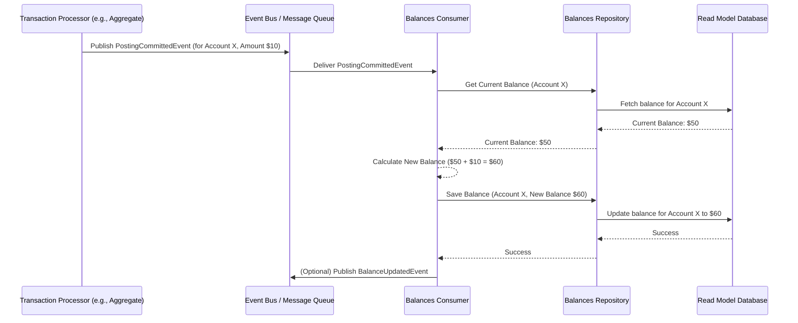

# Chapter 8: Consumer

Welcome to Chapter 8! In our [previous chapter on Services](07_service_.md), we learned how specialized "departments" in our bank help organize business logic, often by reading data using [Repositories](04_repository_.md) or orchestrating actions, sometimes by sending [Commands](02_command_.md). These [Commands](02_command_.md), when processed by [Aggregates](03_aggregate_.md), result in [Events](01_event_.md) – records of things that have happened.

But what happens *after* an [Event](01_event_.md) is generated? For instance, if a `PostingCommittedEvent` (signaling a financial transaction leg) occurs, we probably need to update the customer's account balance so they can see it. Or, if an `AccountCreatedEvent` happens, maybe we need to send a welcome email. How do these follow-up actions happen automatically without slowing down the original process?

This is where the **Consumer** steps in!

## What is a Consumer? The Bank's Automated Event Watcher

Imagine in our bank, every time an important announcement is made (an [Event](01_event_.md) happens), there are dedicated staff members who are always listening for specific types of announcements.
*   One staff member listens for "New Account Opened" announcements. When they hear one, they immediately prepare and send a welcome pack to the new customer.
*   Another staff member listens for "Transaction Completed" announcements. When they hear one, they quickly update the account ledger display.

A **Consumer** in our `corebanking` system is like one ofthese automated staff members. It's a component that **listens for specific types of [Events](01_event_.md)** that occur within the system. When it "hears" an [Event](01_event_.md) it's interested in, it performs a predefined action.

For example, when a `PostingCommittedEvent` occurs (meaning a part of a financial transaction has been finalized), a `BalancesConsumer` might listen for this. Upon receiving it, the consumer will update the account's balance that is stored for quick display (this stored balance is often called a "read model" or "projection").

Consumers are crucial because they allow different parts of the system to react to business happenings **asynchronously**. This means the original action (like processing the transaction) can finish quickly, and the follow-up tasks (like updating the balance display or sending a notification) happen separately, a moment later.

## Key Ideas About Consumers

1.  **Event Listener:** A Consumer "subscribes" to a stream of [Events](01_event_.md) and pays attention only to the types of [Events](01_event_.md) it cares about.
2.  **Asynchronous Operation:** Consumers typically run in the background, separate from the process that originally created the [Event](01_event_.md). This keeps the main operations fast and responsive. The part of the system that created the event doesn't have to wait for the Consumer to finish its job.
3.  **Performs Actions:** When a relevant [Event](01_event_.md) is received, the Consumer executes specific logic. Common actions include:
    *   **Updating Read Models:** Calculating and storing data in a format optimized for fast reading. For example, updating an account balance summary after a transaction.
    *   **Triggering Follow-up Processes:** Starting new workflows, sending notifications (like emails or SMS), or calling other [Services](07_service_.md).
4.  **Decoupling:** The component that produces an [Event](01_event_.md) (e.g., an `AccountAggregate` producing `AccountCreatedEvent`) doesn't need to know anything about the Consumers that might be listening to that [Event](01_event_.md). This makes the system more flexible and easier to change.
5.  **Data Consistency (Eventually):** Consumers help maintain consistency across different views of data. For example, after a transaction, the balance read model will *eventually* reflect the change.

## A Consumer in Action: Updating Account Balances

Let's say a customer makes a deposit. This might result in one or more `PostingCommittedEvent`s. We need to update the account balance that is shown to the customer on their app.

This is a perfect job for a `BalancesConsumer` (like the `BalancesTimeSeriesConsumerDefault` found in `api/balances_consumer.go`):

1.  **[Event](01_event_.md) Happens:** An [Aggregate](03_aggregate_.md) processes a transaction, and a `PostingCommittedEvent` is generated and saved. This event contains details about the amount, currency, and account involved.
2.  **Consumer is Notified:** The `BalancesConsumer` is subscribed to listen for `PostingCommittedEvent`s. An "event bus" (a system for distributing events) delivers this event to the consumer.
3.  **Consumer Processes the [Event](01_event_.md):**
    *   The `BalancesConsumer` receives the `PostingCommittedEvent`.
    *   It extracts the necessary information (account ID, amount, type of posting - debit/credit).
    *   It might fetch the current stored balance for that account using a `BalancesRepository` (a type of [Repository](04_repository_.md)).
    *   It calculates the new balance.
4.  **Consumer Updates Read Model:** The consumer then saves this new, updated balance back using the `BalancesRepository`. This updated balance is now ready to be quickly displayed to the user.
5.  **Optional: Further [Events](01_event_.md):** The consumer might even publish a new [Event](01_event_.md) itself, like a `BalanceUpdatedEvent`, to signal that the read model balance has changed.

This entire process happens *after* the original deposit transaction was confirmed. The customer got a quick confirmation of their deposit, and in the background, the consumer ensures their displayed balance is updated.

## What Does a Consumer Look Like? (A Peek at the Code)

Consumers are often structs that hold dependencies like [Repositories](04_repository_.md) or other [Services](07_service_.md). They typically have a `Start()` method to begin listening and a processing method that gets called when relevant [Events](01_event_.md) arrive.

Let's look at a simplified structure for `BalancesTimeSeriesConsumerDefault` from `api/balances_consumer.go`:

```go
// Simplified from: api/balances_consumer.go
type BalancesTimeSeriesConsumerDefault struct {
	repository    BalancesRepository // To read/write balance data
	events        es.EventPublisher  // To publish new events (optional)
	eventConsumer es.EventConsumer   // The mechanism to receive events
	// ... other dependencies ...
}

// NewBalancesTimeSeriesConsumer creates the consumer
func NewBalancesTimeSeriesConsumer(
	repository BalancesRepository,
	events es.EventPublisher,
	eventConsumer es.EventConsumer,
	// ... other args ...
) BalancesTimeSeriesConsumer {
	// ... (nil checks) ...
	return &BalancesTimeSeriesConsumerDefault{
		repository:    repository,
		events:        events,
		eventConsumer: eventConsumer,
		// ...
	}
}
```
*   `repository`: This is a `BalancesRepository`, used to get the current balance and save the new balance.
*   `events`: An `EventPublisher` which this consumer might use to send out new [Events](01_event_.md) (like `BalanceUpdatedEvent`).
*   `eventConsumer`: This is the component from our event sourcing library (`es`) that actually delivers [Events](01_event_.md) from the event bus to this consumer.

### Starting the Consumer and Processing Events

The consumer needs to be "turned on" to start listening. This is usually done by its `Start()` method:

```go
// Simplified from: api/balances_consumer.go
func (c *BalancesTimeSeriesConsumerDefault) Start() error {
	// Tell the eventConsumer to start sending batches of events
	// to our 'processBalancesTimeSeriesEvents' method.
	err := c.eventConsumer.ConsumeTenantMultiAggregateBatch(
		context.Background(),
		c.processBalancesTimeSeriesEvents, // Our callback function
	)
	return err
}
```
*   `c.eventConsumer.ConsumeTenantMultiAggregateBatch(...)`: This line registers the `processBalancesTimeSeriesEvents` method with the underlying event consumption mechanism. Now, whenever new [Events](01_event_.md) (that this consumer is configured to listen to) arrive, this method will be called with a batch of those [Events](01_event_.md).

The actual work happens in the callback method, `processBalancesTimeSeriesEvents`. Here's a highly simplified conceptual view of what it does when it receives event data related to postings:

```go
// Highly simplified concept of processBalancesTimeSeriesEvents
func (c *BalancesTimeSeriesConsumerDefault) processBalancesTimeSeriesEvents(
	ctx context.Context, tenantID int, events []*es.Event,
) error {
	// For each relevant event (e.g., indirectly from a PostingCommittedEvent):
	for _, event := range events {
		// 1. Extract posting details from the event
		//    (The real code uses a helper 'orderedPostingsFromEvents'
		//     to get 'Posting' data from events like PostingCommittedEvent)
		postingData := extractPostingFrom(event) // Conceptual
		accountID := postingData.AccountID

		// 2. Get current balances for the account (simplified)
		accountBalances, _ := c.repository.GetBalancesByAccountIDs(ctx, []uuid.UUID{accountID})
		// (Real code handles 'not found' and groups by account)
		currentBalanceInfo := accountBalances[0] // Simplified

		// 3. Apply the posting to update the balance
		//    (The real code uses 'ApplyPostingToAccountBalances')
		newBalance := calculateNewBalance(currentBalanceInfo, postingData) // Conceptual

		// 4. Save the updated current balance
		//    (The real code accumulates 'updatedCurrentBalances' and saves in a batch)
		err := c.repository.SaveCurrent(ctx, []*Balance{newBalance})
		if err != nil {
			// Handle error
			return err
		}

		// 5. Optionally, publish a new event
		balanceUpdatedEvt := createBalanceUpdatedEvent(newBalance) // Conceptual
		c.events.PublishBatch(ctx, []es.Event{balanceUpdatedEvt})
	}
	return nil
}
```
Let's break down this conceptual flow:
1.  **Extract Posting Details:** The consumer gets the necessary details from the incoming [Event](01_event_.md) (like account ID, amount, currency, debit/credit). In the actual `corebanking` code, `PostingCommittedEvent`s are processed to extract `Posting` objects.
2.  **Get Current Balance:** It uses its `BalancesRepository` to fetch the most recent balance record for the affected account.
3.  **Apply Posting:** It performs the calculation to update the balance. The actual function `ApplyPostingToAccountBalances` in `api/balances_consumer.go` handles the logic of adding or subtracting based on posting type and account category.
4.  **Save Updated Balance:** The new balance is saved back to the read model storage using the `BalancesRepository`'s `SaveCurrent` method.
5.  **Publish New Event (Optional):** The `BalancesConsumer` in our project also creates and publishes a `BalanceUpdatedEvent`. This allows other parts of the system to know that a balance read model has been updated.

The actual `processBalancesTimeSeriesEvents` is more complex because it handles batches of events, deals with time-series data for historical balances, and manages database transactions. But the core idea is: **receive event -> process it -> update read model.**

## How a Consumer Gets Triggered: The Event Flow

Here’s a simplified sequence diagram showing how a `BalancesConsumer` might react to a `PostingCommittedEvent`:


This shows the asynchronous nature: the `TxnProcessor` fires the event and moves on. The `BalConsumer` picks it up later and does its work.

## Other Types of Consumers

Our `corebanking` system has other consumers too:

*   **`PostingsTransactionsConsumer`** (from `api/postings_transactions_consumer.go`):
    This consumer listens to events related to financial transactions (like `PostingsTransactionCreatedEvent`, `PostingsTransactionSettledEvent`). It updates a read model that stores details about these transactions, making it easy to query their status, amount, etc.

*   **`ProductEnginesConsumer`** (from `api/product_engines_consumer.go`):
    This is an interesting one! It listens for events like `ScheduledEvent` (e.g., "it's end of day for account X") or even `PostingCommittedEvent`. When it receives such an event, it triggers the [Product Engine](09_product_engine_.md) (via `productEngines.HandleEvents()`). The [Product Engine](09_product_engine_.md) might then apply interest, charge fees, or perform other account-specific logic defined by the banking product. This shows a consumer triggering a more complex follow-up process.

## Why Are Consumers So Useful?

1.  **Improved Performance & Responsiveness:** The system part that creates an [Event](01_event_.md) (e.g., an [Aggregate](03_aggregate_.md) handling a [Command](02_command_.md)) can finish its job quickly without waiting for all side effects (like updating multiple read models or sending emails) to complete.
2.  **Decoupling & Modularity:** Event producers don't need to know about event consumers. You can add new consumers or change existing ones without affecting the code that generates the events. This makes the system very flexible.
3.  **Resilience:** If a consumer temporarily fails while processing an event (e.g., a network issue while saving to a database), the event can often be re-processed later without losing the original data, as the [Event](01_event_.md) itself is already safely stored.
4.  **Scalability:** Different consumers can often be scaled independently. If updating balances becomes a bottleneck, you might be able to run more instances of the `BalancesConsumer`.

## Conclusion

Consumers are the unsung heroes working diligently in the background of our `corebanking` system. They are **automated listeners** that subscribe to specific types of [Events](01_event_.md). When they receive an [Event](01_event_.md) they're interested in, they swing into action – perhaps updating a read-model for fast data display (like account balances) or triggering follow-up processes (like complex product calculations).

By reacting to business [Events](01_event_.md) asynchronously, Consumers help keep our system responsive, flexible, and robust. They play a vital role in maintaining data consistency across different views and enabling complex workflows.

One example we saw was the `ProductEnginesConsumer`, which listens for events and then invokes specific business logic defined by a banking product. What is this "Product Engine" that it calls? Let's explore that in our next chapter: the [Product Engine](09_product_engine_.md).

---

Generated by [AI Codebase Knowledge Builder](https://github.com/The-Pocket/Tutorial-Codebase-Knowledge)