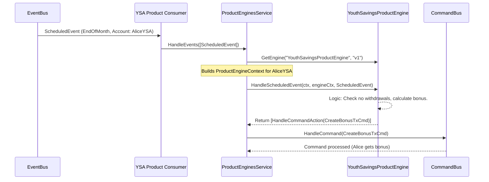

# Chapter 9: Product Engine

Welcome to Chapter 9! In the [previous chapter](08_consumer_.md), we learned about [Consumers](08_consumer_.md) and how they listen for [Events](01_event_.md) to trigger follow-up actions. For example, a [Consumer](08_consumer_.md) might notice that an account needs its monthly interest calculated. But how does the system know *how* to calculate that interest, especially if different types of accounts (like a "Youth Savings Account" vs. a "Standard Mortgage") have vastly different rules?

This is where the **Product Engine** comes in.

## What's a Product Engine? The Bank's Specialized Rulebook

Imagine a bank offers many different financial products:
*   A "Basic Savings Account" with simple interest.
*   A "Youth Savings Account" that gets bonus interest if no money is withdrawn during the month.
*   A "Standard Mortgage" with complex payment schedules and fee structures.
*   A "HELOC Remittance" account with its own unique remittance rules.

Each of these products behaves differently. They have their own specific features, ways to calculate interest, fee rules, and reactions to events like an account being activated or a transaction occurring.

A **Product Engine** is like a **detailed rulebook and automated process manager** specifically designed for *one particular financial product*. It defines exactly how that product, like "Standard Mortgage" or "Youth Savings Account," should work.

When a customer opens an account (say, a "Youth Savings Account"), that account is linked to its specific product. From then on, whenever something relevant happens to that account, the system consults the "Youth Savings Account" Product Engine to:
*   Check if an operation is allowed (validation).
*   Determine any product-specific actions or outcomes (like calculating that special bonus interest).

## Key Ideas About Product Engines

1.  **Product-Specific Logic:** Each Product Engine contains the unique rules and behaviors for one type of financial product.
2.  **Defines Product Behavior:** It specifies features, fee structures, interest calculations, and how the product responds to lifecycle events (e.g., account activation, transaction posting, scheduled events like "end of month").
3.  **Consulted for Operations:** When an action needs to be performed on an account, or an event occurs related to it, the corresponding Product Engine is invoked.
4.  **Automates Processes:** It automates tasks like applying interest, charging fees, or managing scheduled product-specific activities.
5.  **Produces Actions:** Based on its rules and the current situation (e.g., an incoming [Event](01_event_.md) or [Command](02_command_.md)), a Product Engine can decide that certain actions need to happen. These actions are often new [Commands](02_command_.md) (e.g., "Create a transaction to credit bonus interest").

## The Product Engine in Action: Youth Savings Bonus Interest

Let's use our "Youth Savings Account" example. This account type offers bonus interest if no withdrawals are made in a month.

1.  **Account Setup:** Alice has a "Youth Savings Account." This account is linked to the "Youth Savings Product Engine."
2.  **End of Month [Event](01_event_.md):** A `ScheduledEvent` (like "EndOfMonthProcessing") occurs for Alice's account.
3.  **[Consumer](08_consumer_.md) Routes to Service:** A [Consumer](08_consumer_.md) (like the `ProductEnginesConsumer` we touched upon in the [previous chapter](08_consumer_.md)) picks up this `ScheduledEvent`. It knows this event might require product-specific logic, so it passes the event to the `ProductEnginesService`.
4.  **Service Invokes Product Engine:** The `ProductEnginesService`:
    *   Looks at Alice's account and sees it's a "Youth Savings Account."
    *   Retrieves the specific "Youth Savings Product Engine."
    *   Prepares a `ProductEngineContext` for Alice's account. This context contains information the engine might need, like Alice's current account details, balances, and the product's configuration.
    *   Calls a method on the "Youth Savings Product Engine," like `HandleScheduledEvent(context, scheduledEvent)`.
5.  **Product Engine Applies Rules:** The "Youth Savings Product Engine" executes its logic for the "EndOfMonthProcessing" event:
    *   It checks Alice's transaction history for the past month (perhaps by looking at data in the `ProductEngineContext` or by querying for recent postings).
    *   It determines if any withdrawals were made.
    *   If no withdrawals, it calculates the bonus interest.
6.  **Product Engine Returns Actions:** The engine decides that bonus interest should be applied. It returns a list of `ProductEngineAction`s. One of these actions might be a `HandleCommandAction` containing a `CreatePostingsTransactionCommand` to credit the bonus interest to Alice's account.
7.  **Service Executes Actions:** The `ProductEnginesService` takes these actions and processes them. For a `HandleCommandAction`, it would send the `CreatePostingsTransactionCommand` to the [Command Bus](02_command_.md), which then ensures the transaction is created and Alice's balance is updated.

This way, the specific bonus interest logic for the "Youth Savings Account" is neatly contained within its own Product Engine.

## A Peek at the Code: Interfaces and Services

Let's look at some of the key pieces involved.

### 1. The `ProductEngine` Interface

At its core, every product engine implements the `ProductEngine` interface (from `api/product_engines.go`). This interface defines the "hooks" or methods that can be called by the system for different situations.

```go
// Simplified from: api/product_engines.go
type ProductEngine interface {
	ProductEngineID() string // E.g., "YOUTH_SAVINGS_ACCOUNT"
	ProductEngineVersion() string // E.g., "1.0.0"

	// Called when an account is activated
	ActivateAccount(ctx context.Context, engineCtx ProductEngineContext) ([]ProductEngineAction, error)

	// Called for scheduled events (like our "EndOfMonthProcessing")
	HandleScheduledEvent(ctx context.Context, engineCtx ProductEngineContext, scheduledEvent *ScheduledEvent) ([]ProductEngineAction, error)

	// Called when a posting (transaction leg) is accepted for an account
	AcceptPosting(ctx context.Context, engineCtx ProductEngineContext, posting *Posting) ([]ProductEngineAction, error)

	// ... other methods for validating postings, updating parameters, closing accounts etc.
}
```
*   `ProductEngineID()` and `ProductEngineVersion()`: Identify the specific engine.
*   `ActivateAccount`, `HandleScheduledEvent`, `AcceptPosting`: These are examples of methods that get called at different points in an account's lifecycle or when certain [Events](01_event_.md) occur.
*   `ProductEngineContext`: This argument provides all the necessary information about the current account, its product settings, balances, etc., that the engine needs to make decisions.
*   `[]ProductEngineAction`: The method returns a list of actions the system should take as a result of the engine's logic.

### 2. The `ProductEngineContext`

This struct (also from `api/product_engines.go`) is passed to the Product Engine methods. It's like a data package giving the engine all the relevant details for the current operation.

```go
// Simplified from: api/product_engines.go
type ProductEngineContext struct {
	ReferenceDate   *date.Date      // The current date for processing
	Account         *Account        // Details of the specific account
	Product         *ResolvedProduct // Details & parameters of the banking product
	CurrentBalances *BalancesReader // Access to the account's current balances
	// ... and other fields like PostingsByPartition, BalancesByPartition for historical data
}
```
*   `Account`: The specific account being processed.
*   `Product`: The resolved product definition, containing parameters like interest rates, fee schedules, etc.
*   `CurrentBalances`: A way to read the account's current balances.
The engine uses this information to apply its rules.

### 3. `ProductEngineAction`

When a Product Engine finishes its logic, it needs to tell the system what to do next. It does this by returning a slice of `ProductEngineAction` (defined in `api/product_engines.go`).

A common action is to issue a [Command](02_command_.md):
```go
// Simplified from: api/product_engines.go

// ProductEngineAction represents a product engine action.
type ProductEngineAction interface {
	Actuate() // A marker method
}

// HandleCommandAction implements product engine action to handle command.
type HandleCommandAction struct {
	command es.Command // The command to be executed
}

// NewHandleCommandAction returns a new HandleCommandAction.
func NewHandleCommandAction(command es.Command) HandleCommandAction {
	return HandleCommandAction{command}
}

// GetCommand returns the underlying command
func (a HandleCommandAction) GetCommand() es.Command {
	return a.command
}
```
So, if our "Youth Savings Product Engine" decides to apply bonus interest, it would create a `CreatePostingsTransactionCommand` and wrap it in a `NewHandleCommandAction`.

### 4. The `ProductEnginesService`

The `ProductEnginesServiceDefault` (from `api/product_engines.go`) is the orchestrator. It's responsible for receiving [Events](01_event_.md) (often from a [Consumer](08_consumer_.md)), finding the right Product Engine, and invoking it.

```go
// Conceptual flow within ProductEnginesServiceDefault.HandleEvents
// (Actual code is more complex, handling batches and various event types)

func (s *ProductEnginesServiceDefault) HandleEvents(ctx context.Context, events []*es.Event) error {
	for _, event := range events {
		// 1. Determine which account this event is for (from event.AggregateID)
		accountID := event.AggregateID
		account, _ := s.accounts.GetByID(ctx, accountID) // Fetch account details

		// 2. Get the Product Engine for this account's product
		productEngine, _ := s.GetProductEngine(ctx, account.Product)
		if productEngine == nil {
			continue // No engine for this product, or product not set
		}

		// 3. Create an Event Handler wrapper (e.g., for a ScheduledEvent)
		//    The hook file (api/product_engines_hooks.go) has different handlers for different events.
		var eventHandler ProductEngineEventHandler // Defined in api/product_engines_hooks.go
		if se, ok := event.Data.(*ScheduledEvent); ok && eventHandlerNameFromAction(se.Action) == "HandleScheduledEvent" {
			eventHandler = NewProductEngineEventHandlerHandleScheduledEvent(event.ID, se, /*...location...*/)
		}
		// ... (else if for AccountActivatedEvent, PostingCommittedEvent, etc.) ...

		if eventHandler == nil {
			continue
		}

		// 4. Build the ProductEngineContext (simplified)
		engineCtx, _ := s.buildProductEngineContext(ctx, /*...details...*/, account, /*balances*/, /*config*/)

		// 5. Call the specific hook on the event handler, which calls the engine
		actions, err := eventHandler.Hook(ctx, *engineCtx, productEngine)
		// ... error handling ...

		// 6. Run the actions returned by the Product Engine
		s.runActions(ctx, actions) // This would dispatch commands, schedule things, etc.
	}
	return nil
}
```
*   **Get Account & Engine:** It fetches the account and determines the correct Product Engine based on the account's product information (`account.Product.EngineID`, `account.Product.EngineVersion`).
*   **Event Handler Wrapper:** An `ProductEngineEventHandler` (from `api/product_engines_hooks.go`) is chosen based on the type of incoming [Event](01_event_.md). This wrapper standardizes how different events are passed to the Product Engine. For example, `ProductEngineEventHandlerHandleScheduledEvent` has a `Hook` method that will ultimately call `engine.HandleScheduledEvent(...)`.
*   **Build Context:** It prepares the `ProductEngineContext` with all necessary data.
*   **Invoke Engine (via Hook):** It calls the `Hook` method on the event handler, which in turn calls the relevant method on the `ProductEngine` instance (e.g., `HandleScheduledEvent`).
*   **Run Actions:** It takes the `ProductEngineAction`s returned by the engine and executes them (e.g., sends [Commands](02_command_.md) to the [Command Bus](02_command_.md)).

### Example: A Simple Product Engine's `HandleScheduledEvent`

Let's imagine a very basic "MonthlyFeeProductEngine":
```go
// Hypothetical MonthlyFeeProductEngine
type MonthlyFeeProductEngine struct { /* ... */ }

func (pe *MonthlyFeeProductEngine) HandleScheduledEvent(
	ctx context.Context,
	engineCtx api.ProductEngineContext,
	scheduledEvent *api.ScheduledEvent,
) ([]api.ProductEngineAction, error) {

	if scheduledEvent.Action == "APPLY_MONTHLY_FEE" {
		feeAmountStr, _ := engineCtx.Product.Parameters["monthlyFeeAmount"] // Get fee from product config
		feeAmount, _ := decimal.NewFromString(feeAmountStr)

		if feeAmount.IsPositive() {
			// Create a command to charge the fee
			feeTxCmd := &api.CreatePostingsTransactionCommand{
				BaseCommand: es.BaseCommand{AggregateID: engineCtx.Account.ID},
				Action:      api.PostingActionTransfer,
				Code:        "MONTHLY_FEE",
				Amount:      feeAmount,
				Debtor:      &api.PostingDestination{AccountID: engineCtx.Account.ID}, // Debit customer
				Creditor:    &api.PostingDestination{AccountID: uuid.FromString("bank-fee-income-account-id")}, // Credit bank
			}
			return []api.ProductEngineAction{api.NewHandleCommandAction(feeTxCmd)}, nil
		}
	}
	return nil, nil // No action
}

// ... other required methods of ProductEngine interface ...
```
When a `ScheduledEvent` with action "APPLY_MONTHLY_FEE" comes in for an account using this product:
1.  The engine checks if the action matches.
2.  It reads the `monthlyFeeAmount` from the product's parameters (available in `engineCtx.Product.Parameters`).
3.  If a fee is due, it creates a `CreatePostingsTransactionCommand` to transfer the fee from the customer's account to the bank's fee income account.
4.  It returns this command wrapped in a `HandleCommandAction`.

## Visualizing the Flow

Here's how an event for Alice's "Youth Savings Account" (YSA) might trigger its Product Engine to apply bonus interest:



## Why Product Engines are Powerful

*   **Flexibility:** Easily define unique behaviors for many different banking products without cluttering the core system.
*   **Modularity:** Product-specific logic is isolated. Changes to one product's rules don't affect others.
*   **Maintainability:** Easier to understand and update the logic for a specific product.
*   **Testability:** Individual Product Engines can be tested in isolation with a mocked `ProductEngineContext`.
*   **Rapid Development:** New financial products can often be introduced by creating a new Product Engine and its configuration, rather than changing deep parts of the core system.

## Conclusion

Product Engines are the specialized "brains" behind each financial product offered by the bank. They act as detailed rulebooks and automated process managers, defining how a product like a "Standard Mortgage" or a "Youth Savings Account" behaves – its features, fees, interest calculations, and responses to lifecycle events.

When an [Event](01_event_.md) occurs for an account, the `ProductEnginesService` (often triggered by a [Consumer](08_consumer_.md)) identifies the account's product and invokes the corresponding Product Engine. The engine then applies its specific rules and can return a list of actions, such as [Commands](02_command_.md) to create transactions, for the system to execute. This powerful mechanism allows `corebanking` to support a diverse range of financial products with complex, individualized behaviors.

With all these intricate product behaviors and event-driven interactions, how can we be sure everything works as expected? How can we test different scenarios, perhaps even simulating future events? In our next and final chapter, we'll look into [Simulation Services and Repositories](10_simulation_services_and_repositories_.md).

---

Generated by [AI Codebase Knowledge Builder](https://github.com/The-Pocket/Tutorial-Codebase-Knowledge)