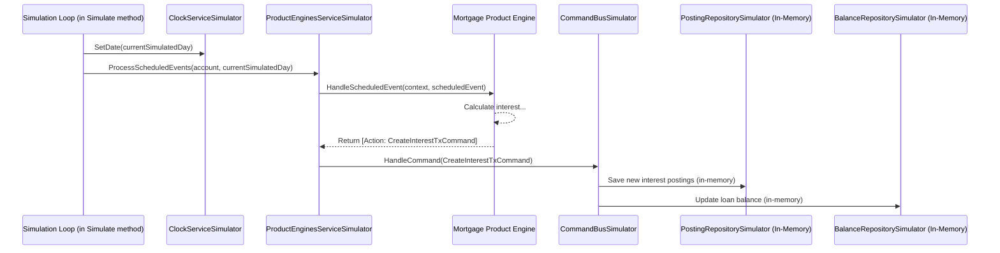

# Chapter 10: Simulation Services and Repositories

Welcome to the final chapter of our conceptual overview! In [Chapter 9: Product Engine](09_product_engine_.md), we saw how our `corebanking` system can support diverse financial products, each with its own complex set of rules for things like interest calculation, fee application, and behavior over time.

Now, imagine we've just designed a sophisticated 30-year mortgage product using our [Product Engine](09_product_engine_.md). How can we be absolutely sure it works correctly under all sorts of conditions? How do we test its behavior over the full 30 years, perhaps with fluctuating interest rates, without actually waiting for three decades or messing with real customer data? This is where **Simulation Services and Repositories** come to the rescue!

## What are Simulation Services and Repositories? Your Bank's Flight Simulator!

Think of Simulation Services and Repositories as your bank's very own **flight simulator** or **practice mode**. They are special "test-double" or "fake" versions of the regular [Services](07_service_.md) and [Repositories](04_repository_.md) we've learned about.

Instead of connecting to real databases and affecting real money or customer data, these simulators:
*   **Work "in-memory":** They store their data temporarily, right in the computer's memory, for the duration of a test or simulation. When the simulation ends, this temporary data is gone. This is great because it's fast and completely isolated from the live system.
*   **Mimic real behavior:** They are designed to act just like their real counterparts, but give us much more control.
*   **Allow controlled testing:** We can use them to test complex business logic, like our 30-year mortgage product, under various scenarios (e.g., "what if interest rates double next year?") in a safe and repeatable way.

Essentially, these simulators let us "play out" complex financial scenarios, fast-forward through time, and see what happens, all without any real-world consequences.

## Key Ideas Behind Simulation

How do these simulators achieve this magic? There are a few key ingredients:

1.  **In-Memory Storage:**
    *   Simulation [Repositories](04_repository_.md) (like `AccountRepositorySimulator` or `PostingsTransactionsRepositorySimulator`) don't save data to a permanent database. Instead, they use simple Go data structures like maps and slices to hold information temporarily.
    *   This makes them very fast and ensures that each simulation run starts fresh.

2.  **Controlled Time (The "Time Machine"):**
    *   A special `ClockServiceSimulator` lets us control the "current date" within the simulation. We can tell it to jump forward day by day, month by month, or even set it to a specific date in the future. This is crucial for testing products that behave differently over long periods.

3.  **Deterministic Behavior:**
    *   For a given starting point and set of actions, a simulation should ideally produce the exact same results every time it's run. This makes testing reliable and helps us pinpoint issues if something changes unexpectedly.

4.  **Isolation:**
    *   Simulations run completely separately from the live banking system. There's no risk of accidentally creating a real account or moving real money.

## Using the Simulators: Testing Our Mortgage Product

Let's go back to our 30-year mortgage product. How would we use the simulation tools to test it? The main entry point for complex product simulations is often the `ProductEnginesServiceSimulatorDefault` (found in `api/pkg/productengines/simulator/simulator.go`).

Here's a conceptual walkthrough:

1.  **Setup the Simulation:**
    *   First, we'd create an instance of `ProductEnginesServiceSimulatorDefault`. This master simulator internally sets up other necessary simulator components like `AccountsServiceSimulator`, `BalancesServiceSimulator`, `PostingsServiceSimulator`, a `ClockServiceSimulator`, and a `CommandBusSimulator`.
    *   We'd tell the simulator about our "Mortgage Product" definition (its rules, interest rates, fee structures, etc.) by registering it.
    *   We'd then create a "Simulated Account" – let's say, "Alice's Mortgage Account" – and link it to our mortgage product. We might also set its initial loan amount and other starting conditions.
    *   We'd define a time period for our simulation, for example, from "2024-01-01" to "2025-01-01" to see how it behaves over one year.

2.  **Run the Simulation:**
    *   We'd call the `Simulate` method on our `ProductEnginesServiceSimulatorDefault`, giving it Alice's simulated account and our desired start and end dates.

3.  **What Happens Inside the `Simulate` Method (Simplified):**
    *   The simulator enters a loop, advancing day by day from the start date to the end date using its internal `ClockServiceSimulator`.
    *   On each simulated day:
        *   It checks if any scheduled events are due for Alice's account (e.g., "end of month interest calculation," "payment due date").
        *   If so, it triggers these events. These events are then passed to the (real) [Product Engine](09_product_engine_.md) logic for our mortgage product.
        *   The mortgage [Product Engine](09_product_engine_.md) runs its rules based on the current simulated date and account state. It might decide to:
            *   Calculate interest due.
            *   Generate a [Command](02_command_.md) like `CreatePostingsTransactionCommand` to add this interest to Alice's loan balance.
        *   This `CreatePostingsTransactionCommand` is then handled by the `CommandBusSimulator`. The `CommandBusSimulator` doesn't send it to the real system; instead, it directs it to other *simulated* services.
        *   For example, the `PostingsServiceSimulator` would "commit" these interest postings to its in-memory store.
        *   The `BalancesServiceSimulator` would update Alice's simulated loan balance in its in-memory store.
    *   This loop continues until the simulation end date is reached.

4.  **Get the Results:**
    *   Once the simulation is complete, the `Simulate` method returns a `SimulationResult` struct.
    *   This `SimulationResult` contains a snapshot of Alice's mortgage account at the end of the simulated year: her final loan balance, a list of all transactions (postings) that occurred (like interest charges, payments), any scheduled items, and potentially any errors that happened during the simulation.

5.  **Check the Results:**
    *   We can then examine this `SimulationResult` to verify if our mortgage product behaved as expected. Did the interest calculate correctly? Were payments applied properly? Is the final balance what we predicted?

## A Peek at Some Simulator Code

Let's look at tiny, simplified snippets to get a feel for how these simulators are built.

### 1. The `AccountRepositorySimulator` (Storing Data In-Memory)

This simulator (from `api/pkg/productengines/simulator/accounts_repository.go`) fakes a [Repository](04_repository_.md) for accounts.

```go
// Simplified from: api/pkg/productengines/simulator/accounts_repository.go
type AccountRepositorySimulator struct {
	// Accounts are stored in a map, with account ID as the key.
	accounts map[uuid.UUID]*api.Account
	// ... other fields for simulation ...
}

// GetByID tries to find an account in its in-memory map.
func (r *AccountRepositorySimulator) GetByID(
	ctx context.Context, accountID uuid.UUID,
) (*api.Account, error) {
	account, found := r.accounts[accountID]
	if !found {
		// Return an error if not found (simplified error)
		return nil, errors.New("simulated account not found")
	}
	return account, nil // Return the account from memory
}
```
*   Instead of database queries, it uses a simple Go `map` (`r.accounts`) to store account data.
*   The `GetByID` method just looks up the account in this map. Very fast!

### 2. The `ClockServiceSimulator` (Controlling Time)

The `ProductEnginesServiceSimulatorDefault` uses a clock service (like `api.ClockServiceDefault`) and controls it. A key method for the simulation loop is `SetDate`:

```go
// Conceptual use of ClockService's SetDate within the simulation loop
// (s.clock is an instance of a clock service)
// s.clock.SetDate(currentSimulatedDate, timeZone)
```
*   Inside the `Simulate` method's loop, this `SetDate` is called repeatedly to advance the simulation's "current time" one day at a time. This makes the whole system believe it's that specific day.

### 3. The `ProductEnginesServiceSimulatorDefault`'s `Simulate` Method

This is the heart of the product simulation (from `api/pkg/productengines/simulator/simulator.go`).

```go
// Highly simplified concept of Simulate method's loop
// (s is *ProductEnginesServiceSimulatorDefault)
func (s *ProductEnginesServiceSimulatorDefault) Simulate(/*...params...*/) (*SimulationResult, error) {
	// ... (lots of initial setup: create account in simulator, set initial balances) ...

	// Loop from start date to end date
	for refDate := startDate; refDate.Before(endDate); refDate = refDate.AddDays(1) {
		s.clock.SetDate(refDate, s.c.ReferenceLocation) // Advance simulated time!

		// 1. Trigger scheduled events for this 'refDate'
		//    This involves calling s.HandleEvents(), which eventually
		//    invokes the Product Engine for the account.
		//    (Simplified representation)
		s.processScheduledItemsForDate(ctx, account.ID, refDate)

		// 2. Settle any simulated transactions due on this 'refDate'
		//    (e.g., if a payment was scheduled to clear today)
		s.settleTransactions(ctx, simulationConfig, account.ID, refDate)
	}

	// ... (gather all simulated data: final account state, postings, balances) ...
	return &SimulationResult{ /* ... collected data ... */ }, nil
}
```
*   The loop iterates day by day.
*   `s.clock.SetDate(...)` tells the entire simulation what "today" is.
*   `processScheduledItemsForDate` (a conceptual helper representing logic within `Simulate` and `GetSchedules/HandleEvents` from `simulator.go`) finds any scheduled tasks for the account on this simulated day (like "calculate monthly interest"). It then uses `s.HandleEvents()` to pass these to the [Product Engine](09_product_engine_.md). The Product Engine might then generate [Commands](02_command_.md).
*   These [Commands](02_command_.md) are handled by the `CommandBusSimulator` (also part of `ProductEnginesServiceSimulatorDefault`), which ensures they are processed by *other simulated services and repositories*, updating the in-memory state.
*   `s.settleTransactions` handles any pre-registered transaction settlements for that day.

## How it All Connects: A Simulation Day

Here's a simplified sequence of what might happen on one simulated day for our mortgage account:


1.  The simulation loop sets the "current day" using the `ClockSim`.
2.  It asks the `PESimService` (our main simulator) to process any events for that day.
3.  The `PESimService` invokes the actual `MortgagePE` (Product Engine) logic.
4.  The `MortgagePE` decides interest needs to be charged and returns an action to create a transaction command.
5.  The `PESimService` uses the `CmdBusSim` to handle this command.
6.  The `CmdBusSim` ensures that the resulting postings and balance updates are stored in the *in-memory* repositories (`PostingRepoSim`, `BalanceRepoSim`).

This cycle repeats for every day in the simulation period.

## Why are these Simulators So Valuable?

*   **Safety First:** We can test the riskiest financial logic without any danger to real operations or data.
*   **Blazing Speed:** Simulating years of financial activity can take just seconds or minutes, not actual years.
*   **Perfect Repetition:** If a test fails, we can run the exact same simulation again to understand and fix the problem. This is called deterministic testing.
*   **"What If?" Scenarios:** We can easily explore complex situations: What if interest rates soar? What if a customer misses payments? How does our product react?
*   **Debugging Superpowers:** When something goes wrong in a simulation, it's often easier to trace the problem step-by-step through the in-memory state changes.
*   **Building Confidence:** Thorough simulation gives us much higher confidence that our banking products will work correctly in the real world.

## Conclusion

Simulation Services and Repositories are powerful, specialized tools within the `corebanking` project. They create a safe, controlled, and fast "practice environment" where we can:
*   Test complex financial products (especially those managed by [Product Engines](09_product_engine_.md)) over long periods.
*   Simulate various market conditions and customer behaviors.
*   Verify that our business logic is correct and robust.

By using in-memory data storage, a controllable clock, and simulated versions of core components, we can gain deep insights into how our system will behave, all before it ever touches real customer information or funds. This is essential for building a reliable and trustworthy core banking system.

---

Congratulations on completing this tour of the core concepts in the `corebanking` project! From the fundamental [Events](01_event_.md) and [Commands](02_command_.md) that drive the system, through [Aggregates](03_aggregate_.md) that protect business rules, [Repositories](04_repository_.md) that manage data, to the [API Handlers](05_api_handler_.md) that welcome external requests, the coordinating [Core Facade](06_core_facade_.md), specialized [Services](07_service_.md), reactive [Consumers](08_consumer_.md), intelligent [Product Engines](09_product_engine_.md), and finally, these invaluable Simulation tools, you now have a solid foundation.

While this marks the end of our conceptual overview, your journey of exploration and contribution is just beginning. You can now revisit earlier chapters with a deeper understanding or start exploring the codebase to see these concepts in full action!

---

Generated by [AI Codebase Knowledge Builder](https://github.com/The-Pocket/Tutorial-Codebase-Knowledge)