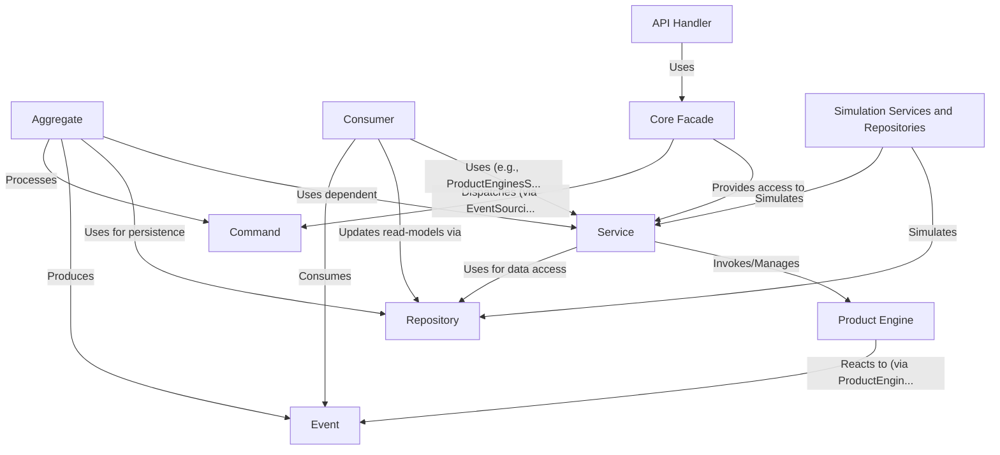

# Tutorial: corebanking

The project is a **core banking system** designed to manage financial operations such as *account creation, transaction processing (postings), and financial product lifecycle management*.
It heavily relies on an *Event Sourcing* architecture, where system state changes are captured as a sequence of immutable **Events**.
*Aggregates* (like `AccountAggregate` or `PostingsTransactionAggregate`) are central entities that process **Commands** (requests for change) and emit these Events.
*Services* (e.g., `AccountsService`, `ProductEnginesService`) encapsulate business logic and often orchestrate interactions between Aggregates, Repositories, and Product Engines.
*Repositories* provide an abstraction layer for data persistence.
*Product Engines* define the specific rules, behaviors, and automated processes for different financial products (e.g., mortgages, HELOCs).

**Source Repository:** [None](None)

## Chapters

1. [Event
](01_event_.md)
2. [Command
](02_command_.md)
3. [Aggregate
](03_aggregate_.md)
4. [Repository
](04_repository_.md)
5. [API Handler
](05_api_handler_.md)
6. [Core Facade
](06_core_facade_.md)
7. [Service
](07_service_.md)
8. [Consumer
](08_consumer_.md)
9. [Product Engine
](09_product_engine_.md)
10. [Simulation Services and Repositories
](10_simulation_services_and_repositories_.md)

---

Generated by [AI Codebase Knowledge Builder](https://github.com/The-Pocket/Tutorial-Codebase-Knowledge)